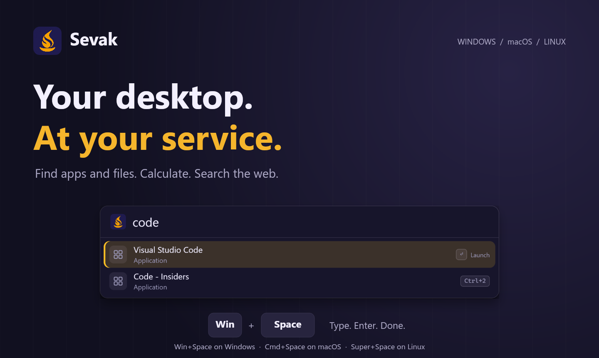
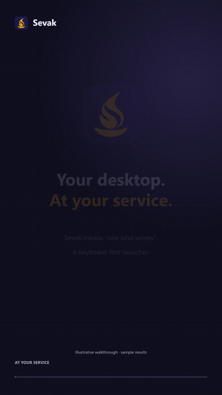
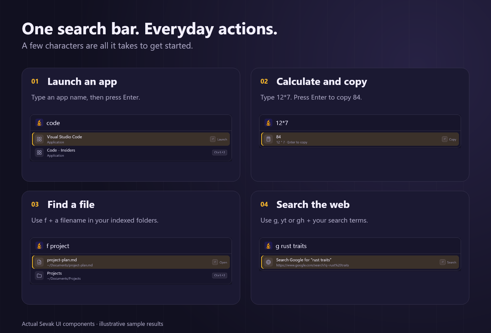
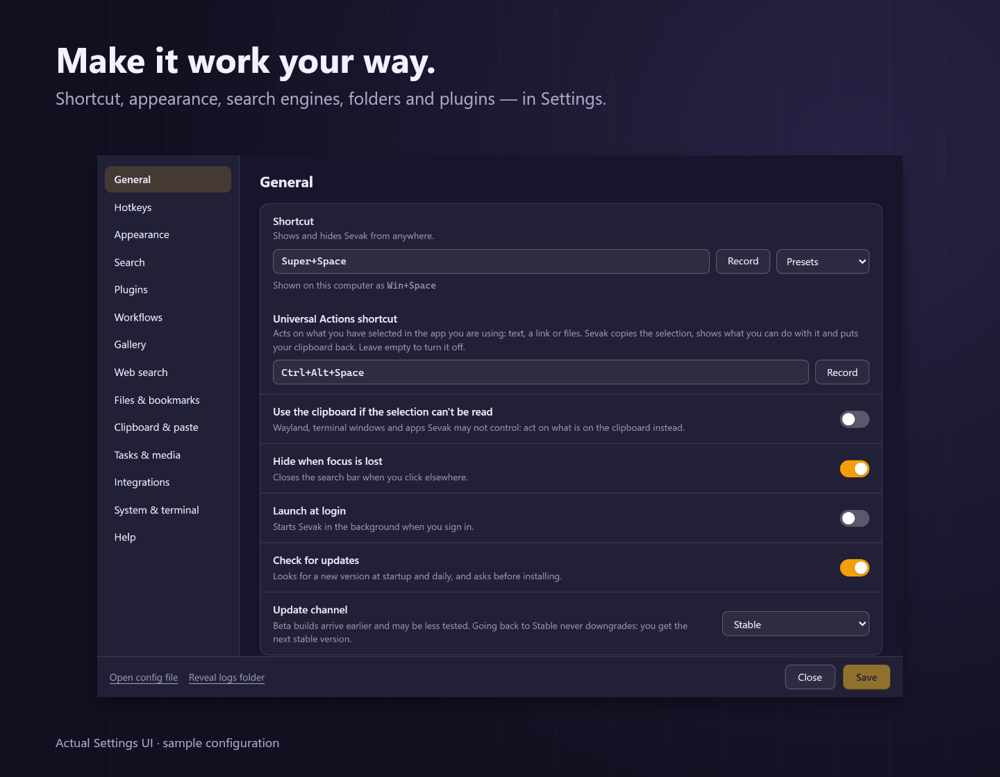
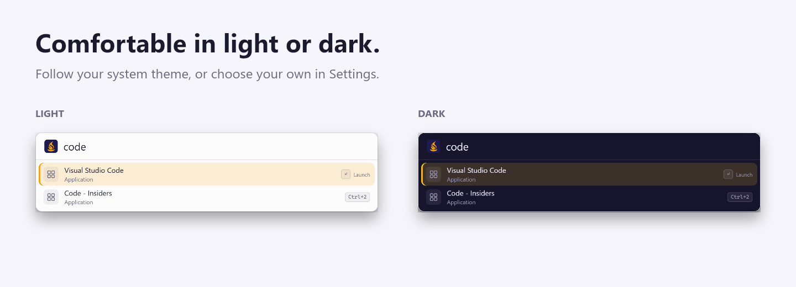

# Sevak

**Your desktop. At your service.**

[](https://github.com/ninad-k/Sevak/actions/workflows/ci.yml)
[](https://github.com/ninad-k/Sevak/releases/latest)
[](LICENSE)

[**Download Sevak**](https://github.com/ninad-k/Sevak/releases/latest) ·
[**Documentation**](https://ninad-k.github.io/Sevak/) ·
[PDF manual](docs/pdf/Sevak-User-Guide.pdf) ·
[Quick start](docs/quickstart.md) · [Help](docs/troubleshooting.md) ·
[Contribute](CONTRIBUTING.md)



Sevak brings everyday desktop actions into one search bar. Launch an app,
find a file, calculate an answer, or open a web search without navigating
through menus. Press **Alt+Space**, type what you need, then press **Enter**.

Built for **Windows, macOS and Linux** with Rust, Tauri 2 and Svelte 5.
App and file searches, calculations, and usage ranking run locally. Web
searches open in your browser, and optional update checks contact GitHub.

## Why “Sevak”?

*Sevak* (सेवक) means **“one who serves”**, a Sanskrit-derived word used in Hindi
([Hindwi dictionary](https://www.hindwi.org/hindi-dictionary/meaning-of-sevak)).
The name reflects the app's purpose: stay close at hand, help with a small task,
and let you return to your work.

The amber **S-shaped flame** and lamp express that same idea of helpfulness and
clarity. [The story behind the name and logo →](docs/brand.md)

## How it works


1. **Open** — press `Alt+Space` (`Option+Space` on macOS).
2. **Search** — type an app name, calculation, or keyword such as `f` or `g`.
3. **Act** — choose a result with `↑` / `↓`, then press `Enter`.

The shortcut is configurable. On Linux Wayland, bind it through your desktop;
see [Linux shortcut setup](docs/install.md#setting-up-the-hotkey-on-linux).

### A 12-second introduction

<p align="center">
  <a href="docs/media/sevak-12s.mp4">
    
  </a>
</p>

[**Watch or download the vertical reel — MP4, 12 seconds, captions and subtle sound**](docs/media/sevak-12s.mp4)

The reel is an illustrative walkthrough. Interface images are rendered from
Sevak's real Svelte components using example results, not personal files.
They show the workflow rather than measured search or launch times.

## What you can do



| Task | Try typing | What Enter does |
|---|---|---|
| Launch an installed app | `code` | Launches the selected application |
| Calculate | `12*7` or `sqrt(16)` | Copies the answer |
| Find a file or folder | `f project` | Opens the selected result |
| Find a file anywhere, or by its contents | `ff budget`, `in invoice 2026` | Opens it (uses your OS file index) |
| Search Google | `g rust traits` | Opens the search in your browser |
| Search YouTube | `yt svelte tutorial` | Opens YouTube search |
| Search GitHub | `gh tauri` | Opens GitHub search |
| Convert units | `10 km in mi`, `72°F to C` | Copies the converted value |
| Open a bookmark | `b github` | Opens it in your browser |
| Browse a folder | `~/Documents/` then `Tab` | Opens the entry; `Tab` drills down |
| Act on selected text or files in any app | select, then `Ctrl+Alt+Space` | Searches, transforms, opens or copies it — you pick |
| Collect files, then act on them all | `Alt+Down` on file results | Move, copy, zip, trash or open the whole [file buffer](docs/features/files.md#file-buffer) |
| Lock, sleep, restart… | `lock`, `restart`, `bluetooth` | Runs the system command (restart, shut down, log out and empty trash ask first) |
| Dark mode, volume, screenshot… | `dark mode`, `vol 30`, `screenshot` | Runs the [automation task](docs/features/tasks.md) |
| Quit or kill an app | `quit`, `kill chrome` | Lists running apps or processes (force quit and kill ask first) |
| Eject a drive, stay awake | `eject`, `awake 45` | Ejects the drive; keeps the computer awake for 45 minutes |
| Control music and video | `pause`, `next`, `play ` | Presses the media button; `play ` also shows [what is playing](docs/features/media.md) |
| Run a terminal command | `> git status` | Opens your terminal and runs it |
| Paste earlier clipboard text, images or files | `cb invoice` | Pastes into the app you were using (opt-in) |
| Paste a snippet | `s sig` | Pastes the snippet with `{date}` etc. filled in |
| Expand a snippet as you type | `;sig` in any app | Replaces it with the snippet (opt-in; watches keystrokes while on) |
| Look up a person | `c ada` or `@ada` | Copies the e-mail; the action panel writes, calls or opens the card (opt-in) |
| Find a 1Password login | `1p github` | Opens its website; never reads passwords (opt-in, needs `op`) |
| Define or spell-check a word | `define serendipity`, `spell recieve` | Copies the definition / pastes the right spelling, offline |
| Pick an emoji | `:heart` or `emoji thumbs up` | Pastes the selected emoji from a grid |
| Generate a UUID | `uuid ` or `uuid 5` | Copies a UUID when the plugin is enabled |

App results depend on what is installed. `f` covers the folders you choose and
matches **names**; `ff` and `in` ask your OS file index for the whole disk and
for text inside files ([details](docs/features/files.md#whole-disk-and-content-search)).
Put a space after a keyword to activate it (`>` is the exception: `>ls` works
too).

Sevak also includes:

- **Universal Actions** — select text, a link or files in any app, press
  `Ctrl+Alt+Space`, and pick: web search, Large Type, transform (case,
  Base64, URL encoding, JSON) and paste back, calculate, open, show in folder,
  open in a terminal. [How it works →](docs/usage.md#universal-actions)
- **Preview, Text View and Grid View** — tap `Shift` or press `Ctrl+Y` to
  see what a result is (file contents, images, folders, links, snippets)
  without opening it; `Ctrl+T` reads a long text in full; picture-like results
  such as emoji are shown as a grid of tiles.
  [How it works →](docs/usage.md#preview-text-view-and-grid-view)
- **Result actions** — `Ctrl+Enter` shows a file or app in its folder,
  `Shift+Enter` copies its path or URL, `Alt+Enter` runs an app as
  administrator (Windows); `→` or `Ctrl+K` lists every action. `Ctrl+C` copies
  a result and `Ctrl+L` shows it as Large Type.
- **Fuzzy matching and usage ranking** — frequent and recent selections help
  order relevant results. `↑` on an empty bar recalls earlier searches.
- **Custom search engines** — create your own keyword and URL template; list
  several fallback engines for queries with no match.
- **Plugins** — enable the sources you need, build a compiled-in extension, or
  drop in a [script plugin](docs/plugins.md#external-plugins) (Python,
  PowerShell, Node…). Many Alfred Script Filter scripts run unchanged.
- **Workflows** — chain a keyword, hotkey, Universal Actions entry or
  `sevak --trigger` to actions and outputs in a visual builder (Settings →
  Workflows). Script filters run your own scripts, with Alfred Script Filter
  JSON supported; anything that runs code asks first.
  [How workflows work →](docs/workflows.md)
- **Gallery** — an optional list of ready-made workflows and script plugins,
  fetched only when you press **Load gallery**, installed only when you press
  **Install**, checksum-verified. Search and filter packages, including
  [Pomodoro, color tools, translation and Tauri docs](docs/extensions.md).
- **Custom hotkeys** — extra global keys that open Sevak with text typed in
  (`> `, `g `) or run a result directly.
- **Themes** — light, dark or system, plus accent color, font, radius, opacity
  and your own stylesheet. A visual theme editor with a live preview, eight
  built-in themes and an optional online theme gallery are in Settings →
  Appearance ([themes guide](docs/themes.md)).
- **Settings and TOML** — use the settings window or a commented config file,
  which can live in a synced folder.
- **Tray access and launch at login** — keep Sevak available in the background.
- **Optional update checks** — check at startup and daily; installation
  requires your agreement and verifies an update signature.

[Explore the complete user guide →](docs/usage.md)

## Make it yours



Open **Settings** from the tray or run `sevak --settings`. Choose your shortcut,
search folders, result limit, theme, web engines, and plugins. Click **Save**
to apply your changes.



Choose **System**, **Light** or **Dark** under Settings → Appearance.
[Configuration reference and examples →](docs/configuration.md)

## Install

Choose a package from [GitHub Releases](https://github.com/ninad-k/Sevak/releases).

| Platform | Package | Instructions |
|---|---|---|
| Windows 10 / 11 | Per-user `.exe` installer or `.msi` | [Windows](docs/install.md#windows-10--11) |
| macOS 11+ | Universal `.dmg` for Apple silicon and Intel | [macOS](docs/install.md#macos-11) |
| Ubuntu 22.04+ / Debian | `.deb` | [Ubuntu / Debian](docs/install.md#ubuntu-2204--debian) |
| Fedora 39+ | `.rpm` | [Fedora](docs/install.md#fedora-39) |
| Other compatible Linux distributions | `.AppImage` | [AppImage](docs/install.md#appimage-other-distributions) |

Package availability follows the assets attached to each release. See the
installation guide for runtime requirements and platform signing status.
Prebuilt packages are not compatible with RHEL 9 and its clones; see
[compatibility notes](docs/install.md#red-hat-enterprise-linux-9-and-clones-rocky-almalinux).

After installing, follow [Your first five minutes with Sevak](docs/quickstart.md).

## Keyboard reference

| Key | Action |
|---|---|
| `Alt+Space` / `Option+Space` | Show or hide Sevak; configurable |
| `↑` / `↓` | Select the previous / next result |
| `Ctrl+P` / `Ctrl+N` | Alternative selection keys |
| `PageUp` / `PageDown` | Move through results by a page |
| `Enter` | Launch, open, or copy the selected result |
| `Ctrl+Enter` / `Shift+Enter` / `Alt+Enter` | Run the result's alternative action (shown under the list) |
| `→` or `Ctrl+K` | Open the action panel for the selected result |
| `Tab` / `Shift+Tab` | Complete the input to the selected result / go up one folder |
| `↑` / `↓` on an empty bar | Recall earlier searches |
| `Ctrl+C` / `Ctrl+L` | Copy the selected result / show it as Large Type |
| `Shift` (tap) or `Ctrl+Y` | Show or hide the preview pane for the selected result |
| `Ctrl+T` | Open the selected result's long text in the Text View (`Esc` or `←` returns) |
| `←` `→` `↑` `↓` | Move between tiles when results are shown as a grid |
| `Alt+↑` / `Alt+↓` on a file | Add it to the [file buffer](docs/features/files.md#file-buffer) and move on |
| `Alt+←` / `Alt+→` / `Alt+Backspace` | Remove the last buffered file / its actions / empty the buffer |
| `Ctrl+Alt+Space` (in any app) | Universal Actions for what you have selected; configurable |
| `Ctrl+1` … `Ctrl+9` | Run the corresponding result when available |
| `Esc` | Close the innermost thing (Text View, action panel, preview pane, folder picker), then hide the launcher |

On macOS, `Command` takes the place of `Ctrl`.
[Every keyboard shortcut →](docs/keyboard.md)

## Privacy and updates

Sevak has no telemetry or analytics. Configuration, local usage history and logs
stay on your machine. The launcher does not send your local search queries to
a cloud search service. Usage history includes your recent searches and the
`>` commands you ran; clipboard history (off by default) is stored unencrypted
in the data folder, including copied text, the paths of copied files and copied
images (as PNG files; `[clipboard] images` and `files` turn those off).
Bookmarks are read from your browsers' files, read-only.

These features stay on your computer and make no network request:

- Whole-disk and content file search (`ff`, `in`) ask only your own computer's
  file index (Windows Search, Spotlight, locate, Tracker or Baloo); the words
  you type go to that local service and nowhere else.
- The preview pane reads the selected file or folder from your disk, only while
  it is open; links are shown as addresses and never fetched.
- Universal Actions reads your selection only when you press its shortcut, by
  briefly borrowing the clipboard and restoring it. The selection is never
  written to disk, logged or sent anywhere.
- Expanding snippets as you type (`[snippets] auto_expand`, off by default)
  watches your keystrokes while it is on, to notice a snippet keyword. Only the
  last 64 characters are kept, in memory, and are wiped constantly; they are
  never stored, logged or sent anywhere, and Sevak's own windows, terminals,
  apps you list in `ignore_apps` and detectable password boxes are skipped.
  [Details →](docs/features/snippets.md#expand-snippets-as-you-type)
- Automation tasks and media controls talk only to your own system (and read
  the playing track from your media player on request).
- Contacts (off by default, `[contacts] enabled`) reads vCard files you name
  and, on request, your system address book (macOS asks for permission; Windows
  People; Evolution on Linux). They are held in memory only: not written to
  disk, logged, or sent anywhere, and your searches in it stay out of the usage
  statistics and search history.
- 1Password (off by default, `[onepassword] enabled`) runs the official `op`
  tool only when you type `1p `, and reads only the list of logins: titles,
  vault names, website addresses and usernames, never passwords or one-time
  codes. The list stays in memory. Unlocking uses 1Password's own prompt, and
  `op` is 1Password's program, which talks to 1Password as it normally does.
- The dictionary and spelling checker are offline: a bundled WordNet dictionary,
  or the operating system's own (macOS Dictionary, Windows spell checker). The
  words you look up are not saved.
- The emoji picker, themes (built-in, edited, imported or exported) and the
  notifications and Large Type of workflows are local.

Every network request Sevak itself makes is in this list:

- **Links you open.** Selecting a web search, a bookmark or any other link
  (including a Universal Actions web search) opens it in your browser, where
  the site receives your search terms.
- **Update checks.** Release information is fetched from GitHub after startup
  and once a day. Disable them in **Settings → General** or set
  `general.check_for_updates = false`.
- **Installing an update.** Its package is downloaded after you agree. Windows
  installation may also download WebView2 if it is missing.
- **Currency rates.** If you turn currency conversion on (`[calculator]
  currency`, off by default), the European Central Bank's daily reference rates
  are downloaded at most once a day. Unit conversion is always offline.
- **Theme gallery.** Only when you click **Browse online themes** (Settings →
  Appearance → Theme editor): one request for
  `https://raw.githubusercontent.com/ninad-k/Sevak/main/gallery/themes.json`.
  Clicking **Install** on a theme downloads that one theme file, saved only if
  its SHA-256 matches the one in the list.
- **Workflow gallery.** Only when you press **Load gallery** (Settings →
  Gallery): one request for `gallery/index.json` from
  `raw.githubusercontent.com`. **Install** on an entry downloads that one
  package, checked against the checksum in the index before anything is
  written, and an installed folder still has to be allowed before it runs.

Both galleries send nothing but the request itself (no cookies or identifiers
beyond a `Sevak/<version> (gallery)` user agent). Script plugins and workflows
you install and allow run with your permissions; what they do on the network
is up to them. Workflows send nothing themselves and keep what you type or
select out of the logs, and Sevak never downloads plugins or workflows on its
own.

Update signatures are separate from Windows installer signing and macOS
notarization. See [Privacy](docs/privacy.md) for the details,
[installation notes](docs/install.md) for packaging and
[Files and data](docs/files-and-data.md) for local files.

## Documentation

The full documentation is published at
**[ninad-k.github.io/Sevak](https://ninad-k.github.io/Sevak/)**, with search,
diagrams and light and dark themes. The same user guide is available as a
single [PDF manual](docs/pdf/Sevak-User-Guide.pdf). The pages are also
readable right here on GitHub:

| I want to… | Read |
|---|---|
| Get started quickly | [Quick start](docs/quickstart.md) |
| Learn searching, launching and the actions panel | [Searching and launching](docs/usage.md) |
| Look up a keyboard shortcut | [Keyboard shortcuts](docs/keyboard.md) |
| Use a specific feature (calculator, files, clipboard, snippets…) | [Features](docs/features/index.md) |
| Chain triggers and actions, or install a ready-made workflow | [Workflows](docs/workflows.md) |
| Change settings in the app | [Settings window](docs/settings.md) |
| Look up every option in `config.toml` | [Configuration file](docs/configuration.md) |
| Use Sevak from the command line or scripts | [Command line](docs/cli.md) |
| Find, back up or reset Sevak's data | [Files and data](docs/files-and-data.md) |
| Restyle the launcher: theme editor, theme gallery or your own CSS | [Themes](docs/themes.md) |
| Fix a shortcut, search or update problem | [Troubleshooting](docs/troubleshooting.md) and [FAQ](docs/faq.md) |
| Know what touches the network | [Privacy](docs/privacy.md) |
| Install on another platform | [Installation](docs/install.md) |
| Understand how Sevak works inside | [How Sevak works](docs/architecture.md) |
| Write a plugin (Rust or a script) | [Plugin guide](docs/plugins.md) |
| Build, test or package Sevak | [Development](docs/development.md) |
| Understand the name and visual identity | [Brand story](docs/brand.md) |

## Build from source

You need **Rust 1.90+**, **Node.js 22+**, and the native libraries required by
[Tauri 2](https://v2.tauri.app/start/prerequisites/). See the
[development guide](docs/development.md#running) for platform dependencies.

```sh
npm ci
npm run tauri dev        # Desktop app with frontend hot reload
npm run check            # Svelte and TypeScript checks
npm run build            # Production frontend
npx tauri build          # Packages for the current platform
```

## Contributing

Bug reports, documentation improvements and plugins are welcome. Read
[CONTRIBUTING.md](CONTRIBUTING.md) and the [Code of Conduct](CODE_OF_CONDUCT.md).
Include your Sevak version, operating system and reproduction steps in issue
reports. Report security issues through [SECURITY.md](SECURITY.md).
Questions and ideas are welcome in
[Discussions](https://github.com/ninad-k/Sevak/discussions).

[Apache License 2.0](LICENSE) · Built with Rust, Tauri and Svelte ·
[Third-party notices](THIRD_PARTY_NOTICES.md) (the bundled WordNet dictionary).
