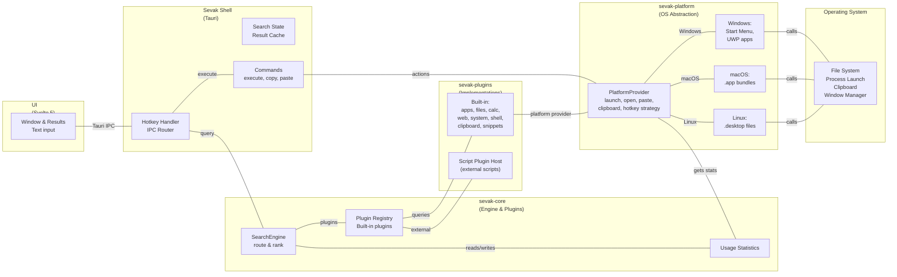
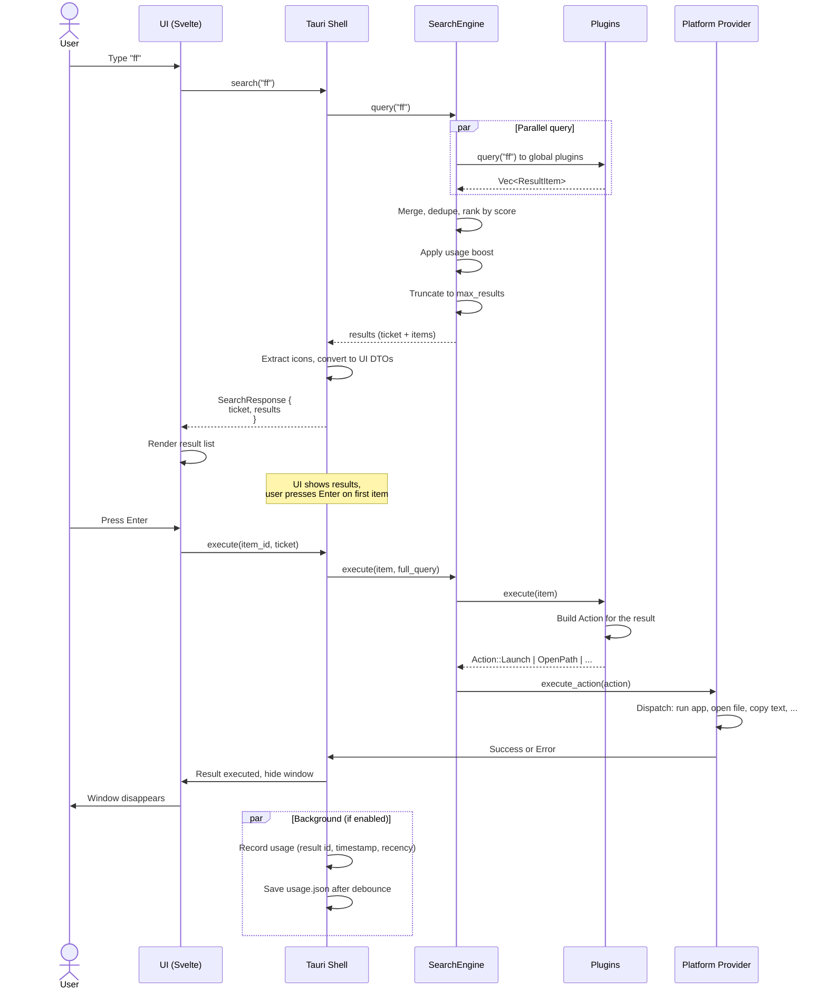
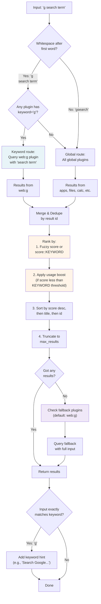
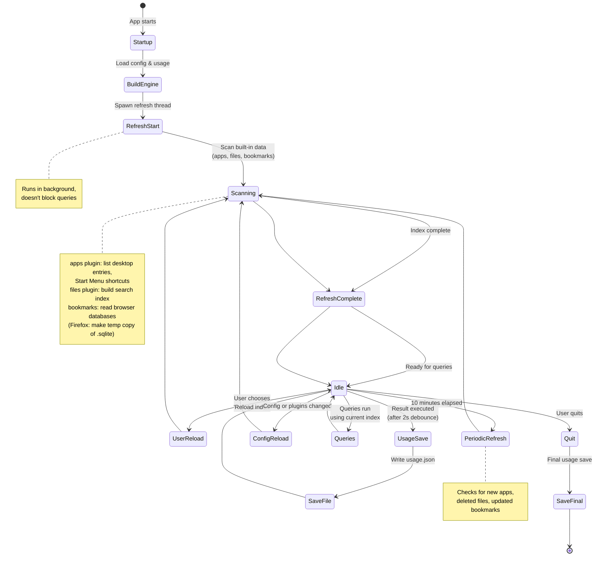

# How Sevak works

This guide explains Sevak's architecture for curious users and contributors. It covers the main components, how a query flows through the system, and the strategies used for hotkeys and indexing.

## System components



**Component breakdown:**

- **UI (Svelte 5):** The launcher window with the search input, result list, and action panel. Communicates with Tauri via IPC commands.
- **Sevak Shell (Tauri):** Owns the application window, system hotkey registration, tray icon, and CLI argument parsing. Routes queries to the engine and executes actions via the platform provider. Manages the single-instance lock (on Windows/macOS/Linux).
- **SearchEngine:** The core: routes queries to plugins, ranks results by fuzzy match and usage statistics, applies fallback search, and supplies late-result notification callbacks.
- **Built-in plugins:** Apps, files (and whole-disk / content search through the OS index), calculator (with unit/currency conversion), web search, system commands, automation tasks, media controls, shell commands, clipboard history (text, images and files), snippets, the emoji picker, contacts, 1Password, the dictionary, the opt-in AI assistant, and bookmarks. Each implements the `Plugin` trait and answers queries from in-memory data or, for slow sources such as the OS file index, through late results. The file buffer and snippet expansion as you type live beside them.
- **Script Plugin Host:** Discovers and manages external plugins—scripts in Python, PowerShell, Node.js, or any language—without requiring a rebuild.
- **Workflows:** A graph engine and runtime for [workflows](workflows.md) (keyword, script filter, hotkey, Universal Actions and external triggers chained to actions and outputs), plus the opt-in gallery. See [Workflows for contributors](plugins.md#workflows-for-contributors).
- **Platform Provider:** The OS abstraction. Launches apps, opens files and URLs, manages clipboard, synthesizes keypresses for pasting, captures the selection (for Universal Actions), and provides the hotkey strategy.

## Query lifecycle



**Key points:**

- **Per keystroke:** `query` runs on a worker thread (never the main thread) and must complete in milliseconds.
- **Result caching:** Results are stored with a ticket number so later-arriving script plugin results can still update the list by rerunning `query` with the cached results.
- **Execute path:** The item contains a prebuilt `Action` from the plugin; `execute_action` in the platform layer handles standard actions without plugin involvement.
- **Usage recording:** After a successful action, the result's id is logged with a timestamp for ranking boost on future queries. This ranking is what "Learn as you type" means.

## Keyword routing and ranking



**Routing rules:**

1. **Whitespace-only input:** No results.
2. **Keyword route** (e.g., `g ` for Google): Only plugins with that keyword answer; no fallback.
3. **Symbol keywords** (e.g., `>`): No space required—`>ls` triggers the shell plugin.
4. **Global route:** All plugins with `global() == true` answer (apps always global; files/bookmarks only if configured).
5. **Fallback search:** If global route found nothing, query the fallback (usually `web:g` for web search).
6. **Keyword hints:** If you type a keyword alone (`g`), a hint row appears so Tab autocompletes it to `g `.

**Ranking:**

- Fuzzy matches score roughly 16–20 points per character plus bonuses for word starts.
- Non-fuzzy sources (calculator, clipboard history) use fixed scores: `EXACT_ANSWER` (10,000), `KEYWORD` (5,000), or `FALLBACK` (0).
- **Usage boost:** Recent and frequent launches get a boost that halves every 72 hours. Prefix matches get a flat bonus. Boosts only apply below `KEYWORD` threshold.
- **Deduplication:** If multiple plugins return the same result id, the highest score wins.

## Executing a result

```mermaid
sequenceDiagram
    actor User
    participant UI as UI
    participant Tauri as Tauri Shell
    participant Engine as SearchEngine
    participant Plugin as Plugin
    participant Platform as Platform Provider
    participant App as Target App
    
    Note over User,App: Execute primary action (Enter)
    
    User->>UI: Press Enter on Firefox result
    UI->>Tauri: execute(item_id='apps:firefox.exe', <br/>ticket=42)
    
    Tauri->>Tauri: Find cached ResultItem by id
    
    alt Cached ResultItem found
        Tauri->>Engine: execute_secondary(item, index=-1, query)
        Engine->>Engine: Find plugin by item.plugin_id
        Engine->>Plugin: execute(item)
        Plugin->>Plugin: Validate Action::Launch
        Plugin-->>Engine: Ok(())
    else Cached ResultItem missing
        Tauri-->>UI: Error: "Result expired"
    end
    
    Engine->>Platform: execute_action(&item.action)
    Platform->>Platform: Match on action type
    
    alt Action::Launch
        Platform->>Platform: Resolve LaunchTarget to command
        Platform->>App: Spawn process (detached)
    else Action::OpenPath
        Platform->>App: Open file with default handler
    else Action::OpenUrl
        Platform->>App: Open URL in default browser
    else Action::CopyText
        Platform->>Platform: Set clipboard
    else Action::PasteText
        Platform->>Platform: Copy text
        Platform->>Platform: Remember foreground app
        Platform->>Platform: Bring it back to focus
        Platform->>Platform: Synthesize Ctrl+V / Cmd+V
        Platform->>Platform: Restore old clipboard (if requested)
    else Action::RevealPath
        Platform->>Platform: Open folder with item highlighted
    else Action::RunAsAdmin
        Platform->>Platform: Launch with elevation (Windows UAC)
    else Action::Custom
        Platform-->>Plugin: "Unsupported; ask plugin"
        Plugin->>Plugin: Handle custom payload
    end
    
    Platform-->>Engine: Result: Success or Error
    Engine-->>Tauri: Success or Error message
    
    Tauri->>Tauri: Record usage: result id + timestamp
    Tauri->>UI: hide_window()
    UI->>UI: Window disappears
    
    opt Late result handling
        Note over Tauri: If error, don't hide;
        Note over Tauri: user can retry or try a different result
    end
```

**Execute path:**

1. **Lookup:** The cached `ResultItem` is found by id from the last successful search.
2. **Plugin execution:** The plugin validates its action and returns success or an error.
3. **Platform dispatch:** Standard actions (`Launch`, `OpenPath`, `CopyText`, `PasteText`, etc.) are handled by the platform provider. `Custom` actions are unsupported at this layer and require the plugin to handle them.
4. **Usage record:** On success, the result id is logged with a timestamp for the usage store. This is how the launcher learns which results you pick.
5. **Error handling:** If an action fails, the window stays open so you can try again.

**Secondary actions** (Ctrl+Enter, Shift+Enter, or via the action panel) follow the same path with a different action swapped into the item.

## Hotkey strategies per OS

```mermaid
graph TD
    A["Sevak is running"] --> B{Operating System}
    
    B -->|Windows| C1["In-App Global Shortcut<br/>(HotkeyStrategy::InApp)"]
    B -->|macOS| C2["In-App Global Shortcut<br/>(HotkeyStrategy::InApp)"]
    B -->|X11 Linux| C3["In-App Global Shortcut<br/>(HotkeyStrategy::InApp)"]
    B -->|Wayland Linux| C4["External Hotkey<br/>(HotkeyStrategy::External)"]
    
    C1 --> D1["Tauri global-shortcut plugin<br/>registers hotkey via OS"]
    C2 --> D2["Tauri global-shortcut plugin<br/>uses Cocoa APIs"]
    C3 --> D3["Tauri global-shortcut plugin<br/>uses X11 grab"]
    C4 --> D4["Sevak does NOT register.<br/>Desktop environment owns it."]
    
    D1 --> E1["Hotkey pressed"]
    D2 --> E2["Hotkey pressed"]
    D3 --> E3["Hotkey pressed"]
    D4 --> E4["Desktop runs:<br/>sevak --toggle"]
    
    E1 --> F["Tauri calls<br/>hotkey::pressed()"]
    E2 --> F
    E3 --> F
    E4 --> G["CLI launches new<br/>single-instance handler"]
    
    G --> H["Single-instance forwards<br/>to running Sevak"]
    H --> F
    
    F --> I{Which hotkey?}
    
    I -->|Main hotkey| J["Toggle window<br/>show/hide"]
    I -->|Actions hotkey| K["Capture selection<br/>Show action panel"]
    I -->|[[hotkey]] entry| L["Execute direct query<br/>or run by id"]
    
    J --> M["window::toggle()"]
    K --> N["selection::trigger()"]
    L --> O["direct::open_with_query()<br/>or direct::run_result()"]
    
    M --> P["Window visible?"]
    P -->|Yes| Q["Hide & return<br/>focus to previous app"]
    P -->|No| R["Show & focus"]
    
    style C4 fill:#ffe8e8
    style E4 fill:#ffe8e8
    style D1 fill:#e8f4f8
    style D2 fill:#e8f4f8
    style D3 fill:#e8f4f8
```

**Hotkey strategies:**

- **Windows, macOS, X11 Linux:** Sevak grabs the configured global shortcut through the Tauri `global-shortcut` plugin. When you press it, the plugin invokes the handler immediately.
- **Super+Space (the default) and keys another app owns:** The OS reserves Win+Space (input language), Cmd+Space (Spotlight) and Super+Space (GNOME input sources). On Windows a low-level keyboard hook (`sevak_platform::hotkey_hook`, one hook thread shared with snippet expansion) recognises exactly the configured shortcuts the plugin cannot register, swallows them and sends the shell the same "pressed" event; the recognising logic is a pure state machine with unit tests. On macOS and GNOME, Sevak asks once whether it may turn the OS shortcut off or move it, records the answer and the old values (`hotkey-takeover.json`) and can restore them (`sevak --restore-hotkey`). See [Troubleshooting](troubleshooting.md#super-space).
- **Wayland Linux:** Applications cannot grab keys (security model). Instead, the desktop environment (typically GNOME) owns the bindings and runs `sevak --toggle` (or `--actions`, `--query`, `--run`) when the hotkey is pressed. Sevak's single-instance handler forwards the command to the running instance.
- **Single-instance:** Only one Sevak process runs. If a second instance is launched, it exits after forwarding its arguments to the first.

## Indexing lifecycle



**Indexing lifecycle:**

1. **Startup:** The app loads the config and usage statistics, builds the search engine, and spawns a background refresh thread.
2. **Initial scan:** Apps, files, and browser bookmarks are indexed.
3. **Queries run:** Until a refresh completes, queries use the previous index. Late refresh results are shown via `sevak:results` event if still relevant.
4. **Periodic refresh:** Every 10 minutes, the index is updated in the background. A file that hasn't changed (modification time and size) is not re-read.
5. **User reload:** "Reload index" in the tray menu forces an immediate refresh.
6. **Config reload:** Editing `config.toml` or restarting triggers a rebuild.
7. **Usage save:** After a result is executed, usage is written to disk after a 2-second debounce (to avoid thrashing on rapid launches).

## Script plugin process model

```mermaid
sequenceDiagram
    participant Sevak
    participant ScriptHost as Script Host
    participant Process as Script Process
    participant Script as Script Code
    
    Note over Sevak,Script: Startup (lazy)
    
    User->>Sevak: Type "hello world"
    Sevak->>ScriptHost: query("hello", plugin_id)
    
    alt Process not running
        ScriptHost->>ScriptHost: Load plugin.toml
        ScriptHost->>ScriptHost: Build command
        ScriptHost-->>Process: spawn(["python", "main.py"])
        Process->>Script: Process starts
    end
    
    ScriptHost->>Process: Send JSON:<br/>{"type":"initialize",...}
    Process->>Script: Parse initialize
    opt Script replies (optional)
        Script->>Process: stdout: {"type":"ready"}
    end
    
    ScriptHost->>ScriptHost: Start timer<br/>(timeout_ms = 50ms)
    ScriptHost->>Process: Send JSON:<br/>{"type":"query",<br/>"request_id":1,<br/>"input":"world"}
    
    par Query wait
        Process->>Script: Execute query logic
        Script->>Script: Do I/O, compute, etc.
    end
    
    alt Before timeout (50ms)
        Script->>Process: stdout: {"type":"results",...}
        Process->>ScriptHost: JSON received
        ScriptHost->>ScriptHost: Parse, validate, cache
        ScriptHost-->>Sevak: results
        Sevak->>User: Show results
    else Timeout, answer comes late
        ScriptHost->>ScriptHost: Timeout; show cached or empty
        ScriptHost-->>Sevak: Late answer dropped or queued
        Note over ScriptHost: Later keystroke (newer request_id)
        Note over ScriptHost: Late result still arrives
        ScriptHost->>ScriptHost: If for newest request,<br/>emit sevak:results event
        Sevak->>Sevak: Re-run query with<br/>now-cached result
        User->>User: List updates
    end
    
    Note over ScriptHost: User picks result or types more
    
    alt Custom action result
        User->>Sevak: Press Enter on custom action
        Sevak->>ScriptHost: execute(key, payload)
        ScriptHost->>Process: Send JSON:<br/>{"type":"execute",...}
        Process->>Script: Handle execution<br/>(e.g., save note)
        Note over Process: No reply; script does work
    end
    
    Note over ScriptHost: Idle timeout or shutdown
    
    ScriptHost->>Process: Send JSON:<br/>{"type":"shutdown"}
    Process->>Script: Graceful shutdown
    Script->>Process: Exit
    Note over ScriptHost: Wait 500ms, then kill if needed
```

**Script plugin communication:**

1. **Lazy start:** A persistent script starts only when its keyword is first used, not at Sevak startup.
2. **Protocol:** Newline-delimited JSON (NDJSON) over stdin/stdout. Every line is one message object, UTF-8.
3. **Query flow:** Sevak sends a `query` message with a request_id and input. The script has `timeout_ms` (default 50ms) to reply.
4. **Late results:** If the script answers after the timeout, Sevak uses the previous cached result (if the typed text is similar) and queues the late answer. The next keystroke reuses the cache, avoiding a flash of empty results.
5. **Execute:** If the user picks a result with a `custom` action, Sevak sends an `execute` message. The script handles it and does not reply.
6. **Graceful shutdown:** When Sevak quits or reloads, it sends `shutdown` and waits 500ms for the process to exit. If it doesn't, Sevak kills it.

**Process lifecycle:**

- **Idle timeout:** After `idle_timeout_secs` (default 5 minutes) with no queries, the script is shut down to free resources.
- **Crashes:** If the process dies or violates the protocol, it counts as a failure. After 5 failures in a row, the plugin stays off until the next "Reload index".
- **Hard timeout:** If a query stays unanswered for `hard_timeout_ms` (default 3 seconds), the process is killed and marked as hung.

---

## More information

- For **why** Sevak is built this way (local-first, the closed action vocabulary, approval before run, the release process and more), see the [design decisions](decisions/index.md). For what it protects and how, see the [threat model](security/threat-model.md).
- For how to write a **built-in plugin**, see [Writing plugins](plugins.md).
- For **external script plugins** (Python, PowerShell, Node.js), see [External plugins](plugins.md#external-plugins).
- For **development setup**, see [Developing Sevak](development.md).
