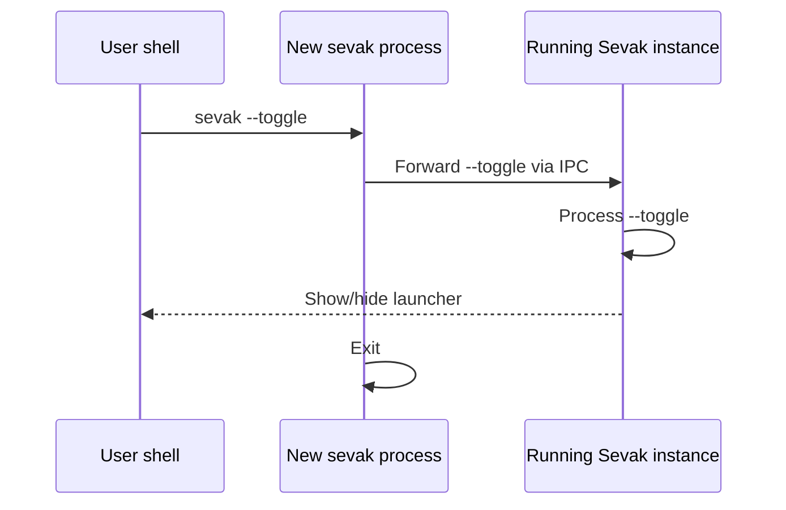

# Command-line reference

Sevak can be controlled from the command line or automated with scripts. When Sevak is already running, a new command forwards its request to the running instance (single-instance architecture).

## Quick reference

| Flag | Effect |
|---|---|
| (none) | Start Sevak; show the search bar if not already visible |
| `--toggle` | Show the search bar, or hide it if visible |
| `--query TEXT` | Show the search bar with TEXT already typed |
| `--run ID` | Run a result by its id without showing the search bar |
| `--actions` | Universal Actions: capture the selection in the foreground app |
| `--trigger WORKFLOW/ID [TEXT]` | Start a workflow's external trigger, with TEXT as its argument |
| `--background` | Start Sevak without showing the window |
| `--settings` | Open the Settings window |
| `--quit` | Quit the running instance |
| `--setup-hotkey [KEY]` | Bind hotkeys to GNOME (Wayland desktop on Linux); offers to free Super+Space |
| `--restore-hotkey` | Put back system shortcuts Sevak changed with your permission (GNOME input sources, macOS Spotlight) |
| `--diagnostics` | Print a report for bug reports (version, system, settings summary, plugin status, recent log lines) with private data removed |
| `--config PATH` | Use a custom config folder or file; overrides `SEVAK_CONFIG_DIR` |
| `-h`, `--help` | Print help |
| `-V`, `--version` | Print version |

## Environment variables

| Variable | Purpose |
|---|---|
| `SEVAK_CONFIG_DIR` | Path to the config folder (overridden by `--config`). If this is set and the folder exists, the config is read from there. |
| `SEVAK_DATA_DIR` | Path to the data folder (usage statistics, logs). If set, overrides the default platform-specific location. |
| `SEVAK_LOG` | Log level filter. Examples: `SEVAK_LOG=debug` for detailed output, `SEVAK_LOG=warn` for warnings and errors only. Defaults to `info`. |

## Flags

### Start or show

#### (no arguments)

```bash
sevak
```

Start Sevak in the background if it is not running. If it is already running and the search bar is hidden, show it. Does nothing if the bar is already visible.

#### `--toggle`

```bash
sevak --toggle
```

Toggle the search bar: show it if hidden, hide it if visible. This is the primary way to bind Sevak to a global hotkey.

On Wayland, where applications cannot grab global keys, bind this to a key in your desktop settings (or use `sevak --setup-hotkey` on GNOME).

#### `--query TEXT`

```bash
sevak --query "firefox"
sevak --query "> pip install requests"
sevak --query ""
```

Show the search bar with TEXT already typed. Used to:

- Open Sevak with a specific search, e.g. `"firefox"` to search for Firefox
- Pre-fill a shell prompt with `"> "` or `">"` (see [Shell commands](features/shell.md))
- Open an empty launcher with an empty string `""`

#### `--background`

```bash
sevak --background
```

Start Sevak in the background. The search bar does not appear. Useful for the `launch_at_login` setting or autostart scripts.

#### `--run ID`

```bash
sevak --run "apps:firefox.desktop"
sevak --run "files:/home/user/Documents"
sevak --run "system:lock"
```

Run a result by its id directly without showing the search bar. The launcher stays hidden. Useful for hotkey bindings, e.g. bind `Ctrl+Alt+L` to `sevak --run "system:lock"`.

See [custom hotkeys](configuration.md#hotkey) for result id formats. Automation tasks have ids too: `tasks:dark_mode`, `tasks:volume:30`, `tasks:keep_awake:45`, `tasks:kill:chrome.exe` (see [Automation tasks](features/tasks.md#bind-a-task-to-a-hotkey)).

#### `--actions`

```bash
sevak --actions
```

Universal Actions: capture what you have selected in the currently focused app (text, a URL, files) and offer actions on it. On Wayland, bind this to a key in your desktop settings or use `sevak --setup-hotkey` on GNOME.

#### `--trigger WORKFLOW/ID [TEXT]`

```bash
sevak --trigger my-flow/go                 # no text
sevak --trigger my-flow/go some text       # several words are one text
sevak --trigger my-flow/go -- --starts-with-dashes
```

Start the external trigger `ID` of the [workflow](workflows.md) in the folder `WORKFLOW` (under `workflows/` next to `config.toml`), with the rest of the command line as its argument. The words after it are its text, up to the next option; `--` makes everything after it text. Use it from a desktop shortcut on Wayland, a script, a file manager action or a scheduled task.

The workflow must be enabled, valid and allowed to run; otherwise the launcher opens and says why. A workflow's hotkey trigger can also be run with `sevak --run workflow:<folder>:run:<node id>`.

### Interaction

#### `--settings`

```bash
sevak --settings
```

Open the Settings window. If Sevak is not running, start it with the Settings window shown.

#### `--quit`

```bash
sevak --quit
```

Quit the running instance. If Sevak is not running, this does nothing and exits cleanly.

### Configuration

#### `--config PATH`

```bash
sevak --config ~/.local/share/sevak
sevak --config /etc/sevak/config.toml
sevak --config .\Config
```

Use a custom config folder or config file instead of the default location. Takes precedence over the `SEVAK_CONFIG_DIR` environment variable.

- If `PATH` ends in `.toml` and is not an existing directory, it is treated as the config file itself; the folder containing it is the config folder.
- Otherwise, `PATH` is treated as the config folder; the file is `config.toml` inside it.
- `~` is expanded to your home directory.
- Relative paths are resolved relative to the current working directory.

This flag only affects a newly started instance. If Sevak is already running, it keeps its own config folder; the flag is noted in the log for reference.

#### `--setup-hotkey [KEY]`

(Linux Wayland with GNOME only)

```bash
sevak --setup-hotkey              # use the hotkey from config.toml
sevak --setup-hotkey "Ctrl+Space"
sevak --setup-hotkey "Super+F"
```

Create GNOME custom keyboard shortcuts that bind your hotkeys to Sevak commands. On Wayland, where applications cannot register global keys, this command asks GNOME to handle key events and forward them to Sevak.

It creates shortcuts for:

- The main hotkey (`[general] hotkey`) → `sevak --toggle`
- Universal Actions hotkey (`[general] actions_hotkey`) → `sevak --actions`
- Each `[[hotkey]]` entry → `sevak --query '<text>'` or `sevak --run <id>`

If you pass a KEY, it overrides the hotkey from `config.toml` just for this setup. The config file is not modified.

On other desktops (KDE, Sway, etc.), bind hotkeys through your desktop's keyboard settings. On X11, hotkeys are registered directly by Sevak and this command is not needed.

After editing `config.toml`, run `--setup-hotkey` again to update GNOME shortcuts. Delete old shortcuts in GNOME's keyboard settings if you remove entries from the config.

GNOME uses ++super+space++ to switch input sources, so it would keep that key from Sevak. When your hotkey is `Super+Space` (the default) and GNOME's switcher uses it, `--setup-hotkey` explains what it would change, shows the old value and asks you to confirm (type `y`). It then moves the input-source shortcuts (`switch-input-source` and `-backward` under `org.gnome.desktop.wm.keybindings`) to the same keys with Ctrl added, saves the previous values in `hotkey-takeover.json` in the data folder and prints what changed. Without a terminal it asks nothing and changes nothing. Undo it with `sevak --restore-hotkey`.

#### `--restore-hotkey`

```bash
sevak --restore-hotkey
```

Puts back the system shortcuts Sevak changed with your permission: GNOME's input-source shortcuts (Linux) or Spotlight's "Show Spotlight search" shortcut (macOS). It prints what it restored, or says there was nothing to restore. On Windows Sevak never changes a system setting, so there is nothing to restore. After restoring, Sevak's own shortcut may clash with the system's again; choose another key in Settings (for example ++alt+space++) or run `sevak --setup-hotkey KEY`.

### Information

#### `-h`, `--help`

```bash
sevak --help
sevak -h
```

Print the help message and exit.

#### `-V`, `--version`

```bash
sevak --version
sevak -V
```

Print the version and exit.

#### `--diagnostics`

```bash
sevak --diagnostics
sevak --diagnostics > sevak-diagnostics.md
sevak --diagnostics --config ~/other-sevak
```

Print a Markdown report that makes a bug report much easier to act on, then exit. Sevak has no telemetry, so this report is the way to tell the maintainers what your installation looks like. It is made on your computer, printed to your terminal and **never sent anywhere**: you read it and decide whether to paste it into an [issue](https://github.com/ninad-k/Sevak/issues/new/choose).

It reads files only, so it works whether or not Sevak is running (it does not contact the running instance, and does not start a second one). Because of that it cannot say whether the shortcut is registered or the tray icon exists, or which plugins loaded; the report from **Settings → Help → Copy diagnostics** adds those. It does build the app and file indexes once to count them, which can take a few seconds.

The first lines of the report say exactly what is and is not in it; see [Privacy](privacy.md#diagnostics-report) for the details. In short it has the version and build, your OS and display server, where Sevak is installed, which features are on, your shortcut, the theme and the keywords in use, the names and sizes of the files in Sevak's folders, the status of every plugin, script plugin and workflow, a few health checks, and the last 100 log lines with private text removed. It never has what you searched for, clipboard or snippet text, the contents of scripts or workflows, usage statistics, contacts, 1Password data or file lists.

To keep the report in a file, use `sevak --diagnostics > sevak-diagnostics.md` in a terminal that understands `>`. On Windows, where Sevak is a window program rather than a console program, `>` may produce an empty file in Command Prompt. Use PowerShell instead:

```powershell
sevak --diagnostics | Out-File -Encoding utf8 sevak-diagnostics.md
```

or **Settings → Help → Save as file**, which works the same everywhere. `--help` and `--version` behave the same way.

## Single-instance forwarding

When you run `sevak` and the app is already running, your command is forwarded to the running instance. Here is how it works:



This means:

- Only one instance of Sevak runs at a time.
- Commands from new invocations are processed by the running instance.
- If Sevak is not running, the new invocation starts it.
- The `--config` flag is ignored by the running instance (it keeps its own config path).

Exit codes:

| Code | Meaning |
|---|---|
| 0 | Success (including `--help` and `--version`) |
| 1 | Sevak could not start or run (the error is printed and logged) |
| 2 | Invalid command line: unknown flag, missing value or conflicting flags (the usage text is printed) |

## Examples

**Bind a key to show/hide Sevak with the macOS system shortcuts:**

Add to your keyboard shortcuts under System Settings:

```
/Applications/Sevak.app/Contents/MacOS/sevak --toggle
```

**Bind Ctrl+Alt+T to open a shell prompt on Windows:**

Use Task Scheduler or a tool like AutoHotkey to run:

```powershell
sevak --query "> "
```

**Lock the desktop from anywhere:**

```bash
sevak --run "system:lock"
```

**Search for a specific file from a script:**

```bash
sevak --query "f my-project"
```

**Start Sevak on login (Linux):**

Add to your `.bash_profile` or autostart script:

```bash
sevak --background
```

**Check Sevak version in a script:**

```bash
sevak --version
```

## Development and debugging

**Enable debug logging:**

=== "Bash/Linux/macOS"

    ```bash
    SEVAK_LOG=debug sevak
    ```

=== "PowerShell/Windows"

    ```powershell
    $env:SEVAK_LOG = "debug"
    sevak
    ```

=== "Windows CMD"

    ```cmd
    set SEVAK_LOG=debug
    sevak
    ```

Logs are written to:

=== "Windows"

    `%APPDATA%\sevak\logs\`

=== "macOS"

    `~/Library/Application Support/sevak/logs/`

=== "Linux"

    `~/.local/share/sevak/logs/`

**Test a config file before deployment:**

```bash
sevak --config /path/to/test/config.toml --version
```

This loads the config without starting the UI. Parsing errors are printed to the terminal.
