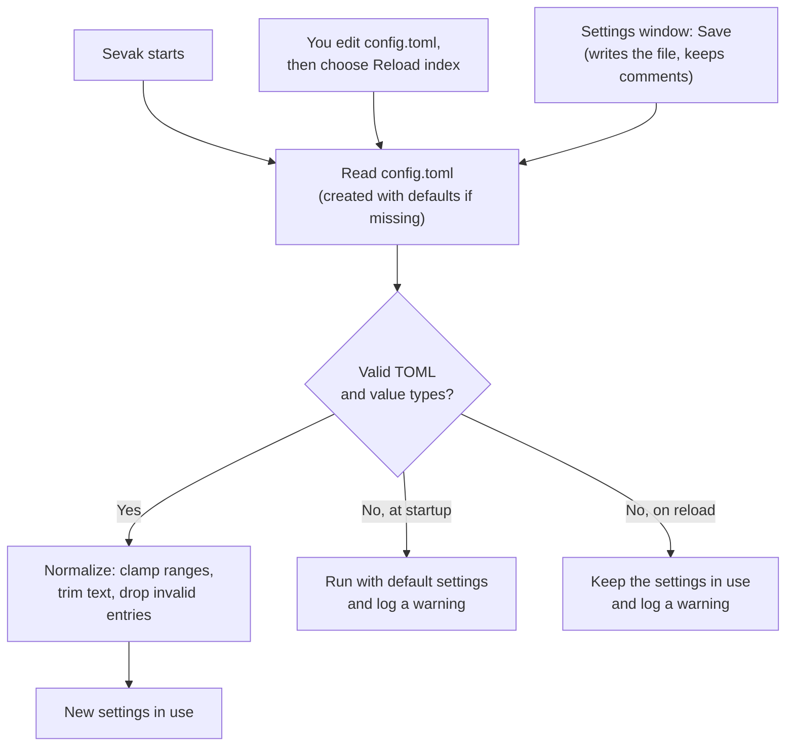

# Configuration file reference

Sevak stores settings in a TOML file. You can edit it by hand or use the Settings window. This page documents every configuration key.

## Where the file is

=== "Windows"

    `%APPDATA%\sevak\config.toml`
    
    Example: `C:\Users\Ninad\AppData\Roaming\sevak\config.toml`

=== "macOS"

    `~/Library/Application Support/sevak/config.toml`

=== "Linux"

    `~/.config/sevak/config.toml`

You can override the config folder with the `SEVAK_CONFIG_DIR` environment variable or the `--config` flag. The Settings window's "Open config file" button opens it in your editor.

## Editing and reloading

After making changes to `config.toml`:

- Choose **Reload index** from the tray menu or menu bar (fastest).
- Or restart Sevak.

If the file has a mistake (invalid TOML or a value of the wrong type), Sevak never overwrites it. At startup it runs with the default settings; on **Reload index** it keeps the settings already in use. Either way the problem is written to the [log](files-and-data.md), so check there if a change seems to have no effect. Comments and key order are preserved when Settings saves changes.

A minimal config works: missing fields use their defaults, so a nearly empty file is valid.

## How configuration is loaded



## Configuration sections

### [general]

Main hotkeys and startup behaviour.

| Key | Type | Default | Description |
|---|---|---|---|
| `hotkey` | string | `"Alt+Space"` | Global keyboard shortcut to show/hide Sevak. Examples: `"Ctrl+Space"`, `"Super+Space"`, `"Ctrl+Shift+K"`. On macOS, `Alt` is the Option key. On Linux Wayland, run `sevak --setup-hotkey` to bind this in GNOME instead. |
| `actions_hotkey` | string | `"Ctrl+Alt+Space"` | Hotkey for Universal Actions: capture the selection in the foreground app and offer actions on it. Empty string `""` turns Universal Actions off. On Wayland, run `sevak --setup-hotkey` to bind this in GNOME. |
| `hide_on_blur` | boolean | `true` | Hide the launcher when it loses focus to another window. Press Esc or click elsewhere to close; this setting hides it automatically. |
| `launch_at_login` | boolean | `false` | Start Sevak when you log in to your desktop. |
| `check_for_updates` | boolean | `true` | Check GitHub for a new version at startup and once daily. Updates are only installed after you confirm. Apart from optional currency rates, this is the only automatic network request. |

```toml
[general]
hotkey = "Alt+Space"
actions_hotkey = "Ctrl+Alt+Space"
hide_on_blur = true
launch_at_login = false
check_for_updates = true
```

### [window]

Launcher window appearance.

| Key | Type | Default | Range | Description |
|---|---|---|---|---|
| `width` | integer | `720` | 400–1600 (logical pixels) | Width of the search bar window. Logical pixels scale with the display's DPI. |

```toml
[window]
width = 720
```

### [linux]

Linux-specific settings (ignored on Windows and macOS).

| Key | Type | Default | Description |
|---|---|---|---|
| `wayland_use_xwayland` | boolean | `true` | On Wayland sessions, draw Sevak through XWayland (X11 compatibility layer). Native Wayland windows cannot position themselves or request focus reliably, so XWayland keeps the launcher centred and typeable. Set to `false` to use the native Wayland backend (window may appear off-centre and not accept input). Only used on Wayland; X11 sessions ignore this. |

```toml
[linux]
wayland_use_xwayland = true
```

### [search]

Search behaviour and fallback when no results match.

| Key | Type | Default | Range | Description |
|---|---|---|---|---|
| `max_results` | integer | `8` | 1–20 | Maximum number of results shown at once. |
| `fallback_web_search` | string or list | `"g"` | any keyword from `[[web_search]]` entries | When a query has no local results, offer a web search with this engine. Write as a single string `"g"` or a list to try several in order: `["g", "yt", "gh"]`. Empty string `""` disables the fallback. Keywords are matched case-insensitively; only one keyword per engine. |
| `query_history` | boolean | `true` | — | Remember the last 50 queries you ran. Press Up/Down on an empty search box to recall them. `false` disables history and clears it. |

```toml
[search]
max_results = 8
fallback_web_search = "g"
query_history = true
```

### [appearance]

Launcher theme and styling.

| Key | Type | Default | Range/Values | Description |
|---|---|---|---|---|
| `theme` | string | `"system"` | `"system"`, `"light"`, `"dark"` | `"system"` follows your OS dark-mode preference. Invalid values fall back to `"system"` and are reported in the log and Settings. |
| `accent` | string | `""` (empty) | `"#rgb"`, `"#rrggbb"`, `"rgb(r, g, b)"`, or `""` | Override the theme's accent colour for buttons and highlights. `""` uses the theme's own accent. Invalid values fall back to `""` with a warning. |
| `font_size` | integer | `15` | 12–22 (pixels) | Size of result titles. The rest of the launcher (icons, text, spacing) scales with it. Clamped to the range. |
| `font_family` | string | `""` (empty) | any font family name, comma-separated | Comma-separated font family list, e.g. `"Fira Sans, sans-serif"`. Empty uses your system font. CSS font-family syntax; if the font is missing, the next in the list is used. |
| `opacity` | integer | `100` | 30–100 (percent) | Background opacity of the search bar. 100 is fully opaque; 30 is quite transparent. Whole numbers only. |
| `radius` | integer | `14` | 0–32 (pixels) | Corner radius of the search bar. 0 is sharp corners; 32 is very rounded. Whole numbers only. |
| `custom_css` | string | `""` (empty) | filename in config folder, or `""` | Stylesheet to override theme colours and layout. Must be a file in the config folder (same folder as `config.toml`), e.g. `"theme.css"`. `""` loads none. See [Themes guide](themes.md) for available CSS variables. |

```toml
[appearance]
theme = "system"
accent = ""
font_size = 15
font_family = ""
opacity = 100
radius = 14
custom_css = ""
```

### [plugins]

Which plugins are active. Each built-in plugin can be disabled.

| Key | Type | Default | Description |
|---|---|---|---|
| `disabled` | array of strings | `[]` | Plugin ids to turn off. Available ids: `"apps"`, `"calculator"`, `"files"`, `"bookmarks"`, `"system"`, `"shell"`, `"clipboard"`, `"snippets"`, `"selection"` (Universal Actions), `"web:<keyword>"` (specific web-search engines). Example: `disabled = ["files", "web:yt"]` turns off file search and YouTube search. Unknown ids are ignored. |

```toml
[plugins]
disabled = []
```

### [calculator]

Calculator and unit conversion settings.

| Key | Type | Default | Description |
|---|---|---|---|
| `currency` | boolean | `false` | Enable currency conversion (e.g. `100 usd in eur`). Off by default because it requires network access: Sevak downloads the European Central Bank's daily reference rates (a small XML file, no API key) at most once per day and caches them. Unit conversion (e.g. `10 km in mi`) never needs the network and is always on. |

```toml
[calculator]
currency = false
```

### [files]

Indexed file search settings.

| Key | Type | Default | Description |
|---|---|---|---|
| `directories` | array of strings | `["~/Desktop", "~/Documents", "~/Downloads"]` | Root folders to index recursively. `~` expands to your home directory and works on all platforms. Relative paths are anchored at the working directory when Sevak starts (usually your home). Forward slashes work everywhere; avoid unescaped backslashes. The index caps at 100,000 entries; reduce roots or depth if you hit this. |
| `max_depth` | integer | `4` | How many folder levels below each root are indexed. `1` means only files directly in the root. |
| `include_hidden` | boolean | `false` | Index dot-files and dot-folders (starting with `.`). `false` ignores them. |
| `keyword` | string | `"f"` | Prefix to search only files: type `f filename`. Leave empty `""` to disable keyword search. |
| `global` | boolean | `true` | Show file results even in ordinary queries without the keyword. `false` requires `f <name>` to search files. |

```toml
[files]
directories = ["~/Desktop", "~/Documents", "~/Downloads"]
max_depth = 4
include_hidden = false
keyword = "f"
global = true
```

### [bookmarks]

Browser bookmark search settings.

| Key | Type | Default | Description |
|---|---|---|---|
| `browsers` | array of strings | `[]` | Browser profiles to index. Empty `[]` means every browser found on your system. Supported ids: `"chrome"`, `"edge"`, `"brave"`, `"vivaldi"`, `"chromium"`, `"opera"`, `"opera-gx"`, `"firefox"`, `"librewolf"`, `"zen"`. All profiles of each browser are searched. Unknown ids are ignored. |
| `keyword` | string | `"b"` | Prefix to search only bookmarks: type `b term`. Leave empty `""` to disable keyword search. |
| `global` | boolean | `true` | Show bookmark results in ordinary queries without the keyword. `false` requires `b <term>` to search bookmarks. |

```toml
[bookmarks]
browsers = []
keyword = "b"
global = true
```

### [system]

System commands (lock, sleep, restart, etc.) and settings pages.

| Key | Type | Default | Description |
|---|---|---|---|
| `confirm` | boolean | `true` | Ask for confirmation before restart, shut down, log out and emptying the trash. Power commands are destructive so default to "ask". |
| `disabled` | array of strings | `[]` | Commands and settings pages to hide. Options: `"lock"`, `"sleep"`, `"hibernate"`, `"restart"`, `"shutdown"`, `"logout"`, `"empty_trash"`, `"settings"` (all settings pages), or specific pages like `"settings:bluetooth"`, `"settings:wifi"`. Case-insensitive. Unknown entries are ignored. To turn off the entire plugin, add `"system"` to `[plugins] disabled` instead. |

```toml
[system]
confirm = true
disabled = []
```

### [shell]

Shell command execution settings (type `> <command>` to run a command).

| Key | Type | Default | Description |
|---|---|---|---|
| `terminal` | string | `""` (auto-detect) | Terminal program to run commands in. Empty means auto-detect: Windows Terminal (else a console window) on Windows, Terminal.app on macOS, `$TERMINAL` environment variable then common terminals on Linux. You can give a program name (`"wt"`, `"iterm"`, `"kitty"`), a full path, or a command with arguments (`"alacritty --class sevak"`). |
| `shell` | string | `""` (auto-detect) | Shell that runs the command. Empty means auto-detect: `pwsh`, then `powershell`, then `cmd` on Windows; `$SHELL` environment variable or `sh` on Linux. Ignored on macOS, where the terminal starts your login shell. You can give a program name or full path. |
| `keep_open` | boolean | `true` | Keep the terminal open at a shell prompt after the command exits. `false` closes it when done. |

```toml
[shell]
terminal = ""
shell = ""
keep_open = true
```

### [paste]

How text is pasted into the previously focused app.

| Key | Type | Default | Description |
|---|---|---|---|
| `restore_clipboard` | boolean | `false` | After pasting from clipboard history or snippets, restore the previous clipboard contents. `false` leaves the pasted text in the clipboard. |

```toml
[paste]
restore_clipboard = false
```

### [actions]

Universal Actions: how the selection in another app is captured.

| Key | Type | Default | Description |
|---|---|---|---|
| `use_primary_selection` | boolean | `true` | Linux X11 only: read the PRIMARY selection (highlighted text) first, without pressing Ctrl+C. Ignored on Wayland (no PRIMARY selection) and other platforms. |
| `use_clipboard_fallback` | boolean | `false` | When the selection cannot be captured (Wayland, terminal windows, missing macOS Accessibility permission), act on the current clipboard contents instead. `true` adds a fallback; `false` does nothing if capture fails. |

```toml
[actions]
use_primary_selection = true
use_clipboard_fallback = false
```

### [clipboard]

Clipboard history settings (opt-in feature).

| Key | Type | Default | Description |
|---|---|---|---|
| `enabled` | boolean | `false` | Enable clipboard history (`cb <text>` to search). Off by default: turning it on makes Sevak watch your clipboard and keep copied text in a local file. Text only; content marked as secret by apps (password managers) is never recorded. |
| `max_items` | integer | `200` | How many clipboard items to keep. Older items are dropped. Range: 1–5000. |
| `max_item_bytes` | integer | `65536` (64 KiB) | Maximum size of a clipboard item in bytes. Longer text is not recorded. Range: 1–4,194,304 (4 MiB). |
| `ignore_apps` | array of strings | `[]` | Apps whose copies are never recorded, e.g. `["KeePassXC", "1Password"]`. Matched case-insensitively against the program or app name. |

```toml
[clipboard]
enabled = false
max_items = 200
max_item_bytes = 65536
ignore_apps = []
```

## [[snippet]]

Snippets: text you paste often, with placeholders that expand.

| Key | Type | Required | Description |
|---|---|---|---|
| `name` | string | yes | Name of the snippet; type `s <name>` to search for it. Must not be empty. |
| `text` | string | yes | Text to paste. Can include newlines (`\n`). Must not be empty. |
| `keyword` | string | optional | Extra word to search by, e.g. `keyword = "sig"` lets you find it with `s sig`. Trimmed; empty keywords are ignored. |

**Placeholders** in `text`:

- `{date}` — today's date in YYYY-MM-DD format
- `{time}` — current time in HH:MM:SS format (24-hour)
- `{datetime}` — date and time, e.g. 2025-10-03 14:30:00
- `{date:%d %B %Y}` — date in a custom format, e.g. `03 October 2025` (uses [Rust strftime syntax](https://docs.rs/chrono/latest/chrono/format/strftime/index.html#specifiers))
- `{clipboard}` — contents of the clipboard at paste time
- `{uuid}` — a random UUID v4
- `{{` and `}}` — literal `{` and `}` in the output

The Settings window never reformats hand-written snippets, so they survive a save. Unknown placeholders are left as-is.

```toml
[[snippet]]
name = "Email signature"
keyword = "sig"
text = "Best regards,\nNinad\n{date}"

[[snippet]]
name = "Meeting note"
text = "{datetime}: {clipboard}"
```

## [[web_search]]

Web search engines. Type the keyword followed by your search terms, e.g. `g rust traits`.

| Key | Type | Required | Description |
|---|---|---|---|
| `keyword` | string | yes | Short name to type before the query, e.g. `"g"` for Google. Must be unique and contain no spaces. Trimmed. |
| `name` | string | yes | Display name shown in results, e.g. `"Google"`. |
| `url` | string | yes | URL template. Must contain `{query}` (replaced by the URL-encoded search terms) and start with `http://` or `https://`. |

If you define any `[[web_search]]` entries, they replace the defaults entirely. The defaults are:

```toml
[[web_search]]
keyword = "g"
name = "Google"
url = "https://www.google.com/search?q={query}"

[[web_search]]
keyword = "yt"
name = "YouTube"
url = "https://www.youtube.com/results?search_query={query}"

[[web_search]]
keyword = "gh"
name = "GitHub"
url = "https://github.com/search?q={query}"
```

## [[hotkey]]

Extra global hotkeys: bind a key to open Sevak with a query or run a result directly.

| Key | Type | Required | Description |
|---|---|---|---|
| `key` | string | yes | Keyboard shortcut, e.g. `"Ctrl+Alt+T"`. Parsed like `[general] hotkey`. Must not be empty. |
| `query` | string | optional* | Open Sevak with this text already typed. Example: `query = "> "` opens a shell command prompt. Either `query` or `run`, not both. |
| `run` | string | optional* | Run the result with this id without showing the launcher. Example: `run = "apps:firefox.desktop"`. Either `query` or `run`, not both. Must not be empty. |

*Exactly one of `query` or `run` must be present.

Result ids:

- Apps: `apps:firefox.desktop` (Linux desktop-file id), `apps:Chrome` or `apps:AppUserModelID` (Windows), `apps:Safari` (macOS)
- Files: `files:<full path>`
- Bookmarks: hover over a bookmark in Sevak to see its id
- System commands: `system:lock`, `system:sleep`, `system:restart`, `system:shutdown`, `system:logout`, `system:settings`, `system:settings:bluetooth`, `system:settings:wifi`, etc.
- Snippets: `snippets:<name>`
- Shell commands: `shell:<command>`

Calculator, web search and clipboard history results have no stable id and cannot be bound.

On Wayland, run `sevak --setup-hotkey` after editing to create GNOME desktop shortcuts. Delete old entries in GNOME's keyboard settings after removing them from config.toml. On X11 and other desktops, the keys are registered directly by Sevak.

```toml
[[hotkey]]
key = "Ctrl+Alt+T"
query = "> "

[[hotkey]]
key = "Ctrl+Alt+L"
run = "system:lock"

[[hotkey]]
key = "Super+F"
run = "apps:firefox.desktop"
```

## Complete example

This is the full default configuration written on first run:

```toml
# Sevak configuration
#
# Created with default values on first run. Edit it, then choose "Reload index"
# from the tray menu (or restart Sevak) to apply changes.

[general]
# Shortcut that shows and hides Sevak. Examples: "Alt+Space", "Ctrl+Space",
# "Super+Space", "Ctrl+Shift+K".
# On Linux Wayland sessions applications cannot grab global keys. Run
# `sevak --setup-hotkey` to bind this key to `sevak --toggle` in GNOME instead.
hotkey = "Alt+Space"

# Shortcut for Universal Actions: it copies what you have selected in the app
# you are using (text, a URL, files) and offers actions for it. "" turns it off.
# On Wayland run `sevak --setup-hotkey` to bind it to `sevak --actions`. See [actions].
actions_hotkey = "Ctrl+Alt+Space"

# Hide the window when it loses focus.
hide_on_blur = true

# Start Sevak in the background when you log in.
launch_at_login = false

# Check GitHub for a new version at startup and once a day. Updates are only
# installed after you agree. Apart from the optional currency rates (see
# [calculator]), this is the only request Sevak makes on its own.
check_for_updates = true

[window]
# Width of the search window in logical pixels (400-1600).
width = 720

[linux]
# On Wayland sessions, draw Sevak's window through XWayland. Native Wayland
# windows cannot position themselves and may be refused focus, so this keeps the
# launcher centered and typeable. Set to false to use the native Wayland backend.
wayland_use_xwayland = true

[search]
# Number of results shown (1-20).
max_results = 8
# Keyword of the web search engine offered when nothing else matches ("" to
# disable). A list offers several, in order: ["g", "yt", "gh"].
fallback_web_search = "g"
# Up/Down on an empty search box recalls the last 50 searches you ran. They are
# kept in usage.json in the data folder; false stops recording and forgets them.
query_history = true

[appearance]
# "system", "light" or "dark".
theme = "system"
# Accent color as "#rrggbb", "#rgb" or "rgb(r, g, b)". "" keeps the theme's own.
accent = ""
# Size of the result titles in pixels (12-22); the rest of the bar scales with it.
font_size = 15
# Font for the search bar, e.g. "Fira Sans, sans-serif". "" uses the system font.
font_family = ""
# How opaque the search bar's background is, in percent (30-100).
opacity = 100
# Corner radius of the search bar in pixels (0-32).
radius = 14
# A stylesheet inside this config folder that overrides the theme's CSS variables
# (see docs/themes.md), for example "theme.css". "" loads none.
custom_css = ""

[plugins]
# Ids of built-in plugins to turn off: "apps", "calculator", "files",
# "bookmarks", "system", "shell", "clipboard", "snippets", "selection"
# (Universal Actions), "web:<keyword>".
disabled = []

[calculator]
# Convert currencies ("100 usd in eur"). Off by default because it needs the
# network: when on, Sevak downloads the European Central Bank's daily reference
# rates (a small XML file, no account or key) in the background at most once a
# day and keeps them on disk. Unit conversion ("10 km in mi") never needs it.
currency = false

[files]
# Folders whose files and subfolders are searchable. "~" is your home folder.
directories = ["~/Desktop", "~/Documents", "~/Downloads"]
# How many folder levels below each directory are indexed.
max_depth = 4
# Index dot-files and dot-folders.
include_hidden = false
# Type "<keyword> <name>" to search only files.
keyword = "f"
# Also show (lower-ranked) file results for plain queries.
global = true

[bookmarks]
# Browsers whose bookmarks are searchable; [] means every browser found.
# Names: "chrome", "edge", "brave", "vivaldi", "chromium", "opera", "opera-gx",
# "firefox", "librewolf", "zen". All profiles of each browser are read.
browsers = []
# Type "<keyword> <text>" to search only bookmarks.
keyword = "b"
# Also show (lower-ranked) bookmark results for plain queries.
global = true

[system]
# System commands: lock, sleep, hibernate, restart, shut down, log out, empty
# the trash, and shortcuts to OS settings pages. Ask before restart, shut down,
# log out and emptying the trash.
confirm = true
# Commands or pages to hide: "lock", "sleep", "hibernate", "restart",
# "shutdown", "logout", "empty_trash", "settings" (every settings page) or
# "settings:<page>" such as "settings:bluetooth". To turn the whole plugin off,
# add "system" to [plugins] disabled instead.
disabled = []

[shell]
# Type "> <command>" (or ">command") to run a command in a terminal window. It
# only runs when you press Enter; recent commands are offered again.
# Terminal to use. "" detects one: Windows Terminal (else a console window) on
# Windows, Terminal.app on macOS, $TERMINAL then common terminals on Linux.
# Examples: "wt", "iterm", "kitty", "gnome-terminal", "alacritty --class sevak".
terminal = ""
# Shell that runs the command. "" picks pwsh, powershell, then cmd on Windows
# and $SHELL (or sh) on Linux. Not used on macOS: your login shell runs it.
shell = ""
# Leave the terminal open, at a shell prompt, after the command exits.
keep_open = true

[paste]
# Clipboard history and snippets paste into the app you were using before Sevak
# opened. With this on, the clipboard's previous text is put back afterwards.
restore_clipboard = false

[actions]
# Universal Actions (see actions_hotkey under [general]). Sevak presses Ctrl+C
# (Cmd+C) in the app you were using, reads the result and puts your clipboard
# back. The selection is never stored or logged. Terminal windows are skipped
# on Windows and Linux because Ctrl+C would interrupt the running program.
# Linux (X11): read the PRIMARY selection (text you just highlighted) first,
# without pressing a key.
use_primary_selection = true
# When the selection cannot be captured (Wayland, a terminal, missing macOS
# Accessibility permission), act on the current clipboard contents instead.
use_clipboard_fallback = false

[clipboard]
# Clipboard history ("cb <text>"). Off by default: turning it on makes Sevak
# watch the clipboard and keep copied text in clipboard-history.json in its data
# folder. Text only. Content that apps mark as secret (password managers) is
# never recorded.
enabled = false
# Items kept (the oldest are dropped).
max_items = 200
# Longer text is not recorded.
max_item_bytes = 65536
# Never record text copied from these apps, e.g. ["KeePassXC", "1Password"].
# Matched case-insensitively against the program or app name.
ignore_apps = []

# Snippets ("s <name>"): text you paste often. Placeholders: {date}, {time},
# {datetime}, {date:%d %B %Y}, {clipboard}, {uuid}; write {{ and }} for literal
# braces. "keyword" is optional and also matches the search.
# [[snippet]]
# name = "Email signature"
# keyword = "sig"
# text = "Best regards,\nNinad"

# Web search engines: type "<keyword> <terms>". "{query}" is replaced by the
# URL-encoded terms. Defining any [[web_search]] entry replaces this list.
[[web_search]]
keyword = "g"
name = "Google"
url = "https://www.google.com/search?q={query}"

[[web_search]]
keyword = "yt"
name = "YouTube"
url = "https://www.youtube.com/results?search_query={query}"

[[web_search]]
keyword = "gh"
name = "GitHub"
url = "https://github.com/search?q={query}"

# Extra global hotkeys. Each [[hotkey]] has a "key" and exactly one of:
#   query = "..."  open Sevak with this text already typed
#   run = "..."    run a result directly, without showing Sevak; the value is a
#                  result id such as "apps:firefox.desktop" or "files:<full path>"
# On Linux Wayland, `sevak --setup-hotkey` binds these in GNOME as well.
#
# [[hotkey]]
# key = "Ctrl+Alt+T"
# query = "> "
#
# [[hotkey]]
# key = "Ctrl+Alt+F"
# run = "apps:firefox.desktop"
```
