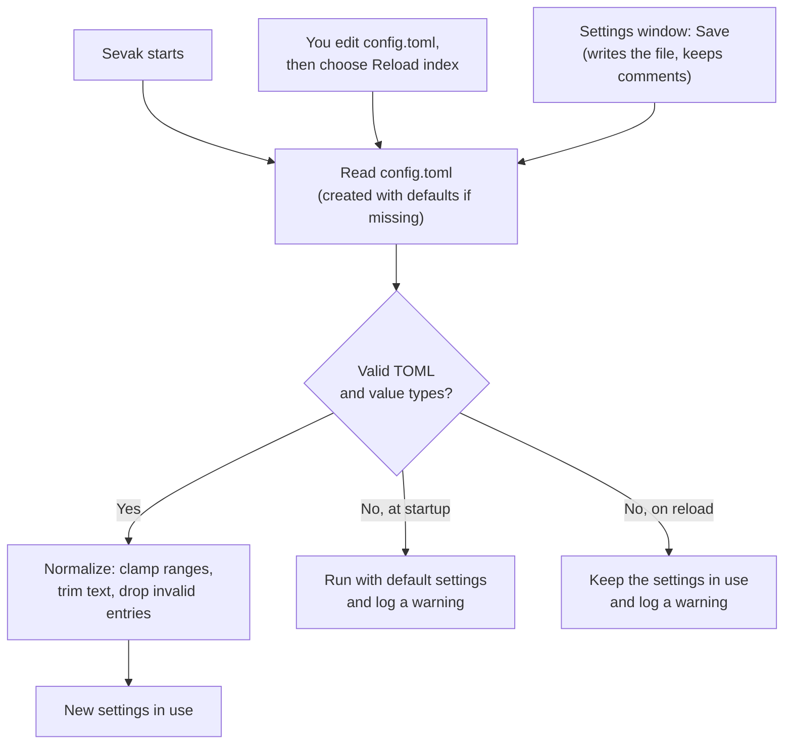

# Configuration file reference

Sevak stores settings in a TOML file. You can edit it by hand or use the [Settings window](settings.md), which has a page for every section except `[[snippet]]` entries. This page documents every configuration key.

## Where the file is

=== "Windows"

    `%APPDATA%\sevak\config.toml`
    
    Example: `C:\Users\Ninad\AppData\Roaming\sevak\config.toml`

=== "macOS"

    `~/Library/Application Support/sevak/config.toml`

=== "Linux"

    `~/.config/sevak/config.toml`

You can override the config folder with the `SEVAK_CONFIG_DIR` environment variable or the `--config` flag. The Settings window's "Open config file" button opens it in your editor.

## Editing and reloading

After making changes to `config.toml`:

- Choose **Reload index** from the tray menu or menu bar (fastest).
- Or restart Sevak.

If the file has a mistake (invalid TOML or a value of the wrong type), Sevak never overwrites it. At startup it runs with the default settings; on **Reload index** it keeps the settings already in use. Either way the problem is written to the [log](files-and-data.md), so check there if a change seems to have no effect. Comments and key order are preserved when Settings saves changes.

A minimal config works: missing fields use their defaults, so a nearly empty file is valid.

### Keywords

Every keyword is one word, and no two searches may share one: the configurable keywords (`[files]` `keyword` / `index_keyword` / `content_keyword`, `[bookmarks]`, `[tasks]`, `[media]`, `[contacts]`, `[onepassword]`, `[dictionary]` `define_keyword` / `spell_keyword`), the fixed ones (`>`, `cb`, `s`, `emoji`, `:`, `@`, `uuid`) and your web search keywords. Settings refuses to save a clash; in a hand-edited file a clashing keyword is ignored and logged. An empty keyword turns that keyword off.

Keywords of [workflows](workflows.md) and [script plugins](features/script-plugins.md) are checked the same way but only produce a warning (in Settings and in the log), because both plugins then answer the keyword and show their results.

## How configuration is loaded



## Configuration sections

### [general]

Main hotkeys and startup behaviour.

| Key | Type | Default | Description |
|---|---|---|---|
| `hotkey` | string | `"Super+Space"` | Global keyboard shortcut to show/hide Sevak. `Super` is the Windows key (Cmd on macOS; `Win`, `Windows` and `Meta` are accepted spellings). Examples: `"Alt+Space"`, `"Ctrl+Space"`, `"Ctrl+Shift+K"`. On macOS, `Alt` is the Option key. Super+Space is used by the system too; Sevak takes it over (a keyboard hook on Windows; a question on macOS and GNOME) - see [Troubleshooting](troubleshooting.md#super-space). Existing config files keep the key they have. On Linux Wayland, run `sevak --setup-hotkey` to bind this in GNOME instead. |
| `actions_hotkey` | string | `"Ctrl+Alt+Space"` | Hotkey for Universal Actions: capture the selection in the foreground app and offer actions on it. Empty string `""` turns Universal Actions off. On Wayland, run `sevak --setup-hotkey` to bind this in GNOME. |
| `accept_injected_hotkeys` | boolean | `false` | Windows keyboard hook only. By default the hook ignores key events that another program sends (`SendInput`), so no program on your desktop can open Sevak or make Universal Actions copy the foreground app's selection by pressing the shortcut for you. Turn it on if **AutoHotkey, PowerToys Keyboard Manager** or another remapper is meant to type Sevak's shortcut. Shortcuts that Windows itself registers (not Win-key combinations or keys another app owns) are still delivered by the system whoever sends them. |
| `hide_on_blur` | boolean | `true` | Hide the launcher when it loses focus to another window. Press Esc or click elsewhere to close; this setting hides it automatically. |
| `launch_at_login` | boolean | `false` | Start Sevak when you log in to your desktop. |
| `check_for_updates` | boolean | `true` | Check GitHub for a new version shortly after startup, every six hours, and whenever you open Sevak (if the last check is over an hour old). Updates are only installed after you confirm. Apart from optional currency rates, this is the only automatic network request. |
| `update_channel` | `"stable"` or `"beta"` | `"stable"` | Which releases the update check follows. `"beta"` also offers pre-release builds (`X.Y.Z-beta.N`), which arrive earlier and may be less tested; Sevak then reads `latest-beta.json` from GitHub Releases as well as `latest.json` and offers the newer of the two. Switching back to `"stable"` never downgrades: Sevak waits for a stable version newer than the one installed. Any other value means `"stable"`. |

```toml
[general]
hotkey = "Super+Space"
actions_hotkey = "Ctrl+Alt+Space"
accept_injected_hotkeys = false
hide_on_blur = true
launch_at_login = false
check_for_updates = true
update_channel = "stable"
```

### [window]

Launcher window appearance.

| Key | Type | Default | Range | Description |
|---|---|---|---|---|
| `width` | integer | `720` | 400–1600 (logical pixels) | Width of the search bar window. Logical pixels scale with the display's DPI. |

```toml
[window]
width = 720
```

### [linux]

Linux-specific settings (ignored on Windows and macOS).

| Key | Type | Default | Description |
|---|---|---|---|
| `wayland_use_xwayland` | boolean | `true` | On Wayland sessions, draw Sevak through XWayland (X11 compatibility layer). Native Wayland windows cannot position themselves or request focus reliably, so XWayland keeps the launcher centred and typeable. Set to `false` to use the native Wayland backend (window may appear off-centre and not accept input). Only used on Wayland; X11 sessions ignore this. |

```toml
[linux]
wayland_use_xwayland = true
```

### [search]

Search behaviour and fallback when no results match.

| Key | Type | Default | Range | Description |
|---|---|---|---|---|
| `max_results` | integer | `8` | 1–20 | Maximum number of results shown at once. |
| `fallback_web_search` | string or list | `"g"` | any keyword from `[[web_search]]` entries | When a query has no local results, offer a web search with this engine. Write as a single string `"g"` or a list to try several in order: `["g", "yt", "gh"]`. Empty string `""` disables the fallback. Keywords are matched case-insensitively; only one keyword per engine. |
| `query_history` | boolean | `true` | — | Remember the last 50 queries you ran. Press Up/Down on an empty search box to recall them. `false` disables history and clears it. |

```toml
[search]
max_results = 8
fallback_web_search = "g"
query_history = true
```

### [appearance]

Launcher theme and styling.

| Key | Type | Default | Range/Values | Description |
|---|---|---|---|---|
| `theme` | string | `"system"` | `"system"`, `"light"`, `"dark"` | `"system"` follows your OS dark-mode preference. Invalid values fall back to `"system"` and are reported in the log and Settings. |
| `accent` | string | `""` (empty) | `"#rgb"`, `"#rrggbb"`, `"rgb(r, g, b)"`, or `""` | Override the theme's accent colour for buttons and highlights. `""` uses the theme's own accent. Invalid values fall back to `""` with a warning. |
| `font_size` | integer | `15` | 12–22 (pixels) | Size of result titles. The rest of the launcher (icons, text, spacing) scales with it. Clamped to the range. |
| `font_family` | string | `""` (empty) | any font family name, comma-separated | Comma-separated font family list, e.g. `"Fira Sans, sans-serif"`. Empty uses your system font. CSS font-family syntax; if the font is missing, the next in the list is used. |
| `opacity` | integer | `100` | 30–100 (percent) | Background opacity of the search bar. 100 is fully opaque; 30 is quite transparent. Whole numbers only. |
| `blur` | boolean | `false` | `true`, `false` | Frosted-glass blur of the desktop behind the search bar (Windows Acrylic, macOS vibrancy); ignored on Linux. You only see it when `opacity` is below 100. On Windows 11 the corners are rounded by the system, so `radius` is fixed at 8 px while blur is on. |
| `radius` | integer | `14` | 0–32 (pixels) | Corner radius of the search bar. 0 is sharp corners; 32 is very rounded. Whole numbers only. |
| `theme_file` | string | `""` (empty) | path in config folder, or `""` | A theme file, such as `"themes/Nord.toml"`, made, imported or installed in **Settings → Appearance → Theme editor**. Applied between the built-in light/dark look and the settings above; `""` uses none. See [Theme files and the editor](themes.md#theme-files-and-the-editor). |
| `custom_css` | string | `""` (empty) | filename in config folder, or `""` | Stylesheet to override theme colours and layout. Must be a file in the config folder (same folder as `config.toml`), e.g. `"theme.css"`. `""` loads none. See [Themes guide](themes.md) for available CSS variables. |

```toml
[appearance]
theme = "system"
accent = ""
font_size = 15
font_family = ""
opacity = 100
radius = 14
theme_file = ""
custom_css = ""
```

### [plugins]

Which plugins are active. Each built-in plugin can be disabled.

| Key | Type | Default | Description |
|---|---|---|---|
| `disabled` | array of strings | `[]` | Plugin ids to turn off. Available ids: `"apps"`, `"calculator"`, `"web"` (all engines) or `"web:<keyword>"` (one engine), `"files"` (its instances `"files:names"` and `"files:content"` are the `ff` and `in` searches), `"bookmarks"`, `"system"`, `"tasks"` (automation tasks), `"media"` (media controls), `"shell"`, `"clipboard"`, `"snippets"`, `"emoji"` (the emoji picker; `"emoji:word"` and `"emoji:colon"` are its two keywords), `"selection"` (Universal Actions), `"contacts"`, `"1password"`, `"dict"` (`define` and `spell`), `"uuid"`, `"script"` or `"script:<name>"` (script plugins) and `"workflow"` or `"workflow:<folder>"` ([workflows](workflows.md); each also has its own switch in **Settings → Workflows**). Example: `disabled = ["files", "web:yt"]` turns off file search and YouTube search. Unknown ids are ignored. |

```toml
[plugins]
disabled = []
```

### [calculator]

Calculator and unit conversion settings.

| Key | Type | Default | Description |
|---|---|---|---|
| `currency` | boolean | `false` | Enable currency conversion (e.g. `100 usd in eur`). Off by default because it requires network access: Sevak downloads the European Central Bank's daily reference rates (a small XML file, no API key) at most once per day and caches them. Unit conversion (e.g. `10 km in mi`) never needs the network and is always on. |

```toml
[calculator]
currency = false
```

### [files]

Indexed file search settings.

| Key | Type | Default | Description |
|---|---|---|---|
| `directories` | array of strings | `["~/Desktop", "~/Documents", "~/Downloads"]` | Root folders to index recursively. `~` expands to your home directory and works on all platforms. Relative paths are anchored at the working directory when Sevak starts (usually your home). Forward slashes work everywhere; avoid unescaped backslashes. The index caps at 100,000 entries; reduce roots or depth if you hit this. |
| `max_depth` | integer | `4` | How many folder levels below each root are indexed. `1` means only files directly in the root. |
| `include_hidden` | boolean | `false` | Index dot-files and dot-folders (starting with `.`). `false` ignores them. |
| `keyword` | string | `"f"` | Prefix to search only files: type `f filename`. Leave empty `""` to disable keyword search. |
| `global` | boolean | `true` | Show file results even in ordinary queries without the keyword. `false` requires `f <name>` to search files. |
| `use_os_index` | boolean | `true` | Whole-disk (`ff`) and content (`in`) search through the operating system's own file index (Windows Search, Spotlight, `locate`, Tracker or Baloo). Queries go only to that local index, never over the network. `false` turns both off. See [what each OS needs](features/files.md#whole-disk-and-content-search). |
| `index_keyword` | string | `"ff"` | Keyword for file names anywhere on the disk: `ff report`. `""` turns off just this search. |
| `content_keyword` | string | `"in"` | Keyword for words inside files: `in invoice 2026`. `""` turns off just this search. |
| `allow_network_paths` | boolean | `false` | Windows only. Use paths on other computers (`\\server\share`, `//server/share`) and mapped network drives. While `false`, such a path is refused before anything touches it (Windows signs in to a computer as soon as it looks at its path), a typed one shows "Network paths are turned off", and `directories` on a share are skipped. Device paths (`\\.\pipe\...`) are refused either way. Turn on only for servers you trust. |

```toml
[files]
directories = ["~/Desktop", "~/Documents", "~/Downloads"]
max_depth = 4
include_hidden = false
keyword = "f"
global = true
use_os_index = true
index_keyword = "ff"
content_keyword = "in"
allow_network_paths = false
```

### [bookmarks]

Browser bookmark search settings.

| Key | Type | Default | Description |
|---|---|---|---|
| `browsers` | array of strings | `[]` | Browser profiles to index. Empty `[]` means every browser found on your system. Supported ids: `"chrome"`, `"edge"`, `"brave"`, `"vivaldi"`, `"chromium"`, `"opera"`, `"opera-gx"`, `"firefox"`, `"librewolf"`, `"zen"`, and on macOS `"safari"` (needs [Full Disk Access](features/bookmarks.md#safari-needs-full-disk-access)). All profiles of each browser are searched. Unknown ids are ignored. |
| `keyword` | string | `"b"` | Prefix to search only bookmarks: type `b term`. Leave empty `""` to disable keyword search. |
| `global` | boolean | `true` | Show bookmark results in ordinary queries without the keyword. `false` requires `b <term>` to search bookmarks. |

```toml
[bookmarks]
browsers = []
keyword = "b"
global = true
```

### [system]

System commands (lock, sleep, restart, etc.) and settings pages.

| Key | Type | Default | Description |
|---|---|---|---|
| `confirm` | boolean | `true` | Ask for confirmation before restart, shut down, log out and emptying the trash. Power commands are destructive so default to "ask". |
| `disabled` | array of strings | `[]` | Commands and settings pages to hide. Options: `"lock"`, `"sleep"`, `"hibernate"`, `"restart"`, `"shutdown"`, `"logout"`, `"empty_trash"`, `"settings"` (all settings pages), or specific pages like `"settings:bluetooth"`, `"settings:wifi"`. Case-insensitive. Unknown entries are ignored. To turn off the entire plugin, add `"system"` to `[plugins] disabled` instead. |

```toml
[system]
confirm = true
disabled = []
```

### [tasks]

[Automation tasks](features/tasks.md): dark mode, show the desktop, volume, screenshots, quit or kill an app, eject a drive, keep the computer awake and more.

| Key | Type | Default | Description |
|---|---|---|---|
| `confirm` | boolean | `true` | Ask before force quitting an app, ending a process and restarting Explorer or Finder. |
| `disabled` | array of strings | `[]` | Tasks to hide: `"dark_mode"`, `"show_desktop"`, `"hide_others"`, `"minimize_all"`, `"screenshot"`, `"downloads"`, `"recent_files"`, `"flush_dns"`, `"restart_shell"`, `"empty_clipboard"`, `"mute"`, `"unmute"`, `"volume_up"`, `"volume_down"`, `"volume"`, `"wifi"`, `"bluetooth"`, `"keep_awake"`, `"stop_keep_awake"`, `"quit_app"`, `"force_quit_app"`, `"kill"`, `"eject"`. To turn the whole plugin off, add `"tasks"` to `[plugins] disabled` instead. |
| `keyword` | string | `"t"` | `t ` lists the tasks. `""` removes the keyword. |
| `global` | boolean | `true` | Also match task names in ordinary searches (`dark mode`, `kill chrome`). |

```toml
[tasks]
confirm = true
disabled = []
keyword = "t"
global = true
```

### [media]

[Media controls](features/media.md): play/pause, next, previous, stop and what is playing now.

| Key | Type | Default | Description |
|---|---|---|---|
| `keyword` | string | `"play"` | `play ` lists the buttons and the track. `""` removes the keyword. |
| `global` | boolean | `true` | Also match `pause`, `next track`… in ordinary searches. |
| `now_playing` | boolean | `true` | Show the playing track (title, artist, app) as a row. It is read from the system's media player on request; nothing is stored or sent anywhere. |

To turn the plugin off, add `"media"` to `[plugins] disabled`.

```toml
[media]
keyword = "play"
global = true
now_playing = true
```

### [shell]

Shell command execution settings (type `> <command>` to run a command).

| Key | Type | Default | Description |
|---|---|---|---|
| `terminal` | string | `""` (auto-detect) | Terminal program to run commands in. Empty means auto-detect: Windows Terminal (else a console window) on Windows, Terminal.app on macOS, `$TERMINAL` environment variable then common terminals on Linux. You can give a program name (`"wt"`, `"iterm"`, `"kitty"`), a full path, or a command with arguments (`"alacritty --class sevak"`). |
| `shell` | string | `""` (auto-detect) | Shell that runs the command. Empty means auto-detect: `pwsh`, then `powershell`, then `cmd` on Windows; `$SHELL` environment variable or `sh` on Linux. Ignored on macOS, where the terminal starts your login shell. You can give a program name or full path. |
| `keep_open` | boolean | `true` | Keep the terminal open at a shell prompt after the command exits. `false` closes it when done. |

```toml
[shell]
terminal = ""
shell = ""
keep_open = true
```

### [paste]

How text is pasted into the previously focused app.

| Key | Type | Default | Description |
|---|---|---|---|
| `restore_clipboard` | boolean | `false` | After pasting from clipboard history or snippets, restore the previous clipboard contents. `false` leaves the pasted text in the clipboard. |

```toml
[paste]
restore_clipboard = false
```

### [actions]

Universal Actions: how the selection in another app is captured.

| Key | Type | Default | Description |
|---|---|---|---|
| `use_primary_selection` | boolean | `true` | Linux X11 only: read the PRIMARY selection (highlighted text) first, without pressing Ctrl+C. Ignored on Wayland (no PRIMARY selection) and other platforms. |
| `use_clipboard_fallback` | boolean | `false` | When the selection cannot be captured (Wayland, terminal windows, missing macOS Accessibility permission), act on the current clipboard contents instead. `true` adds a fallback; `false` does nothing if capture fails. |

```toml
[actions]
use_primary_selection = true
use_clipboard_fallback = false
```

### [clipboard]

Clipboard history settings (opt-in feature).

| Key | Type | Default | Description |
|---|---|---|---|
| `enabled` | boolean | `false` | Enable clipboard history (`cb <text>` to search). Off by default: turning it on makes Sevak watch your clipboard and keep what you copy in its local data folder (on Windows `%LOCALAPPDATA%\sevak\`, which does not roam): text and the paths of copied files in `clipboard-history.json`, images as PNG files in the `clipboard` folder. Encrypted for your account on Windows (see `encrypt`), plain but owner-only elsewhere. Content marked as secret by apps (password managers) is never recorded. |
| `max_items` | integer | `200` | How many clipboard items to keep, of all kinds together. Older items are dropped (with their image files). Range: 1–5000. |
| `max_item_bytes` | integer | `65536` (64 KiB) | Maximum size of a clipboard item in bytes. Longer text is not recorded. Range: 1–4,194,304 (4 MiB). |
| `images` | boolean | `true` | Also record copied images (as PNG files with thumbnails). |
| `files` | boolean | `true` | Also record copied files and folders (their paths only). |
| `max_image_bytes` | integer | `10485760` (10 MiB) | An image whose PNG is larger is not recorded. Range: 1–67,108,864 (64 MiB). |
| `ignore_apps` | array of strings | `[]` | Apps whose copies are never recorded, e.g. `["Signal", "Messages"]`. Matched case-insensitively against the program or app name. |
| `default_ignore_apps` | boolean | `true` | Also never record copies from the built-in list of password managers (KeePass, KeePassXC, 1Password, Bitwarden, LastPass, Dashlane, Enpass, NordPass, RoboForm, Keeper, Proton Pass and others), system credential prompts and ssh/gpg passphrase prompts, in addition to `ignore_apps`. The [full list](features/clipboard.md#password-managers-and-other-apps-skipped-by-default) is in the clipboard documentation. `false` turns it off. |
| `encrypt` | boolean | `true` | Encrypt the history file and the image files for the current user where the system can: Windows (DPAPI). macOS and Linux have no such encryption here; their files are plain, readable by your user only. A history stored plain is encrypted at the next start. |

```toml
[clipboard]
enabled = false
max_items = 200
max_item_bytes = 65536
images = true
files = true
max_image_bytes = 10485760
ignore_apps = []
default_ignore_apps = true
encrypt = true
```

### [file_buffer]

The [file buffer](features/files.md#file-buffer) (++alt+arrow-down++ on a file result collects it). Set it in **Settings → Files & bookmarks**.

| Key | Type | Default | Description |
|---|---|---|---|
| `keep_between_shows` | boolean | `false` | Keep the collected files when the launcher hides. By default the buffer is emptied whenever the launcher hides. |

```toml
[file_buffer]
keep_between_shows = false
```

### [contacts]

[Contacts](features/contacts.md) (`c <name>` or `@name`). Off by default. Contacts are read into memory only; nothing is written to disk or sent anywhere. Set it in **Settings → Integrations**.

| Key | Type | Default | Description |
|---|---|---|---|
| `enabled` | boolean | `false` | Turn the plugin on. |
| `keyword` | string | `"c"` | Keyword to search contacts. The `@` keyword always works too. `""` keeps the default. |
| `use_system` | boolean | `true` | Also read the system address book: macOS Contacts (asks for permission the first time you use it), the Windows People store and Evolution's local address books on Linux. |
| `vcard_files` | array of strings | `[]` | vCard files (`.vcf`) or folders of them, e.g. `["~/contacts.vcf", "~/Contacts"]`. Works everywhere and needs no permission. |

```toml
[contacts]
enabled = false
keyword = "c"
use_system = true
vcard_files = []
```

### [onepassword]

[1Password](features/1password.md) logins (`1p github`) through the official `op` command-line tool. Off by default. Only titles, vault names, websites and usernames are read, never passwords or one-time codes. Set it in **Settings → Integrations**.

| Key | Type | Default | Description |
|---|---|---|---|
| `enabled` | boolean | `false` | Turn the plugin on. `op` only runs when you type the keyword followed by a space. |
| `keyword` | string | `"1p"` | Keyword to search logins. |
| `op_path` | string | `""` | Path to the `op` program. `""` looks on `PATH` and in the usual install folders. |
| `account` | string | `""` | Which account to use when several are signed in: its address (`my.1password.com`), short name or ID. `""` uses `op`'s default. |
| `cache_minutes` | integer | `10` | How long the list of logins is kept in memory before `1p` refreshes it. Range: 1–1440. |

```toml
[onepassword]
enabled = false
keyword = "1p"
op_path = ""
account = ""
cache_minutes = 10
```

### [dictionary]

[Dictionary and spelling](features/dictionary.md), all offline. On by default; turn it off with `"dict"` in `[plugins] disabled`. Set it in **Settings → Integrations**.

| Key | Type | Default | Description |
|---|---|---|---|
| `define_keyword` | string | `"define"` | Keyword for definitions. |
| `spell_keyword` | string | `"spell"` | Keyword for spelling corrections. |
| `use_system` | boolean | `true` | Use the macOS Dictionary and the Windows spell checker where available. `false` always uses the bundled English dictionary (WordNet) and word list. |

```toml
[dictionary]
define_keyword = "define"
spell_keyword = "spell"
use_system = true
```

### [snippets]

[Expanding snippets as you type](features/snippets.md#expand-snippets-as-you-type) in any app. **Off by default**: while it is on, Sevak watches your keystrokes (in memory only, the last 64 characters, never stored or logged) to notice a snippet `keyword`. Not available on Wayland. The snippets themselves are the `[[snippet]]` entries below.

| Key | Type | Default | Description |
|---|---|---|---|
| `auto_expand` | boolean | `false` | Expand snippet keywords as you type. Reloading applies changes; Sevak stops watching typing when this is turned off. |
| `prefix` | string | `""` | Typed before every keyword, e.g. `";"` so that `;sig` expands and `sig` does not. No spaces. |
| `expand_on` | string | `"immediate"` | `"immediate"` expands the moment the keyword is typed; `"delimiter"` waits for a space or punctuation mark, which is kept after the text. An unknown value is treated as `"delimiter"`. |
| `case_sensitive` | boolean | `true` | `false`: `SIG` and `sig` both expand. |
| `ignore_apps` | array of strings | `[]` | Never watch or expand in these apps, e.g. `["KeePassXC", "Firefox"]`. Matched case-insensitively against the program or app name, like `[clipboard] ignore_apps`. |
| `expand_in_terminals` | boolean | `false` | Terminal windows are skipped unless this is on. |
| `expand_in_browsers` | boolean | `false` | Web browsers (Chrome, Edge, Firefox, Brave, Vivaldi, Opera, Safari, Arc, Zen, LibreWolf, Chromium) are skipped unless this is on: a password field in a web page cannot be reliably told from other text boxes, so a keyword typed inside a password would expand there. Also in **Settings → Plugins**. |

```toml
[snippets]
auto_expand = false
prefix = ""
expand_on = "immediate"
case_sensitive = true
ignore_apps = []
expand_in_terminals = false
expand_in_browsers = false
```

## [[snippet]]

Snippets: text you paste often, with placeholders that expand.

| Key | Type | Required | Description |
|---|---|---|---|
| `name` | string | yes | Name of the snippet; type `s <name>` to search for it. Must not be empty. |
| `text` | string | yes | Text to paste. Can include newlines (`\n`). Must not be empty. |
| `keyword` | string | optional | Extra word to search by, e.g. `keyword = "sig"` lets you find it with `s sig`. With [`[snippets] auto_expand`](#snippets) on, typing it in any app expands the snippet. Trimmed; empty keywords are ignored. |

**Placeholders** in `text`:

- `{date}` — today's date in YYYY-MM-DD format
- `{time}` — current time in HH:MM:SS format (24-hour)
- `{datetime}` — date and time, e.g. 2025-10-03 14:30:00
- `{date:%d %B %Y}` — date in a custom format, e.g. `03 October 2025` (uses [Rust strftime syntax](https://docs.rs/chrono/latest/chrono/format/strftime/index.html#specifiers))
- `{clipboard}` — contents of the clipboard at paste time
- `{uuid}` — a random UUID v4
- `{{` and `}}` — literal `{` and `}` in the output

The Settings window never reformats hand-written snippets, so they survive a save. Unknown placeholders are left as-is.

```toml
[[snippet]]
name = "Email signature"
keyword = "sig"
text = "Best regards,\nNinad\n{date}"

[[snippet]]
name = "Meeting note"
text = "{datetime}: {clipboard}"
```

## [[web_search]]

Web search engines. Type the keyword followed by your search terms, e.g. `g rust traits`.

| Key | Type | Required | Description |
|---|---|---|---|
| `keyword` | string | yes | Short name to type before the query, e.g. `"g"` for Google. Must be unique and contain no spaces. Trimmed. |
| `name` | string | yes | Display name shown in results, e.g. `"Google"`. |
| `url` | string | yes | URL template. Must contain `{query}` (replaced by the URL-encoded search terms) and start with `http://` or `https://`. |

If you define any `[[web_search]]` entries, they replace the defaults entirely. The defaults are:

```toml
[[web_search]]
keyword = "g"
name = "Google"
url = "https://www.google.com/search?q={query}"

[[web_search]]
keyword = "yt"
name = "YouTube"
url = "https://www.youtube.com/results?search_query={query}"

[[web_search]]
keyword = "gh"
name = "GitHub"
url = "https://github.com/search?q={query}"
```

## [[hotkey]]

Extra global hotkeys: bind a key to open Sevak with a query or run a result directly.

| Key | Type | Required | Description |
|---|---|---|---|
| `key` | string | yes | Keyboard shortcut, e.g. `"Ctrl+Alt+T"`. Parsed like `[general] hotkey`. Must not be empty. |
| `query` | string | optional* | Open Sevak with this text already typed. Example: `query = "> "` opens a shell command prompt. Either `query` or `run`, not both. |
| `run` | string | optional* | Run the result with this id without showing the launcher. Example: `run = "apps:firefox.desktop"`. Either `query` or `run`, not both. Must not be empty. |

*Exactly one of `query` or `run` must be present.

Result ids:

- Apps: `apps:firefox.desktop` (Linux desktop-file id), `apps:Chrome` or `apps:AppUserModelID` (Windows), `apps:Safari` (macOS)
- Files: `files:<full path>`
- Bookmarks: hover over a bookmark in Sevak to see its id
- System commands: `system:lock`, `system:sleep`, `system:restart`, `system:shutdown`, `system:logout`, `system:settings`, `system:settings:bluetooth`, `system:settings:wifi`, etc.
- Snippets: `snippets:<name>`
- Shell commands: `shell:<command>`
- Automation tasks: `tasks:dark_mode`, `tasks:volume:30`, `tasks:keep_awake:45`, `tasks:kill:chrome.exe` (see [Automation tasks](features/tasks.md#bind-a-task-to-a-hotkey))
- Workflows: `workflow:<folder>:run:<node id>`, the result a workflow's hotkey trigger runs; usually it is simpler to give the workflow its own hotkey trigger in the builder (see [Triggers](workflows.md#triggers))

Calculator, web search and clipboard history results have no stable id and cannot be bound.

On Wayland, run `sevak --setup-hotkey` after editing to create GNOME desktop shortcuts. Delete old entries in GNOME's keyboard settings after removing them from config.toml. On X11 and other desktops, the keys are registered directly by Sevak.

```toml
[[hotkey]]
key = "Ctrl+Alt+T"
query = "> "

[[hotkey]]
key = "Ctrl+Alt+L"
run = "system:lock"

[[hotkey]]
key = "Super+F"
run = "apps:firefox.desktop"
```

## Files next to config.toml

Some settings are files of their own in the config folder rather than keys in `config.toml`:

| Folder | Contents |
|---|---|
| `plugins/` | [Script plugins](features/script-plugins.md), one folder each with a `plugin.toml` |
| `workflows/` | [Workflows](workflows.md), one folder each with a `workflow.toml`; the builder in **Settings → Workflows** writes them |
| `themes/` | [Theme files](themes.md#theme-files-and-the-editor) made, imported or installed in **Settings → Appearance**; `[appearance] theme_file` picks one |

Everything Sevak writes itself is in the data folders, not here: the approvals file, usage history, logs, and the clipboard history with its images, which on Windows is in the *local* data folder (`%LOCALAPPDATA%\sevak\`) and encrypted for your account (`[clipboard] encrypt`).

See [Files and data](files-and-data.md) for the data folders.

## Complete example

This is the full default configuration written on first run:

```toml
# Sevak configuration
#
# Created with default values on first run. Edit it, then choose "Reload index"
# from the tray menu (or restart Sevak) to apply changes.

[general]
# Shortcut that shows and hides Sevak. Super is the Windows key (Cmd on macOS).
# Examples: "Super+Space", "Alt+Space", "Ctrl+Space", "Ctrl+Shift+K".
# Super+Space is normally taken by the system (Windows' input-language switcher,
# macOS Spotlight, GNOME's input sources). Sevak takes the key over on Windows
# with a keyboard hook, and on macOS and GNOME after asking you once. To go back
# to a key the system leaves alone, use "Alt+Space" (Option+Space on macOS).
# On Linux Wayland sessions applications cannot grab global keys. Run
# `sevak --setup-hotkey` to bind this key to `sevak --toggle` in GNOME instead.
hotkey = "Super+Space"

# Shortcut for Universal Actions: it copies what you have selected in the app
# you are using (text, a URL, files) and offers actions for it. "" turns it off.
# On Wayland run `sevak --setup-hotkey` to bind it to `sevak --actions`. See [actions].
actions_hotkey = "Ctrl+Alt+Space"

# Windows: also react to shortcuts that another program types for you (AutoHotkey,
# PowerToys Keyboard Manager and other remappers send "injected" keys). Off by
# default so that a program on your desktop cannot open Sevak or trigger Universal
# Actions by sending the shortcut itself; turn it on if a remapper is meant to.
accept_injected_hotkeys = false

# Hide the window when it loses focus.
hide_on_blur = true

# Start Sevak in the background when you log in.
launch_at_login = false

# Check GitHub for a new version at startup, every six hours and when you open Sevak. Updates are only
# installed after you agree. Apart from the optional currency rates (see
# [calculator]), this is the only request Sevak makes on its own.
check_for_updates = true

# Which releases to follow: "stable" (the default) or "beta". Beta builds arrive
# earlier and may be less tested; they come from the same GitHub releases page.
# Switching back to "stable" never downgrades: Sevak waits for the next stable
# version that is newer than the one you have.
update_channel = "stable"

[window]
# Width of the search window in logical pixels (400-1600).
width = 720

[linux]
# On Wayland sessions, draw Sevak's window through XWayland. Native Wayland
# windows cannot position themselves and may be refused focus, so this keeps the
# launcher centered and typeable. Set to false to use the native Wayland backend.
wayland_use_xwayland = true

[search]
# Number of results shown (1-20).
max_results = 8
# Keyword of the web search engine offered when nothing else matches ("" to
# disable). A list offers several, in order: ["g", "yt", "gh"].
fallback_web_search = "g"
# Up/Down on an empty search box recalls the last 50 searches you ran. They are
# kept in usage.json in the data folder; false stops recording and forgets them.
query_history = true

[appearance]
# "system", "light" or "dark".
theme = "system"
# Accent color as "#rrggbb", "#rgb" or "rgb(r, g, b)". "" keeps the theme's own.
accent = ""
# Size of the result titles in pixels (12-22); the rest of the bar scales with it.
font_size = 15
# Font for the search bar, e.g. "Fira Sans, sans-serif". "" uses the system font.
font_family = ""
# How opaque the search bar's background is, in percent (30-100).
opacity = 100
# Frosted-glass blur of the desktop behind the search bar (Windows and macOS).
# You only see it when opacity is below 100.
blur = false
# Corner radius of the search bar in pixels (0-32).
radius = 14
# A theme file inside this config folder, for example "themes/Nord.toml". Settings,
# Appearance, Theme editor creates and applies them. "" uses no theme file.
theme_file = ""
# A stylesheet inside this config folder that overrides the theme's CSS variables
# (see docs/themes.md), for example "theme.css". "" loads none.
custom_css = ""

[plugins]
# Ids of built-in plugins to turn off: "apps", "calculator", "files",
# "bookmarks", "system", "tasks", "media", "shell", "clipboard", "snippets",
# "emoji", "selection" (Universal Actions), "contacts", "1password", "dict",
# "web:<keyword>".
disabled = []

[calculator]
# Convert currencies ("100 usd in eur"). Off by default because it needs the
# network: when on, Sevak downloads the European Central Bank's daily reference
# rates (a small XML file, no account or key) in the background at most once a
# day and keeps them on disk. Unit conversion ("10 km in mi") never needs it.
currency = false

[files]
# Folders whose files and subfolders are searchable. "~" is your home folder.
directories = ["~/Desktop", "~/Documents", "~/Downloads"]
# How many folder levels below each directory are indexed.
max_depth = 4
# Index dot-files and dot-folders.
include_hidden = false
# Type "<keyword> <name>" to search only files.
keyword = "f"
# Also show (lower-ranked) file results for plain queries.
global = true
# Whole-disk search through the operating system's own index (Windows Search,
# Spotlight, locate / Tracker / Baloo). Nothing leaves your computer. Type
# "<index_keyword> <name>" for file names and "<content_keyword> <words>" for
# what is inside files. false turns both off.
use_os_index = true
index_keyword = "ff"
content_keyword = "in"
# Windows only. Use paths on other computers (\\server\share, or a mapped
# network drive). Off by default: merely looking at such a path makes Windows
# connect to that computer and sign in to it, which can hand your Windows
# credentials to whoever runs it. Turn on if you keep files on a file server
# you trust; folders listed in "directories" on a share are skipped while off.
allow_network_paths = false

[bookmarks]
# Browsers whose bookmarks are searchable; [] means every browser found.
# Names: "chrome", "edge", "brave", "vivaldi", "chromium", "opera", "opera-gx",
# "firefox", "librewolf", "zen", and "safari" (macOS; needs Full Disk Access).
# All profiles of each browser are read.
browsers = []
# Type "<keyword> <text>" to search only bookmarks.
keyword = "b"
# Also show (lower-ranked) bookmark results for plain queries.
global = true

[system]
# System commands: lock, sleep, hibernate, restart, shut down, log out, empty
# the trash, and shortcuts to OS settings pages. Ask before restart, shut down,
# log out and emptying the trash.
confirm = true
# Commands or pages to hide: "lock", "sleep", "hibernate", "restart",
# "shutdown", "logout", "empty_trash", "settings" (every settings page) or
# "settings:<page>" such as "settings:bluetooth". To turn the whole plugin off,
# add "system" to [plugins] disabled instead.
disabled = []

[tasks]
# Automation tasks: toggle dark mode, show the desktop, mute and set the volume
# ("vol 30"), take a screenshot, quit an app ("quit"), kill a process by name
# ("kill chrome"), eject a drive ("eject"), keep the computer awake ("awake 30")
# and more. What is offered depends on your system.
# Ask before force quitting an app, ending a process and restarting Explorer or
# Finder.
confirm = true
# Tasks to hide: "dark_mode", "show_desktop", "hide_others", "minimize_all",
# "screenshot", "downloads", "recent_files", "flush_dns", "restart_shell",
# "empty_clipboard", "mute", "unmute", "volume_up", "volume_down", "volume",
# "wifi", "bluetooth", "keep_awake", "stop_keep_awake", "quit_app",
# "force_quit_app", "kill", "eject". To turn the whole plugin off, add "tasks"
# to [plugins] disabled instead.
disabled = []
# Type "<keyword> <task>" to search only tasks.
keyword = "t"
# Also show tasks for plain queries ("dark mode", "kill chrome").
global = true

[media]
# Media controls: play/pause, next, previous, stop, and what is playing now.
# Type "<keyword> <button>" to search only the controls.
keyword = "play"
# Also show the controls for plain queries ("pause", "next track").
global = true
# Show the track that is playing as a row (Enter plays or pauses it). It is read
# from the system's media player on request; nothing is stored or sent anywhere.
now_playing = true

[shell]
# Type "> <command>" (or ">command") to run a command in a terminal window. It
# only runs when you press Enter; recent commands are offered again.
# Terminal to use. "" detects one: Windows Terminal (else a console window) on
# Windows, Terminal.app on macOS, $TERMINAL then common terminals on Linux.
# Examples: "wt", "iterm", "kitty", "gnome-terminal", "alacritty --class sevak".
terminal = ""
# Shell that runs the command. "" picks pwsh, powershell, then cmd on Windows
# and $SHELL (or sh) on Linux. Not used on macOS: your login shell runs it.
shell = ""
# Leave the terminal open, at a shell prompt, after the command exits.
keep_open = true

[paste]
# Clipboard history and snippets paste into the app you were using before Sevak
# opened. With this on, the clipboard's previous text is put back afterwards.
restore_clipboard = false

[actions]
# Universal Actions (see actions_hotkey under [general]). Sevak presses Ctrl+C
# (Cmd+C) in the app you were using, reads the result and puts your clipboard
# back. The selection is never stored or logged. Terminal windows are skipped
# on Windows and Linux because Ctrl+C would interrupt the running program.
# Linux (X11): read the PRIMARY selection (text you just highlighted) first,
# without pressing a key.
use_primary_selection = true
# When the selection cannot be captured (Wayland, a terminal, missing macOS
# Accessibility permission), act on the current clipboard contents instead.
use_clipboard_fallback = false

[file_buffer]
# The file buffer (Alt+Up / Alt+Down on a file result collects it). By default it
# is emptied whenever the launcher hides; true keeps what you collected.
keep_between_shows = false

[clipboard]
# Clipboard history ("cb <text>"). Off by default: turning it on makes Sevak
# watch the clipboard and keep what you copy in clipboard-history.json in its
# local data folder (on Windows %LOCALAPPDATA%\sevak, which does not roam with your
# profile): text, images (as PNG files in a "clipboard" folder next to it) and
# the paths of copied files. Content that apps mark as secret (password
# managers) is never recorded.
enabled = false
# Items kept, of all kinds together (the oldest are dropped).
max_items = 200
# Longer text is not recorded.
max_item_bytes = 65536
# Record copied images, and copied files and folders (paths only).
images = true
files = true
# An image whose PNG is larger than this is not recorded.
max_image_bytes = 10485760
# Never record text copied from these apps, e.g. ["Signal", "Messages"].
# Matched case-insensitively against the program or app name.
ignore_apps = []
# Also skip password managers (KeePass, KeePassXC, 1Password, Bitwarden,
# LastPass, Dashlane, Enpass, NordPass, RoboForm, Keeper, Proton Pass), the
# system's credential prompts and ssh/gpg passphrase prompts, in addition to
# ignore_apps. The full list is in the clipboard documentation. false turns it off.
default_ignore_apps = true
# Encrypt the history file and the image files for your Windows account
# (DPAPI). macOS and Linux have no such encryption here: the files are plain,
# readable by you only. Files already stored plain are encrypted on the next
# start.
encrypt = true

[contacts]
# Search your contacts ("c <name>" or "@name"): copy an email or phone number,
# write an email, call (tel: link), or open the card. Off by default. Contacts
# are read into memory only; nothing is written to disk or sent anywhere.
enabled = false
# Keyword (the "@" keyword always works too). "" keeps the default.
keyword = "c"
# Also read the system address book: macOS Contacts (asks for permission the
# first time you use it), the Windows People store and Evolution's local
# address books on Linux.
use_system = true
# vCard files (.vcf) or folders of them, e.g. ["~/contacts.vcf", "~/Contacts"].
# This works everywhere and needs no permission.
vcard_files = []

[onepassword]
# Search your 1Password logins ("1p github"): Enter opens the item's website,
# the action panel opens it in the 1Password app or copies the username. Needs
# the official `op` command-line tool, signed in (1Password > Settings >
# Developer > "Integrate with 1Password CLI"). Only titles, websites and
# usernames are read, never passwords or one-time codes. Off by default.
enabled = false
keyword = "1p"
# Path to the `op` program. "" looks on PATH and in the usual install folders.
op_path = ""
# Which account to use when several are signed in: its address (my.1password.com),
# short name or ID. "" uses op's default.
account = ""
# How long the list of logins is kept in memory before `1p` refreshes it.
cache_minutes = 10

[dictionary]
# "define <word>" shows definitions and "spell <word>" suggests corrections, all
# offline. macOS uses its Dictionary and Windows its spell checker; elsewhere a
# bundled English dictionary (WordNet) is used. Turn it off with "dict" in
# [plugins] disabled.
define_keyword = "define"
spell_keyword = "spell"
# false always uses the bundled dictionary and word list.
use_system = true

# Snippets ("s <name>"): text you paste often. Placeholders: {date}, {time},
# {datetime}, {date:%d %B %Y}, {clipboard}, {uuid}; write {{ and }} for literal
# braces. "keyword" is optional and also matches the search.
# [[snippet]]
# name = "Email signature"
# keyword = "sig"
# text = "Best regards,\nNinad"

[snippets]
# Expand snippets as you type in any app (a snippet needs a "keyword"). OFF by
# default: while on, Sevak watches your keystrokes (in memory only, last 64
# characters, never stored or logged) to notice a keyword. See "Privacy" in the
# README. Not available on Wayland.
auto_expand = false
# Typed before every keyword, e.g. ";" so that ";sig" expands and "sig" does not.
prefix = ""
# "immediate" expands the moment the keyword is typed; "delimiter" waits for a
# space or punctuation mark, which is kept after the text.
expand_on = "immediate"
# false: "SIG" and "sig" both expand.
case_sensitive = true
# Never expand in these apps (program or app name, case-insensitive).
ignore_apps = []
# Terminal windows are skipped unless this is on.
expand_in_terminals = false
# Web browsers are skipped unless this is on: a password field in a web page
# cannot be reliably told from other text boxes, so a keyword typed inside a
# password would expand there. Chrome, Edge, Firefox, Brave, Vivaldi, Opera,
# Safari, Arc, Zen, LibreWolf and Chromium count as browsers.
expand_in_browsers = false

# Web search engines: type "<keyword> <terms>". "{query}" is replaced by the
# URL-encoded terms. Defining any [[web_search]] entry replaces this list.
[[web_search]]
keyword = "g"
name = "Google"
url = "https://www.google.com/search?q={query}"

[[web_search]]
keyword = "yt"
name = "YouTube"
url = "https://www.youtube.com/results?search_query={query}"

[[web_search]]
keyword = "gh"
name = "GitHub"
url = "https://github.com/search?q={query}"

# Extra global hotkeys. Each [[hotkey]] has a "key" and exactly one of:
#   query = "..."  open Sevak with this text already typed
#   run = "..."    run a result directly, without showing Sevak; the value is a
#                  result id such as "apps:firefox.desktop" or "files:<full path>"
# On Linux Wayland, `sevak --setup-hotkey` binds these in GNOME as well.
#
# [[hotkey]]
# key = "Ctrl+Alt+T"
# query = "> "
#
# [[hotkey]]
# key = "Ctrl+Alt+F"
# run = "apps:firefox.desktop"
```
