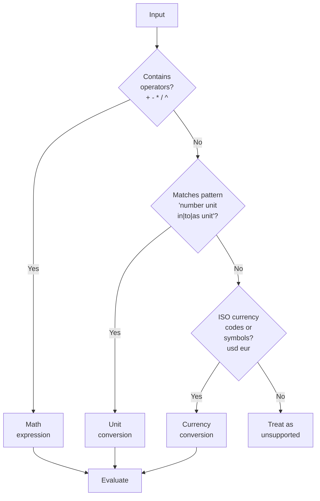

# Calculator and conversions

Evaluate math expressions, convert units, and convert currencies without leaving the launcher. No keyword is required; just type. ++enter++ copies the result.

## How to use it

Type a math expression directly into Sevak. The calculator recognizes what you're asking and shows the result:

### Math expressions

Type a math expression and ++enter++ copies the result. Results use up to 12 significant digits.

| Expression | Result | Operation |
|---|---|---|
| `12*7` | `84` | Multiplication |
| `(125+75)/4` | `50` | Grouped arithmetic |
| `2^10` | `1024` | Powers (`^` or `**`) |
| `sqrt(16)` | `4` | Square root |
| `5!` | `120` | Factorial |
| `17%5` | `2` | Remainder (not percentage) |
| `sin(0)` | `0` | Trigonometry |

**Operators:** `+` `-` `*` `/` `%` (remainder) `^` (power, right-associative) `!` (factorial)
- `×` and `÷` work as aliases for `*` and `/`
- `**` is an alias for `^`
- Unary minus: `-2^2 = -4` (minus binds loose; negate then power)

**Functions:** 
- Roots: `sqrt(x)` `cbrt(x)` (cube root)
- Trig: `sin`, `cos`, `tan`, `asin`, `acos`, `atan`, `sinh`, `cosh`, `tanh`
- Logarithms: `ln` (natural log) `log` (base 10) `log2` `exp` (e^x)
- Rounding: `floor` `ceil` `round`
- Utility: `abs` `sign` `min(a,b)` `max(a,b)` `pow(a,b)` `hypot(a,b)` `atan2(y,x)`

**Constants:** `pi` (π) `e` `tau` (2π)

### Unit conversion

Type `<amount> <unit> (in|to|as|=|→) <target_unit>`.

| Input | Result |
|---|---|
| `10 km in mi` | `6.213711922 mi` |
| `72°F to C` | `22.22222222°C` |
| `5'11" to cm` | `180.34 cm` |
| `2 h 30 min in min` | `150 min` |
| `1 acre in m²` | `4047 m²` |
| `60 mph in km/h` | `96.56064 km/h` |
| `5 GB in MiB` | `4768.371582 MiB` |

Units work offline. Amounts can be expressions: `(2+3) km in m` = `5000 m`.

**Supported categories:**
- **Length:** m, km, cm, mm, mi, yd, ft, in, nmi (nautical mile), ly (light-year), au (astronomical unit)
- **Mass:** kg, g, lb, oz (mass ounce), t (metric ton), ton (short ton)
- **Temperature:** °C, °F, K (no expression allowed; just `32 f to c`)
- **Volume:** L, ml, gal (US gallon), cup, tbsp (tablespoon), tsp (teaspoon), fl oz (fluid ounce), pt (US pint), qt (quart)
  - Imperial: `imp gal`, `imp pt` for British units
- **Area:** m², km², cm², ft², mi², acres, hectares
- **Speed:** m/s, km/h, mph (miles per hour), knots, ft/min, any length/time combination (e.g., `mi/h`)
- **Data:** B (byte), KB, MB, GB, TB, PB (powers of 1000); KiB, MiB, GiB, TiB, PiB (powers of 1024)
  - Case matters: `MB` = megabyte, `Mb` = megabit; `kb`, `mb`, `gb` = bytes
- **Time:** s, min, h, d, mo (month = 1/12 year), yr (year = 365.25 days)
- **Pressure:** Pa, kPa, MPa, bar, atm, psi, torr
- **Energy:** J, kJ, MJ, cal, Cal (food Calorie = kcal), kWh
- **Angle:** ° `deg` `rad` (radian) `turn` (full rotation)

**Compound units:** `10 km/h`, `5 sq ft`, `cm²`, `cubic m`, `m/s`, `miles per hour` all work.

**Ambiguous cases:**
- `oz` = mass ounce; `fl oz` = fluid ounce
- `m` = meters; `min` = minutes
- `°` or `deg` alone = angle; `°C` or `deg C` = temperature
- `cal` = small calorie (4.184 J); `Cal` = food Calorie (kcal)
- `t` = metric tonne; `ton` = US short ton

Results keep up to 10 significant digits.

### Currency conversion

Off by default. Turn it on in **Settings** → **Plugins** → **Currency conversion**, or set `[calculator] currency = true` and reload.

Type `<amount> <currency> in <currency>`. Use ISO codes (`usd`, `eur`) or symbols (`$`, `€`):

| Input | Result |
|---|---|
| `100 usd in eur` | `92.15 EUR` (example rate) |
| `50 € to $` | `54.50 USD` (example rate) |
| `$100 in eur` | `92.15 EUR` (example rate) |

Rates come from the European Central Bank daily, updated at most once a day in the background (never while you type). Until the first download, the result says "Fetching exchange rates…". Amounts can be expressions.

**Supported currencies:** 30+ major fiat currencies with EUR as the base. The subtitle shows the exchange rate and the ECB's publication date. Cryptocurrencies are not supported.

##Options

| Setting | Default | What it does | Config section |
|---|---|---|---|
| Currency | `false` | Enable currency conversion (needs network) | [`[calculator] currency`](../configuration.md#calculator) |

## Platform notes

=== "Windows"

    The calculator works identically on all Windows versions. Keyboard layouts that use `^` as a dead key (European layouts) still parse `^` as the power operator inside Sevak.

=== "macOS"

    The calculator works identically on all macOS versions. Type `option+0` for the degree symbol in unit conversions (e.g., `32°F to C`).

=== "Linux"

    The calculator works identically on all Linux desktop environments. Compose key sequences can type special characters outside Sevak; inside the launcher use ASCII equivalents like `deg` for `°`.

## Tips and troubleshooting

**Percentage of a number:** The `%` operator is **remainder**, not percentage. To find 15% of 200, type `200*15/100` = `30`.

**Scientific notation:** Write `1e3` for 1000, `2e-4` for 0.0002. Leading zeroes and underscores: `1_000_000` = `1000000`.

**Rounding noise:** `sin(pi)` shows something like `1.2e-16` instead of exactly `0` because of floating-point precision. Real results like `sin(π/2)` = `1` are exact.

**Precision:** Results are rounded to 12 significant digits to fit the launcher and remove noise from floating-point math. For most everyday use, this is more than enough.
