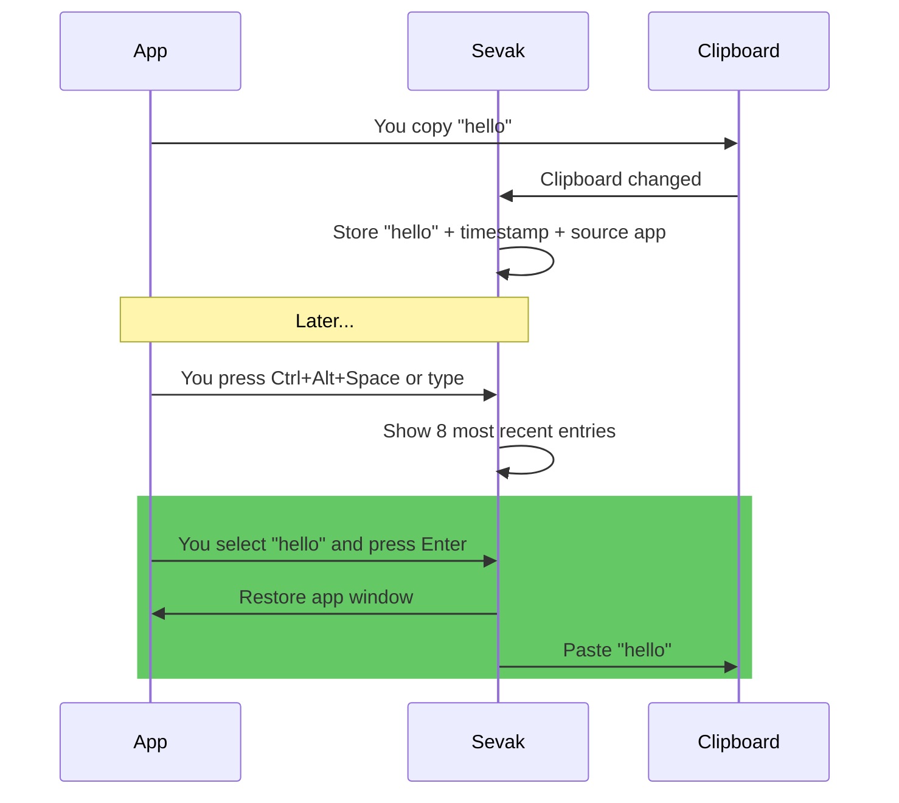

# Clipboard history

Store and search what you've copied recently: text, images and files. Type `cb <text>` to find a clipboard entry and paste it back into the app you were using. Entries are stored newest first, and duplicates are merged (copying the same text, picture or files again moves the existing entry to the top).

This feature is **opt-in**; nothing is watched or stored unless you turn it on.

## Turn it on

1. Open **Settings** (tray or `sevak --settings`), go to **Plugins**, and enable **Clipboard history**.
2. Or manually edit `config.toml` and set [`[clipboard] enabled = true`](../configuration.md#clipboard), then reload.

The first time you enable it, Sevak starts watching the clipboard. Everything copied *after* that moment is remembered; what was on the clipboard before is not.

## How to use it

Type `cb ` followed by at least one character of the text you want to find:

| Type | Shown | Press ++enter++ |
|---|---|---|
| `cb test` | Clipboard entries containing "test" (or copied files named so), newest first | Pastes the selected entry into the app you were in |
| `cb image` | Copied images, as a [grid of thumbnails](../usage.md#preview-text-view-and-grid-view) when only images match | Pastes the selected image |
| `cb clear` | A "Clear clipboard history" row | Permanently deletes all clipboard history |

When you press ++enter++, Sevak hides, brings back the app that was in focus before you opened Sevak, and pastes the text (unless [pasting is unavailable](#pasting-platform-notes)).

### Example

## Actions

What a row shows and what its keys do depends on what you copied:

| You copy | The row shows | ++enter++ | Other actions |
|---|---|---|---|
| Text | The first line, with its length in lines | Pastes the text | ++ctrl+c++ copies it without pasting; ++ctrl+t++ opens a long entry in the [Text View](../usage.md#preview-text-view-and-grid-view) |
| An image (a screenshot, "Copy image" in a browser) | A thumbnail, `Image 1920 × 1080` and the file size | Pastes the image | ++ctrl+enter++ copies it without pasting; ++shift+enter++ **Save image as…** writes a PNG to the Desktop (else Downloads) as `Clipboard image <date> <time>.png`, never over an existing file, and shows it in the file manager |
| Files or folders (a file manager's copy) | The file names and how many | Pastes the files, as a file manager's paste would | ++ctrl+enter++ shows the first one in the file manager; ++shift+enter++ copies the files without pasting; ++ctrl+c++ copies their paths as text |

Files are only recorded by their path: if one has been moved or deleted by the time you paste, the rest are pasted, and if none is left Sevak says so. ++ctrl+k++ lists every action of the selected entry, and the [preview pane](../usage.md#preview-text-view-and-grid-view) (tap ++shift++ or ++ctrl+y++) shows the full text, the full image, or the copied file.

## Options

| Setting | Default | What it does | Config section |
|---|---|---|---|
| Enabled | `false` | Turn clipboard history on or off | [`[clipboard] enabled`](../configuration.md#clipboard) |
| Max items | `200` | Keep this many entries; oldest are dropped (1–5000) | [`[clipboard] max_items`](../configuration.md#clipboard) |
| Max item size | `64 KB` | Longer text is not recorded (1 B–4 MB) | [`[clipboard] max_item_bytes`](../configuration.md#clipboard) |
| Images | `true` | Also record copied images (as PNG files) | [`[clipboard] images`](../configuration.md#clipboard) |
| Files | `true` | Also record copied files and folders (their paths) | [`[clipboard] files`](../configuration.md#clipboard) |
| Max image size | `10 MB` | An image whose PNG is larger is not recorded (1 B–64 MB) | [`[clipboard] max_image_bytes`](../configuration.md#clipboard) |
| Ignore apps | *(empty)* | Never record copies made in these apps (case-insensitive names), e.g. `["Signal", "Messages"]` | [`[clipboard] ignore_apps`](../configuration.md#clipboard) |
| Skip password managers | `true` | Also never record copies from the [built-in list](#password-managers-and-other-apps-skipped-by-default) of password managers and credential prompts | [`[clipboard] default_ignore_apps`](../configuration.md#clipboard) |
| Encrypt | `true` | Encrypt the history file and the images for your Windows account (macOS and Linux: plain files, readable by you only) | [`[clipboard] encrypt`](../configuration.md#clipboard) |
| Restore clipboard | `false` | Put back the clipboard's previous text after pasting | [`[paste] restore_clipboard`](../configuration.md#paste) |

## What is and isn't recorded

**Recorded** (up to `max_items` entries of all kinds together):
- Plain text copies
- Images (unless `images = false`), as PNG files with a small thumbnail
- Copied files and folders (unless `files = false`), by their paths only
- The timestamp (seconds since the Unix epoch)
- The name of the app where it was copied from (where available)

**Never recorded:**
- Content marked secret by the app (password managers set a marker on Windows and macOS; on Linux, KeePassXC and other managers set the `x-kde-passwordManagerHint` marker, which Sevak reads on X11 and, when `wl-clipboard` is installed, on Wayland; see [Linux](#linux))
- Copies made while one of the `ignore_apps`, or one of the [built-in password managers](#password-managers-and-other-apps-skipped-by-default), had focus
- Copies made while Sevak cannot tell which app has focus (a protected or elevated process on Windows, a window without a class on X11), on systems that can normally tell: the ignore list cannot be checked, so the copy is not kept
- Text longer than `max_item_bytes`
- Images whose PNG is larger than `max_image_bytes` (10 MB by default), and a copy of more than 1000 files
- Empty or whitespace-only text
- Copies Sevak itself made (pastes, or copies from its own actions), including the copy Universal Actions makes to read your selection
- Rich text and HTML (the plain text of such a copy is recorded)

Images together are also kept under about 500 MB: the oldest go first.

**The clipboard you started with:**
- When you enable clipboard history, it does not record what was already on the clipboard—only what you copy *after* enabling it.

## Storage and privacy

- **Location**: `clipboard-history.json` in Sevak's *local* data folder holds the text and the paths of copied files; each image is a PNG file (plus a small thumbnail) in the `clipboard` folder next to it (see [Files and data](../files-and-data.md) for the path by platform). On Windows that is `%LOCALAPPDATA%\sevak\`, which stays on this computer; earlier versions kept the history in `%APPDATA%\sevak\` (the roaming profile, which domain setups, folder redirection and backup tools copy elsewhere). The first start after the update moves the history and deletes the old files. Everything is stored only while the history is on.
- **Encryption**: On Windows the history file and the image files are encrypted for your Windows account (DPAPI) when `encrypt = true`, the default. Another Windows user, another computer or a copy of the files in a backup cannot read them; software running as you can, as it can read your clipboard directly. A history written before is encrypted the next time Sevak starts. If the saved history cannot be decrypted (the files came from another account or computer, or the account was reset), Sevak starts with an empty history, keeps nothing of the old one, and the first row of `cb` says so.
- **Permissions**: On Linux and macOS there is no encryption: the files are plain, readable only by your user (mode `0600`, the folder `0700`). On Windows the files also inherit the NTFS permissions of the local profile folder.
- **Clearing**: Type `cb clear` (any start of "clear clipboard history", at least 3 letters) to show a **Clear clipboard history** row, then press ++enter++ on it to delete the entire history, image files included. There is no further prompt, and it cannot be undone. Trimming the history (`max_items`) deletes the image files of the entries it drops too.
- **On uninstall**: The `clipboard-history.json` file and the `clipboard` folder stay behind. Delete them manually if you want to remove the history.

## Password managers and other apps skipped by default

Unless you set `default_ignore_apps = false`, copies made while one of these apps has focus are never recorded, in addition to your own `ignore_apps`. Names are compared like `ignore_apps` (case-insensitive, `.exe` and `.app` ignored) with the program name on Windows, the app name or bundle id on macOS and the window class or program name on Linux:

- Password managers: KeePass, KeePassXC, 1Password, Bitwarden, LastPass, Dashlane, Enpass, NordPass, RoboForm, Keeper, Proton Pass, Authy Desktop, WinAuth, GNOME Secrets, Seahorse, KWalletManager
- System credential prompts: the Windows credential and consent prompts (`CredentialUIBroker`, `consent`, `LogonUI`), macOS Keychain Access, Passwords and the security agent, `gcr-prompter`
- Passphrase prompts of ssh, gpg and their agents: `ssh-askpass` and its variants (`x11-ssh-askpass`, `gnome-ssh-askpass`, `ksshaskpass`, `lxqt-openssh-askpass`), `pinentry` and its variants, `pageant`, `puttygen`

This is a best-effort list: an app that is not on it, or that reports another name, is not covered, and the macOS and Linux names have not all been checked against every release. Add anything else to `ignore_apps`. The same name appears in the subtitle of a recorded entry ("Copied from ..."), so you can check what Sevak sees.

## Linux

Password managers on Linux mark a secret copy with the MIME type `x-kde-passwordManagerHint` (value `secret`); KDE's and GNOME's clipboard managers honour it, and Sevak does too:

- **X11**: Sevak asks the clipboard owner for its targets (a short request that waits at most about 150 ms for an answer) and skips the copy when the marker is there. An owner that offers the marker but does not answer is treated as secret.
- **Wayland**: only if `wl-paste` (the `wl-clipboard` package) is installed; Sevak runs it, without a shell and with a time limit, to list the types and to read the marker. Without `wl-clipboard` nothing is checked.

This depends on the app that copied the text setting the marker: a password copied from an app that does not set it looks like any other text, so keep `default_ignore_apps` on and add such apps to `ignore_apps`. Selection capture for Universal Actions honours the marker too.

## Pasting: platform notes

=== "Windows"
    Pasting works in most applications. **Exception**: applications running with elevated privileges (Admin, UAC elevation) cannot receive simulated keypresses, so Sevak copies the entry instead of pasting and the row says so.

=== "macOS"
    Requires *System Settings → Privacy & Security → Accessibility → Sevak* to paste. Without this permission, Sevak copies instead and the row shows "Copies to clipboard". Keyboard layouts that move the ++v++ key (e.g. Dvorak) also prevent pasting; use copy instead.

=== "Linux (X11)"
    Pasting works in most applications.

=== "Linux (Wayland)"
    Applications cannot simulate keypresses, so Sevak can only copy the entry. The row shows "Copies to clipboard". If you need pasting on Wayland, set [`[actions] use_clipboard_fallback = true`](../configuration.md#actions), copy the entry into the clipboard yourself, and use Universal Actions (Ctrl+Alt+Space) to apply transformations.

## Tips and troubleshooting

!!! tip "Password managers"
    The common password managers are skipped by default (see above). If you use one that is not on the list, add its name to [`[clipboard] ignore_apps`](../configuration.md#clipboard) to prevent passwords and secret keys from being recorded. Sevak also skips content marked secret by the app (Windows, macOS and, when the app sets the marker, Linux).

!!! note "The old clipboard is not put back over a newer copy"
    With `restore_clipboard`, after a paste Sevak puts your previous clipboard text back. If you (or another app) copied something in the meantime, Sevak notices and leaves the newer copy alone. Pasting also checks that the window you were in is still in front immediately before it presses the paste shortcut, and only copies if another window took the focus.

!!! tip "Restore the clipboard"
    If you want pasting to restore the clipboard's previous content (so `cb <text>` does not permanently replace what you had copied), set [`[paste] restore_clipboard = true`](../configuration.md#paste). This is useful when the text you're pasting is temporary and you want to keep your existing clipboard.

!!! tip "Limit the history size"
    Each entry takes a little disk space. If you have many very long entries (near the `max_item_bytes` limit), the history file can grow. Increase `max_items` to trim entries more aggressively, or lower `max_item_bytes` to skip long text.

!!! warning "What encryption does and does not protect"
    On Windows the history is encrypted for your account, which protects the files if they are copied elsewhere (a backup, a roaming profile, another account). It does not protect against software running as you: anything that can read your clipboard can ask Windows to decrypt the history too. On macOS and Linux the files are not encrypted, only readable by your user, so a stolen disk without disk encryption exposes them. A screenshot of a bank page is as readable in the history as it was on screen. Only enable clipboard history if you are comfortable with this risk, or keep sensitive copies out of it by using `ignore_apps` or turning images off (`images = false`).

!!! warning "App names must be exact (or close)"
    For `ignore_apps`, Sevak matches the application or window name case-insensitively. For example, `KeePassXC` and `keepassxc` both work, but `KeePass` (without `XC`) might not. If ignoring is not working, check the actual name of the app in the clipboard entry's subtitle (e.g. "Copied from KeePassXC").
