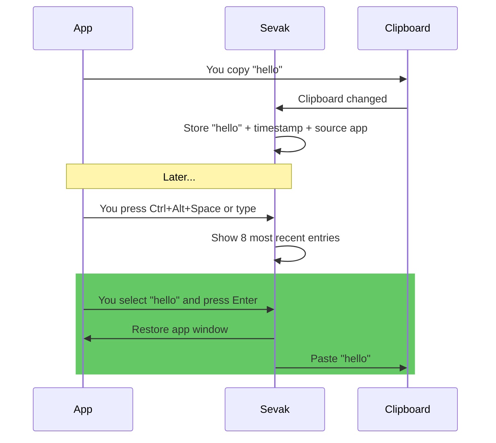

# Clipboard history

Store and search what you've copied recently: text, images and files. Type `cb <text>` to find a clipboard entry and paste it back into the app you were using. Entries are stored newest first, and duplicates are merged (copying the same text, picture or files again moves the existing entry to the top).

This feature is **opt-in**; nothing is watched or stored unless you turn it on.

## Turn it on

1. Open **Settings** (tray or `sevak --settings`), go to **Clipboard & paste**, switch on **Keep a clipboard history** and press **Save**. (The **Clipboard history** switch under **Plugins** must stay on too; it is on by default.)
2. Or manually edit `config.toml` and set [`[clipboard] enabled = true`](../configuration.md#clipboard), then reload.

The first time you enable it, Sevak starts watching the clipboard. Everything copied *after* that moment is remembered; what was on the clipboard before is not.

## How to use it

Type `cb ` followed by at least one character of the text you want to find:

| Type | Shown | Press ++enter++ |
|---|---|---|
| `cb test` | Clipboard entries containing "test" (or copied files named so), newest first | Pastes the selected entry into the app you were in |
| `cb image` | Copied images, as a [grid of thumbnails](../usage.md#preview-text-view-and-grid-view) when only images match | Pastes the selected image |
| `cb clear` | A "Clear clipboard history" row | Permanently deletes all clipboard history |

When you press ++enter++, Sevak hides, brings back the app that was in focus before you opened Sevak, and pastes the text (unless [pasting is unavailable](#pasting-platform-notes)).

### Example

## Actions

What a row shows and what its keys do depends on what you copied:

| You copy | The row shows | ++enter++ | Other actions |
|---|---|---|---|
| Text | The first line, with its length in lines | Pastes the text | ++ctrl+c++ copies it without pasting; ++ctrl+t++ opens a long entry in the [Text View](../usage.md#preview-text-view-and-grid-view) |
| An image (a screenshot, "Copy image" in a browser) | A thumbnail, `Image 1920 × 1080` and the file size | Pastes the image | ++ctrl+enter++ copies it without pasting; ++shift+enter++ **Save image as…** writes a PNG to the Desktop (else Downloads) as `Clipboard image <date> <time>.png`, never over an existing file, and shows it in the file manager |
| Files or folders (a file manager's copy) | The file names and how many | Pastes the files, as a file manager's paste would | ++ctrl+enter++ shows the first one in the file manager; ++shift+enter++ copies the files without pasting; ++ctrl+c++ copies their paths as text |

Files are only recorded by their path: if one has been moved or deleted by the time you paste, the rest are pasted, and if none is left Sevak says so. ++ctrl+k++ lists every action of the selected entry, and the [preview pane](../usage.md#preview-text-view-and-grid-view) (tap ++shift++ or ++ctrl+y++) shows the full text, the full image, or the copied file.

## Options

| Setting | Default | What it does | Config section |
|---|---|---|---|
| Enabled | `false` | Turn clipboard history on or off | [`[clipboard] enabled`](../configuration.md#clipboard) |
| Max items | `200` | Keep this many entries; oldest are dropped (1–5000) | [`[clipboard] max_items`](../configuration.md#clipboard) |
| Max item size | `64 KB` | Longer text is not recorded (1 B–4 MB) | [`[clipboard] max_item_bytes`](../configuration.md#clipboard) |
| Images | `true` | Also record copied images (as PNG files) | [`[clipboard] images`](../configuration.md#clipboard) |
| Files | `true` | Also record copied files and folders (their paths) | [`[clipboard] files`](../configuration.md#clipboard) |
| Max image size | `10 MB` | An image whose PNG is larger is not recorded (1 B–64 MB) | [`[clipboard] max_image_bytes`](../configuration.md#clipboard) |
| Ignore apps | *(empty)* | Never record copies made in these apps (case-insensitive names), e.g. `["KeePassXC", "1Password"]` | [`[clipboard] ignore_apps`](../configuration.md#clipboard) |
| Restore clipboard | `false` | Put back the clipboard's previous text after pasting | [`[paste] restore_clipboard`](../configuration.md#paste) |

## What is and isn't recorded

**Recorded** (up to `max_items` entries of all kinds together):
- Plain text copies
- Images (unless `images = false`), as PNG files with a small thumbnail
- Copied files and folders (unless `files = false`), by their paths only
- The timestamp (seconds since the Unix epoch)
- The name of the app where it was copied from (where available)

**Never recorded:**
- Content marked secret by the app (password managers on Windows and macOS set a marker; Linux has no marker, so use `ignore_apps`)
- Copies made while one of the `ignore_apps` had focus
- Text longer than `max_item_bytes`
- Images whose PNG is larger than `max_image_bytes` (10 MB by default), and a copy of more than 1000 files
- Empty or whitespace-only text
- Copies Sevak itself made (pastes, or copies from its own actions), including the copy Universal Actions makes to read your selection
- Rich text and HTML (the plain text of such a copy is recorded)

Images together are also kept under about 500 MB: the oldest go first.

**The clipboard you started with:**
- When you enable clipboard history, it does not record what was already on the clipboard—only what you copy *after* enabling it.

## Storage and privacy

- **Location**: `clipboard-history.json` in Sevak's data folder holds the text and the paths of copied files; each image is a PNG file (plus a small thumbnail) in the `clipboard` folder next to it (see [Files and data](../files-and-data.md) for the path by platform). Everything is stored only while the history is on.
- **Permissions**: On Linux and macOS, the file is readable only by your user (mode `0600`). On Windows, it inherits NTFS permissions from its folder.
- **Clearing**: Press **Clear history…** (then **Delete everything**) in **Settings → Clipboard & paste**, or type `cb clear` (any start of "clear clipboard history", at least 3 letters) to show a **Clear clipboard history** row, then press ++enter++ on it to delete the entire history, image files included. There is no further prompt, and it cannot be undone. Trimming the history (`max_items`) deletes the image files of the entries it drops too.
- **On uninstall**: The `clipboard-history.json` file and the `clipboard` folder stay behind. Delete them manually if you want to remove the history.

## Pasting: platform notes

=== "Windows"
    Pasting works in most applications. **Exception**: applications running with elevated privileges (Admin, UAC elevation) cannot receive simulated keypresses, so Sevak copies the entry instead of pasting and the row says so.

=== "macOS"
    Requires *System Settings → Privacy & Security → Accessibility → Sevak* to paste. Without this permission, Sevak copies instead and the row shows "Copies to clipboard". Keyboard layouts that move the ++v++ key (e.g. Dvorak) also prevent pasting; use copy instead.

=== "Linux (X11)"
    Pasting works in most applications.

=== "Linux (Wayland)"
    Applications cannot simulate keypresses, so Sevak can only copy the entry. The row shows "Copies to clipboard". If you need pasting on Wayland, set [`[actions] use_clipboard_fallback = true`](../configuration.md#actions), copy the entry into the clipboard yourself, and use Universal Actions (Ctrl+Alt+Space) to apply transformations.

## Tips and troubleshooting

!!! tip "Password managers"
    If you use KeePassXC, 1Password, Bitwarden or another password manager, add its name to [`[clipboard] ignore_apps`](../configuration.md#clipboard) to prevent passwords and secret keys from being recorded. Sevak already skips content marked secret by the app (Windows and macOS), but Linux has no such marker.

!!! tip "Restore the clipboard"
    If you want pasting to restore the clipboard's previous content (so `cb <text>` does not permanently replace what you had copied), set [`[paste] restore_clipboard = true`](../configuration.md#paste). This is useful when the text you're pasting is temporary and you want to keep your existing clipboard.

!!! tip "Limit the history size"
    Each entry takes a little disk space. If you have many very long entries (near the `max_item_bytes` limit), the history file can grow. Increase `max_items` to trim entries more aggressively, or lower `max_item_bytes` to skip long text.

!!! warning "History is not encrypted"
    The `clipboard-history.json` file contains the text you copied, in plain text, and the `clipboard` folder the images you copied as ordinary PNG files. A screenshot of a bank page is as readable there as it was on screen. If your computer is stolen or your home folder is otherwise compromised, the history can be read. Only enable clipboard history if you are comfortable with this risk, or keep sensitive copies out of it by using `ignore_apps` or turning images off (`images = false`).

!!! warning "App names must be exact (or close)"
    For `ignore_apps`, Sevak matches the application or window name case-insensitively. For example, `KeePassXC` and `keepassxc` both work, but `KeePass` (without `XC`) might not. If ignoring is not working, check the actual name of the app in the clipboard entry's subtitle (e.g. "Copied from KeePassXC").
