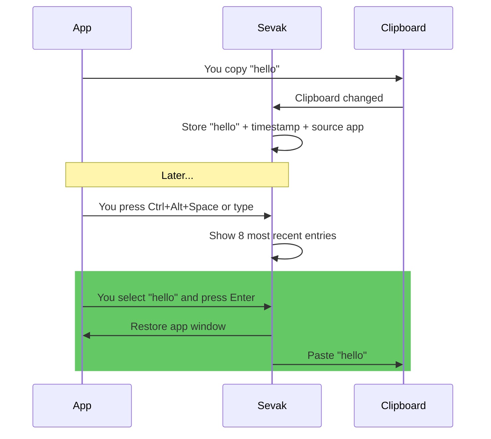

# Clipboard history

Store and search text you've copied recently. Type `cb <text>` to find a clipboard entry and paste it back into the app you were using. Entries are stored newest first, and duplicates are merged (the oldest copy disappears, the newest stays).

This feature is **opt-in**; nothing is watched or stored unless you turn it on.

## Turn it on

1. Open **Settings** (tray or `sevak --settings`), go to **Plugins**, and enable **Clipboard history**.
2. Or manually edit `config.toml` and set [`[clipboard] enabled = true`](../configuration.md#clipboard), then reload.

The first time you enable it, Sevak starts watching the clipboard. Everything copied *after* that moment is remembered; what was on the clipboard before is not.

## How to use it

Type `cb ` followed by at least one character of the text you want to find:

| Type | Shown | Press ++enter++ |
|---|---|---|
| `cb test` | Clipboard entries containing "test", newest first | Pastes the selected entry into the app you were in |
| `cb clear` | A "Clear clipboard history" row | Permanently deletes all clipboard history |

When you press ++enter++, Sevak hides, brings back the app that was in focus before you opened Sevak, and pastes the text (unless [pasting is unavailable](#pasting-platform-notes)).

### Example

## Actions

- **++enter++**: Paste the selected entry into the app you were in.
- **++ctrl+k++** (action panel): See all available actions for the selected entry (typically just paste and copy).
- **++ctrl+c++**: Copy the selected entry to the clipboard without pasting into the previous app.

## Options

| Setting | Default | What it does | Config section |
|---|---|---|---|
| Enabled | `false` | Turn clipboard history on or off | [`[clipboard] enabled`](../configuration.md#clipboard) |
| Max items | `200` | Keep this many entries; oldest are dropped (1–5000) | [`[clipboard] max_items`](../configuration.md#clipboard) |
| Max item size | `64 KB` | Longer text is not recorded (1 B–4 MB) | [`[clipboard] max_item_bytes`](../configuration.md#clipboard) |
| Ignore apps | *(empty)* | Never record copies made in these apps (case-insensitive names), e.g. `["KeePassXC", "1Password"]` | [`[clipboard] ignore_apps`](../configuration.md#clipboard) |
| Restore clipboard | `false` | Put back the clipboard's previous text after pasting | [`[paste] restore_clipboard`](../configuration.md#paste) |

## What is and isn't recorded

**Recorded:**
- Plain text copies (only text, not images, files or rich content)
- The timestamp (seconds since the Unix epoch)
- The name of the app where it was copied from (where available)

**Never recorded:**
- Content marked secret by the app (password managers on Windows and macOS set a marker; Linux has no marker, so use `ignore_apps`)
- Copies made while one of the `ignore_apps` had focus
- Text longer than `max_item_bytes`
- Empty or whitespace-only text
- Copies Sevak itself made (pastes, or copies from its own actions)
- Images, files, rich text, HTML or any non-text content

**The clipboard you started with:**
- When you enable clipboard history, it does not record what was already on the clipboard—only what you copy *after* enabling it.

## Storage and privacy

- **Location**: `clipboard-history.json` in Sevak's data folder (see [Files and data](../files-and-data.md) for the path by platform).
- **Permissions**: On Linux and macOS, the file is readable only by your user (mode `0600`). On Windows, it inherits NTFS permissions from its folder.
- **Clearing**: Type `cb clear` (any start of "clear clipboard history", at least 3 letters) to show a **Clear clipboard history** row, then press ++enter++ on it to delete the entire history. There is no further prompt, and it cannot be undone.
- **On uninstall**: The `clipboard-history.json` file stays behind. Delete it manually if you want to remove the history.

## Pasting: platform notes

=== "Windows"
    Pasting works in most applications. **Exception**: applications running with elevated privileges (Admin, UAC elevation) cannot receive simulated keypresses, so Sevak copies the entry instead of pasting and the row says so.

=== "macOS"
    Requires *System Settings → Privacy & Security → Accessibility → Sevak* to paste. Without this permission, Sevak copies instead and the row shows "Copies to clipboard". Keyboard layouts that move the ++v++ key (e.g. Dvorak) also prevent pasting; use copy instead.

=== "Linux (X11)"
    Pasting works in most applications.

=== "Linux (Wayland)"
    Applications cannot simulate keypresses, so Sevak can only copy the entry. The row shows "Copies to clipboard". If you need pasting on Wayland, set [`[actions] use_clipboard_fallback = true`](../configuration.md#actions), copy the entry into the clipboard yourself, and use Universal Actions (Ctrl+Alt+Space) to apply transformations.

## Tips and troubleshooting

!!! tip "Password managers"
    If you use KeePassXC, 1Password, Bitwarden or another password manager, add its name to [`[clipboard] ignore_apps`](../configuration.md#clipboard) to prevent passwords and secret keys from being recorded. Sevak already skips content marked secret by the app (Windows and macOS), but Linux has no such marker.

!!! tip "Restore the clipboard"
    If you want pasting to restore the clipboard's previous content (so `cb <text>` does not permanently replace what you had copied), set [`[paste] restore_clipboard = true`](../configuration.md#paste). This is useful when the text you're pasting is temporary and you want to keep your existing clipboard.

!!! tip "Limit the history size"
    Each entry takes a little disk space. If you have many very long entries (near the `max_item_bytes` limit), the history file can grow. Increase `max_items` to trim entries more aggressively, or lower `max_item_bytes` to skip long text.

!!! warning "History is not encrypted"
    The `clipboard-history.json` file contains the text you copied, in plain text. If your computer is stolen or your home folder is otherwise compromised, the history can be read. Only enable clipboard history if you are comfortable with this risk, or keep sensitive copies out of it by using `ignore_apps`.

!!! warning "App names must be exact (or close)"
    For `ignore_apps`, Sevak matches the application or window name case-insensitively. For example, `KeePassXC` and `keepassxc` both work, but `KeePass` (without `XC`) might not. If ignoring is not working, check the actual name of the app in the clipboard entry's subtitle (e.g. "Copied from KeePassXC").
