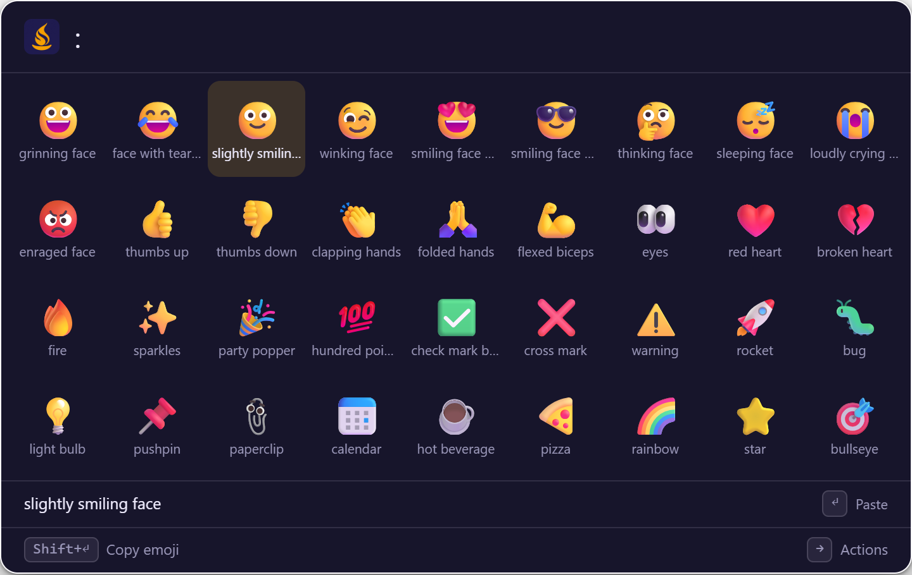

# Emoji picker

Find an emoji by name and paste it into the app you were using. Type `:` and a name (`:heart`, `:thumbs up`) or `emoji ` and a name. The matches are shown as a [grid of tiles](../usage.md#preview-text-view-and-grid-view).

## How to use it

| Type | Shown | Press ++enter++ |
|---|---|---|
| `:heart` | Every emoji whose name or keywords match "heart" | Pastes the selected emoji |
| `:thumbs up` | 👍 and related emoji | Pastes it |
| `emoji party` | 🎉 🥳 and others, by keyword | Pastes it |

The `:` keyword needs no space (`:smile` works). About 1,900 emoji are bundled with Sevak and found by their names and keywords, offline. Skin-tone variants are not listed: the base emoji is pasted and apps apply their own tone setting.

## Actions

| Key | Action |
|---|---|
| ++enter++ | Paste the emoji into the app you were using (it is copied where pasting is unavailable) |
| ++shift+enter++ | Copy the emoji instead of pasting it |
| ++arrow-left++ ++arrow-right++ ++arrow-up++ ++arrow-down++ | Move between tiles; ++pageup++ / ++pagedown++ jump three rows |
| ++shift++ (tap) or ++ctrl+y++ | Preview pane: the emoji large, with its name, keywords and code points |
| ++ctrl+k++ | All actions of the selected tile |

The grid shows up to 60 tiles. Pasting works like snippets and clipboard history; see [Pasting: platform notes](snippets.md#pasting-platform-notes).

## Options

| Setting | Default | What it does | Config section |
|---|---|---|---|
| Keywords | `emoji` and `:` | Fixed; they cannot be changed | — |
| Turn it off | on | Add `"emoji"` to `[plugins] disabled` (`emoji:word` and `emoji:colon` turn off one keyword) | [`[plugins] disabled`](../configuration.md#plugins) |

## Tips

!!! tip "Find by meaning"
    Keywords come from the Unicode CLDR annotations, so a word describing an emoji often finds it even when it is not in the emoji's name.
