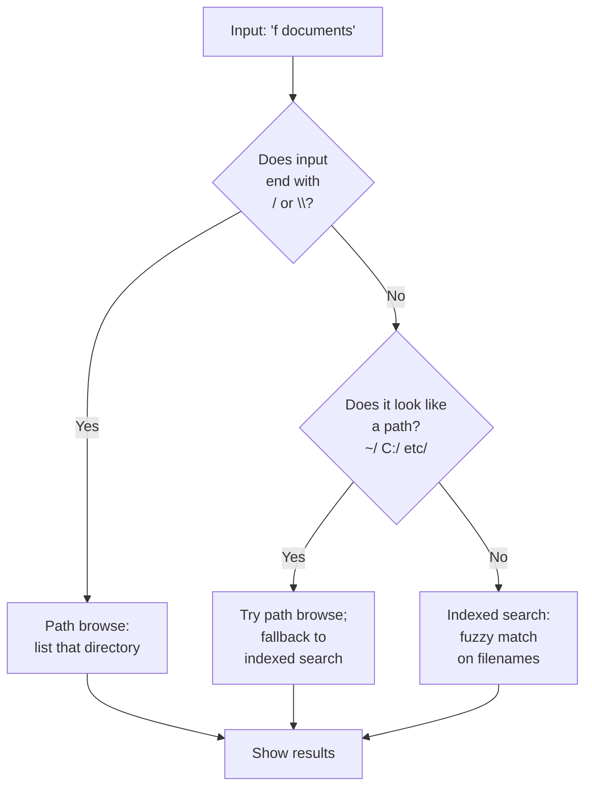

# Files and folders

Find and open files by name from your configured directories, search the whole disk or inside documents through your computer's own file index, or browse folders by typing a path. ++enter++ opens the file or folder. The [file buffer](#file-buffer) collects several files so you can act on them together.

## How to use it

The Files plugin works two ways: **indexed search** (fast, pre-built) and **path browsing** (live, as you type).

### Indexed search

Type `f ` followed by at least two characters of a filename:

| Input | What you see | What ++enter++ does |
|---|---|---|
| `f report` | All files/folders matching "report" | Open the selected file |
| `f config.toml` | Exact match for config.toml | Open config.toml |
| `f src/main` | Files in src/ matching "main" | Open the file |
| `report` (no keyword) | Files matching "report" + apps + other results | Open the file (if Files is global) |

Matching is fuzzy: `fsrc` finds `File System (C:)`, `fmain.rs` finds `src/main.rs`.

### Path browsing

Type a path to browse its contents live. ++tab++ and ++shift+tab++ navigate up and down folder levels:

| Input | What you see | Action |
|---|---|---|
| `~/Doc` | Contents of ~/Documents (path-matched) | Press ++tab++ to complete folder name |
| `~/Documents/` | Contents of Documents folder | ++enter++ on a folder to open it |
| `C:\Users\` | Contents of C:\Users | Navigate folders with ++tab++ |
| `/etc/` | Contents of /etc (Linux) | Press ++shift+tab++ to go up one level |

Folders end with `/` (or `\` on Windows), so ++tab++ drills deeper. Path browsing shows contents live without waiting for the full index.

!!! warning "Network paths are off by default (Windows)"
    A path on another computer (`\\server\share\...`, `//server/share/...`, `\\?\UNC\...`) or on a mapped network drive is not listed, opened or checked: Sevak shows one row, **Network paths are turned off (Settings → Files)**, before it touches the path. Windows signs in to a computer as soon as anything looks at its path, which can hand your Windows credentials to whoever runs that computer, and a path can reach Sevak from a pasted text or another program. Turn **Allow network paths** on (**Settings → Files**, or [`[files] allow_network_paths = true`](../configuration.md#files)) if you keep files on a server you trust. While it is off, folders in `directories` that are on a network share are skipped (a line in the log says so), and the same rule applies to the file buffer's destination picker, workflows' open-file nodes and any other path Sevak is about to open. Device paths such as `\\.\pipe\name` are never used. Text you select in other apps is never checked as a network path, whatever this setting says.

### Whole-disk and content search

`f` only knows the folders you chose. Two more keywords ask your computer's own file index, which covers the whole disk and can read inside documents:

| Input | What you see | What ++enter++ does |
|---|---|---|
| `ff report` | Files and folders anywhere the index looks whose **name** matches | Open the selected file |
| `in invoice 2026` | Files whose **contents** contain the words (at least three characters) | Open the selected file |

Several words must all match. Results are ordinary file results: ++enter++ opens, ++ctrl+enter++ shows in folder, ++shift+enter++ copies the path, ++tab++ fills in the path. Names match from the start of each word (`rep` finds `annual_report.docx`). Hidden files, caches and generated folders are left out, as for `f`.

| OS | Names | Inside files | Notes |
|---|---|---|---|
| Windows | Windows Search; "Everything" if `es.exe` is on `PATH` and Everything is running | Windows Search | Only indexed places are searched (by default your user folders and the Start menu). Add drives in *Indexing Options*. Reading PDFs and Office files depends on the installed search filters. |
| macOS | Spotlight (`mdfind`) | Spotlight | Honors Spotlight's Privacy list; app bundles and system folders are left out. |
| Linux | `plocate` or `locate` | Tracker 3 (`tracker3`), else Baloo (`baloosearch`) | Names need a `locate` database (`updatedb`, usually a daily timer). Contents need Tracker or Baloo to be installed and indexing. |

Asking the index takes a moment, so it never holds up typing: for `ff`, matches from the `f` folder index appear immediately, and the index's results join the list when they arrive. A search that takes more than two seconds is given up. If there is no index to ask (the Windows Search service is stopped, `locate` is not installed), a "File index unavailable" row says what to do, and `ff` still shows the folder matches. Queries go only to that local index, never over the network.

## How indexing vs. path-browsing is chosen

## Actions

| Key(s) | Action |
|---|---|
| ++enter++ | Open the file or folder |
| ++ctrl+enter++ | Show the file in your file manager (reveal in folder) |
| ++shift+enter++ | Copy the full path to your clipboard |
| ++tab++ (path browsing) | Complete or drill into a folder |
| ++shift+tab++ (path browsing) | Go up one folder level |
| ++alt+arrow-up++ / ++alt+arrow-down++ | Add the file to the [file buffer](#file-buffer) and move on |
| ++shift++ (tap) or ++ctrl+y++ | Preview the file or folder ([preview pane](../usage.md#preview-text-view-and-grid-view)) |

Use ++ctrl+k++ to see all available actions.

## File buffer

Collect several files and folders, then act on all of them. With a file or folder result selected (from file search or a browsed path; not bookmarks or apps):

| Key | What it does |
|---|---|
| ++alt+arrow-up++ / ++alt+arrow-down++ | Add the selected result to the buffer and move the selection up / down (++option++ on macOS) |
| ++alt+arrow-left++ | Remove the last item |
| ++alt+backspace++ / ++alt+delete++ | Empty the buffer |
| ++alt+arrow-right++ | Open the buffer's actions |

The buffer is a strip of chips above the results (click the `x` on a chip to drop it). It stays while you search for other things, and is emptied when the launcher hides, unless you set [`[file_buffer] keep_between_shows`](../configuration.md#file_buffer). The same actions are in the action panel of a file result (**Add to file buffer**, and **File buffer actions** once something is collected). The ++alt+arrow-left++, ++alt+arrow-right++ and ++alt+backspace++ keys only act while the buffer holds something, so on macOS ++option+arrow-left++ and ++option+backspace++ keep their text-editing meaning when it is empty.

| Buffer action | What it does |
|---|---|
| Open all | Opens each item with its default application (asks above 10 items) |
| Show in folder | Opens a file manager window for each folder the items are in (asks above 3) |
| Copy paths | Copies the paths, one per line |
| Copy files to clipboard | Puts the files on the clipboard as a file list, so pasting in Explorer, Finder or a file manager copies them |
| Move to… / Copy to… | Asks for a folder, then moves or copies the items there |
| Move to Trash | Sends the items to the Recycle Bin, Trash or freedesktop trash |
| Compress to .zip | Writes `Archive.zip` (one item: `<name>.zip`) into the folder the items share |
| Open in terminal | Opens a terminal in each folder, or in the folder of each file (asks above 3) |
| More file actions… | The [Universal Actions](selection.md) for files, over the collected items |

**Move to…** and **Copy to…** turn the search bar into a folder picker, starting at `~/`. Type a path or browse it as usual: ++tab++ opens the highlighted folder, ++shift+tab++ goes up, ++enter++ uses the highlighted folder, ++ctrl+enter++ uses the path exactly as typed, and ++escape++ cancels. Only folders are listed; the path browsing needs [`[files] global`](../configuration.md#files) or the `f ` prefix.

What to expect:

- Moving and trashing ask first, naming the items. Nothing is overwritten: a name that is taken becomes `report (2).docx` (`photos (2)`, `a (2).tar.gz`).
- Move, copy, trash and zip run in the background with a progress line under the chips; you can keep typing. When done, a line says what happened. If some items failed it says how many worked and why the first one did not, and the failed ones stay in the buffer. Moved and trashed items leave the buffer; copied and zipped ones stay for the next action.
- A folder is never moved or copied into itself. Items inside a collected folder are handled with the folder, not twice. Moving to another drive copies first and removes the original only if the copy worked.
- Zip archives skip symbolic links, and files that cannot be read (the line says how many).
- There is no undo, and no way to cancel a running operation. Trashed items can be restored from the Recycle Bin or Trash.
- On Linux, trashing needs `gio` (part of GLib), and "Copy files to clipboard" works with file managers that read `text/uri-list`; some (Nautilus) only accept their own format and may ignore it.

## Options

| Setting | Default | What it does | Config section |
|---|---|---|---|
| Directories | `~/Desktop`, `~/Documents`, `~/Downloads` | Folders whose contents are indexed | [`[files] directories`](../configuration.md#files) |
| Max depth | `4` | How many folder levels below each directory are indexed | [`[files] max_depth`](../configuration.md#files) |
| Include hidden | `false` | Whether to index dot-files and dot-folders (`.gitignore`, `.config/`) | [`[files] include_hidden`](../configuration.md#files) |
| Allow network paths | `false` | Windows: use `\\server\share` paths and mapped network drives (see [Path browsing](#path-browsing)) | [`[files] allow_network_paths`](../configuration.md#files) |
| Keyword | `f` | Keyword to search only files | [`[files] keyword`](../configuration.md#files) |
| Global | `true` | Also show file results in ordinary searches without the keyword | [`[files] global`](../configuration.md#files) |
| Use the OS index | `true` | Turn whole-disk (`ff`) and content (`in`) search on or off | [`[files] use_os_index`](../configuration.md#files) |
| Whole-disk keyword | `ff` | Keyword for names anywhere; `""` turns that search off | [`[files] index_keyword`](../configuration.md#files) |
| Contents keyword | `in` | Keyword for words inside files; `""` turns that search off | [`[files] content_keyword`](../configuration.md#files) |
| Keep the buffer | `false` | Keep the file buffer when the launcher hides | [`[file_buffer] keep_between_shows`](../configuration.md#file_buffer) |

### How indexing works

At startup and every few minutes, Sevak scans your configured directories and builds an index. Results from indexed search come back instantly.

**Pruned directories** (always skipped to save time):
- `node_modules`, `.git`, `target`, `__pycache__`, `.cache`, `venv`, `.venv`, `appdata`

To search inside one of these, use path browsing or configure them as a separate directory with a small depth.

**Limits:** The index is capped at 100,000 entries to bound memory. If you exceed this, older or less-used files drop out.

## Platform notes

=== "Windows"

    Paths use backslashes: `C:\Users\Name\Documents\`. Type `~` to expand to your home directory. Hidden files have the hidden attribute set; they appear in path browsing only if you explicitly type `.`.

=== "macOS"

    Paths use forward slashes: `/Users/Name/Documents/`. The index includes system directories but respects macOS privacy settings (it cannot read files in ~/Library without permission).

=== "Linux"

    Paths use forward slashes: `/home/name/documents/`. The `~` shortcut expands to your home. Root directories like `/etc/` and `/usr/` are not automatically indexed; add them to `[files] directories` if you need to search them.

## Tips and troubleshooting

**Slow indexing:** The first index scan takes longer than refreshes. It runs in the background; you can keep using Sevak while it builds.

**`ff` or `in` says "File index unavailable":** Start the Windows Search service (`WSearch`), install `plocate` and run `updatedb`, or install Tracker or Baloo, as the row explains. The OS only finds what it has indexed, so a file created seconds ago may take a moment to appear.

**Index doesn't include files I added:** Refresh the index by choosing **Reload index** from the tray menu, or wait a few minutes for the automatic refresh.

**Hidden files not showing:** Path browsing respects `[files] include_hidden`; if it's false, hidden files appear only when the filter itself starts with a dot (e.g., `.git`).

**Path completion is slow:** Path browsing reads the filesystem live, so large directories (like `node_modules`) can take a moment. The indexed search is faster for large collections.

**Symlinks:** Sevak follows symlinks when indexing, so the same file can appear under different paths. If this is unwanted, add the symlinked directory to the pruned list in the code and recompile, or use path browsing to navigate directly.
