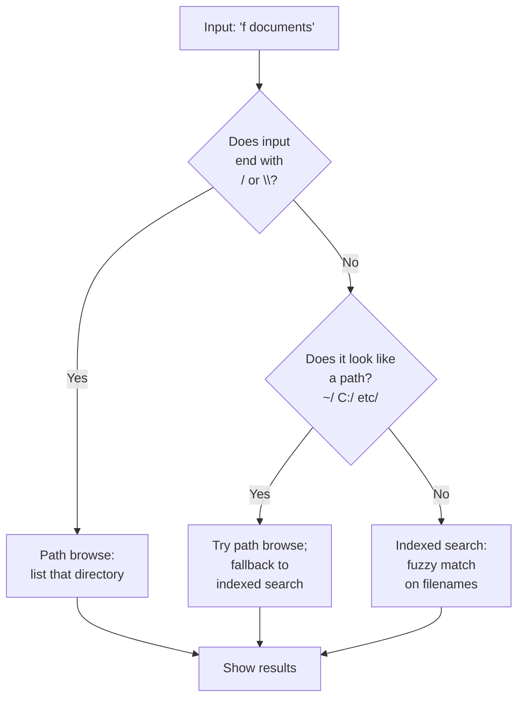

# Files and folders

Find and open files by name from your configured directories, or browse folders by typing a path. ++enter++ opens the file or folder.

## How to use it

The Files plugin works two ways: **indexed search** (fast, pre-built) and **path browsing** (live, as you type).

### Indexed search

Type `f ` followed by at least two characters of a filename:

| Input | What you see | What ++enter++ does |
|---|---|---|
| `f report` | All files/folders matching "report" | Open the selected file |
| `f config.toml` | Exact match for config.toml | Open config.toml |
| `f src/main` | Files in src/ matching "main" | Open the file |
| `report` (no keyword) | Files matching "report" + apps + other results | Open the file (if Files is global) |

Matching is fuzzy: `fsrc` finds `File System (C:)`, `fmain.rs` finds `src/main.rs`.

### Path browsing

Type a path to browse its contents live. ++tab++ and ++shift+tab++ navigate up and down folder levels:

| Input | What you see | Action |
|---|---|---|
| `~/Doc` | Contents of ~/Documents (path-matched) | Press ++tab++ to complete folder name |
| `~/Documents/` | Contents of Documents folder | ++enter++ on a folder to open it |
| `C:\Users\` | Contents of C:\Users | Navigate folders with ++tab++ |
| `/etc/` | Contents of /etc (Linux) | Press ++shift+tab++ to go up one level |

Folders end with `/` (or `\` on Windows), so ++tab++ drills deeper. Path browsing shows contents live without waiting for the full index.

## How indexing vs. path-browsing is chosen

## Actions

| Key(s) | Action |
|---|---|
| ++enter++ | Open the file or folder |
| ++ctrl+enter++ | Show the file in your file manager (reveal in folder) |
| ++shift+enter++ | Copy the full path to your clipboard |
| ++tab++ (path browsing) | Complete or drill into a folder |
| ++shift+tab++ (path browsing) | Go up one folder level |

Use ++ctrl+k++ to see all available actions.

## Options

| Setting | Default | What it does | Config section |
|---|---|---|---|
| Directories | `~/Desktop`, `~/Documents`, `~/Downloads` | Folders whose contents are indexed | [`[files] directories`](../configuration.md#files) |
| Max depth | `4` | How many folder levels below each directory are indexed | [`[files] max_depth`](../configuration.md#files) |
| Include hidden | `false` | Whether to index dot-files and dot-folders (`.gitignore`, `.config/`) | [`[files] include_hidden`](../configuration.md#files) |
| Keyword | `f` | Keyword to search only files | [`[files] keyword`](../configuration.md#files) |
| Global | `true` | Also show file results in ordinary searches without the keyword | [`[files] global`](../configuration.md#files) |

### How indexing works

At startup and every few minutes, Sevak scans your configured directories and builds an index. Results from indexed search come back instantly.

**Pruned directories** (always skipped to save time):
- `node_modules`, `.git`, `target`, `__pycache__`, `.cache`, `venv`, `.venv`, `appdata`

To search inside one of these, use path browsing or configure them as a separate directory with a small depth.

**Limits:** The index is capped at 100,000 entries to bound memory. If you exceed this, older or less-used files drop out.

## Platform notes

=== "Windows"

    Paths use backslashes: `C:\Users\Name\Documents\`. Type `~` to expand to your home directory. Hidden files have the hidden attribute set; they appear in path browsing only if you explicitly type `.`.

=== "macOS"

    Paths use forward slashes: `/Users/Name/Documents/`. The index includes system directories but respects macOS privacy settings (it cannot read files in ~/Library without permission).

=== "Linux"

    Paths use forward slashes: `/home/name/documents/`. The `~` shortcut expands to your home. Root directories like `/etc/` and `/usr/` are not automatically indexed; add them to `[files] directories` if you need to search them.

## Tips and troubleshooting

**Slow indexing:** The first index scan takes longer than refreshes. It runs in the background; you can keep using Sevak while it builds.

**Index doesn't include files I added:** Refresh the index by choosing **Reload index** from the tray menu, or wait a few minutes for the automatic refresh.

**Hidden files not showing:** Path browsing respects `[files] include_hidden`; if it's false, hidden files appear only when the filter itself starts with a dot (e.g., `.git`).

**Path completion is slow:** Path browsing reads the filesystem live, so large directories (like `node_modules`) can take a moment. The indexed search is faster for large collections.

**Symlinks:** Sevak follows symlinks when indexing, so the same file can appear under different paths. If this is unwanted, add the symlinked directory to the pruned list in the code and recompile, or use path browsing to navigate directly.
