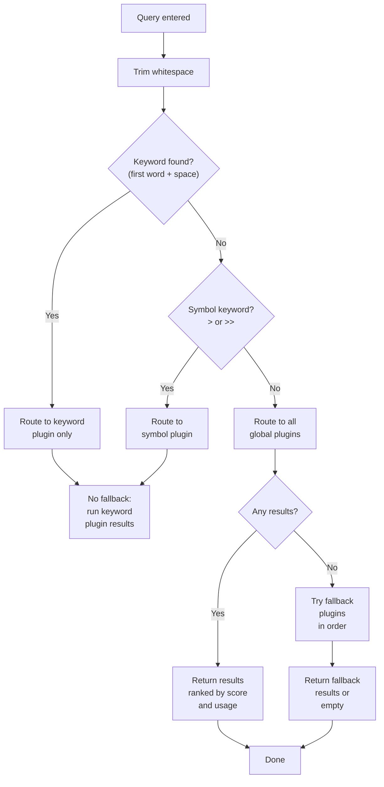

# Features overview

Sevak includes built-in result sources (plugins) for applications, calculations, files, bookmarks and more. Each plugin answers queries, and the search engine routes and ranks results to show the most relevant ones first.

## All built-in features

| Plugin | Trigger | Keyword | What Enter does | Learn more |
|---|---|---|---|---|
| Applications | Type any app name | (global) | Launch the application | [Applications →](apps.md) |
| Calculator | Type a math expression | (global) | Copy the result | [Calculator →](calculator.md) |
| Web search | `<keyword> <search>` | g, yt, gh | Open search results | [Web search →](web-search.md) |
| Files | `f <name>` or path-browse | f | Open the file or folder | [Files →](files.md) |
| Whole-disk and content search | `ff <name>`, `in <words>` | ff, in | Open the file | [Files →](files.md#whole-disk-and-content-search) |
| File buffer | ++alt+arrow-down++ on a file | (key) | Act on all collected files | [Files →](files.md#file-buffer) |
| Bookmarks | `b <bookmark name>` | b | Open the URL | [Bookmarks →](bookmarks.md) |
| System commands | Type a command name | (global) | Run the command | [System →](system.md) |
| Automation tasks | Type a task name, or `t ` | t (also global) | Run the task | [Tasks →](tasks.md) |
| Media controls | `pause`, `next`, `play ` | play (also global) | Press the media button | [Media →](media.md) |
| Window layouts | `win left`, `win max`, `win next display` | win | Snap or move the window you were using | [Window management →](../window-management.md) |
| Window switcher | `w <title or app>` | w | Bring that window to the front | [Window management →](../window-management.md#switch-windows) |
| Terminal commands | `> <command>` | > | Run in a terminal | [Shell →](shell.md) |
| Clipboard history | `cb <text>` | cb | Paste the text, image or files | [Clipboard →](clipboard.md) |
| Snippets | `s <snippet>`, or the keyword in any app | s | Paste the saved text | [Snippets →](snippets.md) |
| Emoji picker | `:<name>` or `emoji <name>` | :, emoji | Paste the emoji | [Emoji →](emoji.md) |
| Contacts (opt-in) | `c <name>` or `@<name>` | c, @ | Copy the e-mail address | [Contacts →](contacts.md) |
| 1Password (opt-in) | `1p <login>` | 1p | Open the login's website | [1Password →](1password.md) |
| Dictionary and spelling | `define <word>`, `spell <word>` | define, spell | Copy the definition / paste the spelling | [Dictionary →](dictionary.md) |
| AI assistant (opt-in) | `ai <question>` | ai | Send the question to the provider you chose; Enter on the answer copies it | [AI assistant →](../ai.md) |
| Universal Actions | Press hotkey on selection | (hotkey) | Open action menu | [Selection →](selection.md) |
| Script plugins | Your plugin's keyword | (yours) | What the script says | [Script plugins →](script-plugins.md) |
| Workflows | Your workflow's keyword, hotkey or trigger | (yours) | Run the workflow | [Workflows →](../workflows.md) |
| Extensions store | `ext <name>`, `store <name>` | ext, store | Install or update it | [Extensions →](extensions.md) |
| UUID generator | `uuid ` | uuid | Copy a generated UUID | — |

## How query routing works

The search engine routes each query to the right plugins using these rules:



### Keyword routing

Type `<keyword><space><rest>` to query only plugins with that keyword. For example:
- `f documents/report` searches only in Files
- `g rust traits` searches only Google
- `b github` searches only Bookmarks

The space is optional after symbol keywords: both `> ls` and `>ls` route to Terminal commands.

### Global queries

Without a keyword, global plugins answer every query:
- **Applications** (global, no keyword)
- **Calculator** (global, no keyword)
- **System commands** (global, no keyword)
- **Automation tasks** and **Media controls** (global if enabled; `global = true` in `[tasks]` and `[media]`)
- **Files** (global if enabled; `global = true` in config)
- **Bookmarks** (global if enabled; `global = true` in config)

Plugins with a keyword but also answering globally (e.g., Files with `f` keyword) have their results multiplied by **0.5** to rank below their dedicated keyword searches.

### Ranking

Results are scored by:
1. The plugin's own scoring (e.g., how closely a filename matches the query)
2. Your usage history (frequently picked results rank higher)
3. Query time (results from slower plugins lag behind faster ones)

Exact matches and keyword-triggered results keep the order their plugin gave them. They do not get boosted by usage history because they are already highly relevant.

### Fallback

When no global plugin found any results, the search engine tries fallback plugins in order. This catches cases like:
- Empty search → show suggestions from configured web engines (default: Google)
- No file or app matches → try web search
- New plugin answer → still show something useful

Fallback plugins run after all global plugins have answered, and results are shown in the fallback plugins' configured order (not re-ranked).

### Keyword hints

Type just the keyword (`g`, `f`, `b`) and the search engine appends that plugin's keyword row, so Tab can complete to `g `, `f `, `b ` ready for input.

## Turning plugins on and off

### In Settings

Open **Settings** → **Plugins**. Toggle any plugin or instance to enable or disable it.

### In config

Add plugin ids or instance ids to `[plugins] disabled`:

```toml
[plugins]
disabled = ["clipboard", "web:yt"]   # turn off clipboard history and YouTube
```

Family ids turn off all instances: `disabled = ["web"]` turns off every web engine.
Instance ids turn off one instance: `disabled = ["web:g"]` turns off Google only.

The built-in ids are `apps`, `calculator`, `web` (instances `web:<keyword>`), `files` (its instances `files:names` and `files:content` are the `ff` and `in` searches), `bookmarks`, `system`, `tasks`, `media`, `windows` (`windows:switch` is the window switcher), `shell`, `clipboard`, `snippets`, `emoji` (`emoji:word` and `emoji:colon` are its two keywords), `selection` (Universal Actions), `contacts`, `1password`, `dict` and `uuid`. Script plugins use `script:<name>` (or `script` for all), and workflows `workflow:<folder>` (or `workflow` for all). The full list is in the [configuration reference](../configuration.md#plugins).

To find a plugin's id, hover over a result for a moment—the id appears at the bottom.

## Customizing keywords and defaults

Read individual feature pages for options:
- [Web search keywords and engines](web-search.md)
- [Files keyword and folders](files.md)
- [Bookmarks keyword and browsers](bookmarks.md)
- [Calculator functions and units](calculator.md)
- [Automation tasks](tasks.md) and [media controls](media.md)
- [Window management](../window-management.md)
- [Contacts](contacts.md), [1Password](1password.md) and [the dictionary](dictionary.md)

Every plugin has its options in **Settings** (see [Settings window](../settings.md)) and in a `[section]` of `config.toml`. After editing the file by hand, choose **Reload index** from the tray menu or restart Sevak.
