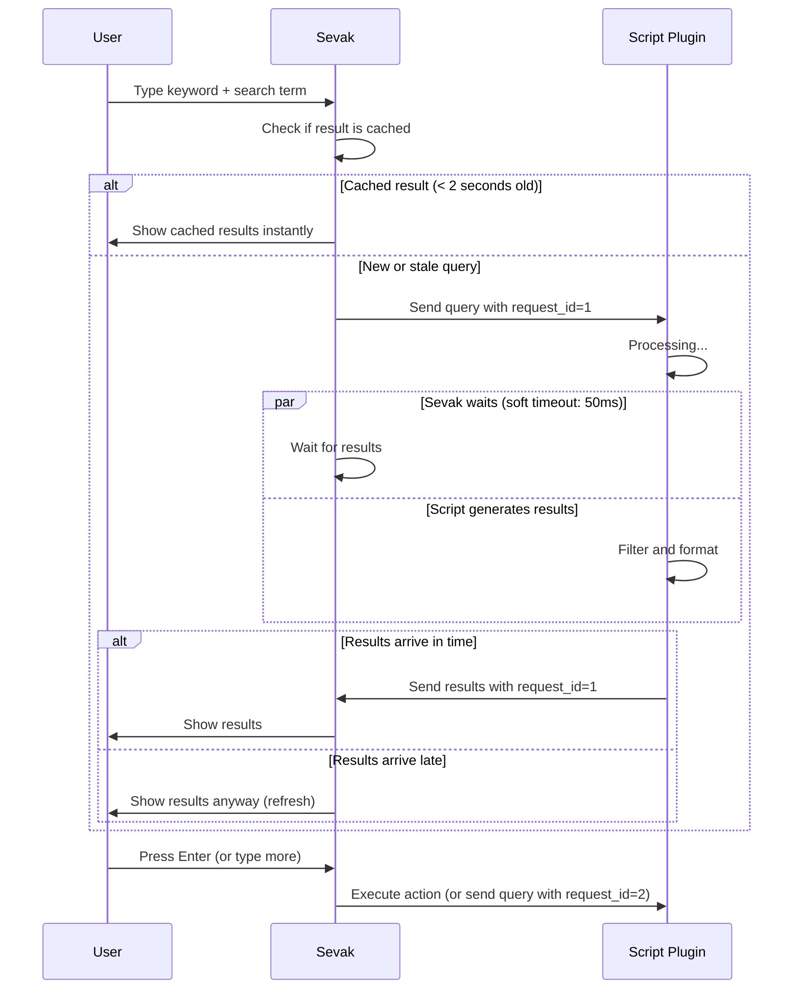

# Script plugins

Extend Sevak with custom search results by writing a script in Python, Node.js, PowerShell, or any language. A script plugin is a folder with a manifest (`plugin.toml`) and a script; drop it into your plugins folder and Sevak loads it on the next startup (or after **Reload index**).

This page covers installing and using script plugins. For writing one, see [Writing plugins](../plugins.md).

For ready-made tools, see the [extensions catalog](../extensions.md): Pomodoro,
color tools, browser translation and Tauri docs are available as separate packages.

## Install a plugin

1. **Get the plugin folder.** Download or clone a script plugin (examples are in the [Sevak repository](https://github.com/ninad-k/Sevak/tree/main/examples/plugins)).

2. **Find your plugins folder:**
   - **Windows**: `%APPDATA%\sevak\plugins`
   - **macOS**: `~/Library/Application Support/sevak/plugins`
   - **Linux**: `~/.config/sevak/plugins`

   Or in Sevak, choose **Settings → Open config file**, then go up one folder to find the plugins folder.

3. **Copy the plugin folder** (with its `plugin.toml` and script files) into the plugins folder. The folder structure looks like:

   ```
   ~/.config/sevak/
   ├── config.toml
   ├── plugins/
   │   ├── hello-python/
   │   │   ├── plugin.toml
   │   │   └── main.py
   │   └── timestamp-powershell/
   │       ├── plugin.toml
   │       └── timestamp.ps1
   ```

4. **Approve the plugin** (first time only):
   - Restart Sevak or choose **Reload index** from the tray menu.
   - Sevak finds the new plugin and shows a warning dialog, **Sevak: new script plugin**, with its name, keyword, folder (and a short contents id), the exact command it runs, the files covered, any extra environment variables it asks for and whether its results may start applications. Text written by the plugin's author is shown with control and direction-changing characters removed and long text cut.
   - Click **Allow** only if you trust where the plugin came from: it runs with your account's permissions. **Not now** leaves it off and asks again the next time Sevak starts.
   - Sevak remembers the answer for that plugin's *contents*: its `plugin.toml`, the script files its command names, and the folder it lives in. If any of them changes (you edit the script, update it with `git pull`, or move or copy the folder) you are asked again, and the dialog says the plugin's contents changed. If a script that is already running changes on disk, Sevak refuses to start it again until you review it: choose **Reload index**.
   - After upgrading to a Sevak that binds approvals to contents, every script plugin asks once more. That is expected.

The plugin is now active. Type its keyword (defined in `plugin.toml`) to search it.

## How to use a script plugin

Each script plugin has a **keyword** (defined in its `plugin.toml`). Type the keyword followed by your search term:

| Type | Shown | Press ++enter++ |
|---|---|---|
| `hello john` | Results from the "Hello" plugin matching "john" | Runs the action for the selected result |
| `ts` | Results from the "Timestamp" plugin (if ts is the keyword) | Runs the action |

Results come from the script's output; the script decides what actions do (copy, paste, open a URL, etc.).

### How script plugins communicate

A persistent-mode script runs once and listens on stdin for queries. Sevak and the script speak JSON lines:



### Example: built-in plugins

Sevak's built-in plugins work the same way:

- `cb` is clipboard history's keyword
- `s` is snippets' keyword  
- `>` is shell commands' keyword
- `f` is file search's keyword

Script plugins work exactly like these: type the keyword, get results, press Enter. If a script plugin's keyword is also used by a built-in search, a web search engine, a workflow or another script plugin, Sevak logs a warning and shows it in the plugin's description in Settings; the plugin still loads and both sets of results appear.

## Built-in examples

The Sevak repository includes example plugins you can install:

=== "hello-python"
    A Python plugin that greets you. Demonstrates a persistent process answering queries on stdin/stdout.
    
    - **Location**: [`examples/plugins/hello-python/`](https://github.com/ninad-k/Sevak/tree/main/examples/plugins/hello-python)
    - **Keyword**: `hello`
    - **How to use**: Type `hello john` to see a greeting.

=== "timestamp-powershell"
    A PowerShell plugin that generates timestamps. Demonstrates using PowerShell on Windows and other platforms.
    
    - **Location**: [`examples/plugins/timestamp-powershell/`](https://github.com/ninad-k/Sevak/tree/main/examples/plugins/timestamp-powershell)
    - **Keyword**: `ts`
    - **How to use**: Type `ts` to see timestamp options (now, yesterday, tomorrow, etc.).

=== "case-converter-node"
    A Node.js plugin that converts text case (uppercase, lowercase, title case, etc.). Demonstrates a one-shot plugin (fresh process per query).
    
    - **Location**: [`examples/plugins/case-converter-node/`](https://github.com/ninad-k/Sevak/tree/main/examples/plugins/case-converter-node)
    - **Keyword**: `case`
    - **How to use**: Type `case hello` to see case-conversion options.

### More plugins in the gallery

The gallery (Settings → Gallery) also offers offline Python 3 plugins, none of which touches the network or writes files: `pw` (random passwords, PINs and tokens; `pw 24` sets the length), `id` (UUID v4 and v7, ULID, NanoID), `color` (HEX, RGB, HSL, HSV and WCAG contrast of a color), `lorem` (placeholder text) and `hash` (checksums of text, or of a file given by its full path). Their sources are in [`examples/plugins/`](https://github.com/ninad-k/Sevak/tree/main/examples/plugins).

## Views, modifiers and the gallery

- A script can ask for its rows to be shown as a **grid of tiles** (pictures, icons) or mark a row whose long text opens in the **Text View**; see [Views: text and grid](../plugins.md#views-text-and-grid). The [preview pane](../usage.md#preview-text-view-and-grid-view) works for script results too.
- Alfred's `mods` (secondary actions on ++ctrl+enter++, ++alt+enter++, ++shift+enter++) are supported; see [Modifiers](../plugins.md#modifiers-mods).
- **Settings → Gallery** can install ready-made script plugins, but only after you press **Load gallery** and **Install**; see [The gallery](../workflows.md#the-gallery). An installed plugin still asks for permission before it runs.
- **Settings → Extensions** (and `ext` in the launcher) is the newer place to browse, install, update and remove gallery items, including [native extensions](../writing-extensions-in-rust.md) written in Rust; see [Extensions](extensions.md).
- To chain a script with other steps (open a link, paste, show a notification), use a [workflow](../workflows.md) with a script filter.

## Enable and disable plugins

- **Enable**: Place the plugin folder in the plugins folder and reload.
- **Disable all script plugins**: In `config.toml`, add `"script"` to [`[plugins] disabled`](../configuration.md#plugins):
  ```toml
  [plugins]
  disabled = ["script"]
  ```
- **Disable a specific plugin**: Add its id (typically `script:<name>`) to the disabled list:
  ```toml
  [plugins]
  disabled = ["script:hello"]
  ```

Disabled plugins do not run, but their folders stay in place.

## Script plugin types

Script plugins can work in two modes, defined in their `plugin.toml`:

| Mode | How it works | When to use |
|---|---|---|
| **Persistent** (default) | One long-lived process speaks JSON lines on stdin/stdout | Complex plugins that benefit from caching or keeping state across queries |
| **One-shot** | A fresh process per query; it prints JSON and exits | Simple plugins, or quick ad-hoc scripts that do not need to stay running |

A plugin's `plugin.toml` declares which mode it uses (`mode = "persistent"` or `mode = "oneshot"`). As a user, you do not need to know the difference—both work the same way.

## Troubleshooting

!!! danger "Plugin did not load"
    1. Check that the plugins folder exists (create it if it does not).
    2. Restart Sevak or choose **Reload index** from the tray.
    3. Check Sevak's log for errors. Choose **Settings → Troubleshooting** (if available) or look at the log file (see [Files and data](../files-and-data.md)).
    4. Make sure the `plugin.toml` is valid TOML and has a `protocol`, `keyword`, and `script` or `command`.

!!! warning "Plugin asked for approval but I clicked the wrong thing"
    1. Note the plugin's id (shown in the approval prompt, e.g., `script:hello`).
    2. Open `config.toml` and remove the id from [`[plugins] disabled`](../configuration.md#plugins) if it was added.
    3. Reload or restart Sevak.

!!! warning "Plugin appears but does not return results"
    1. Check the plugin's `plugin.toml` for the `script` or `command` field.
    2. Verify the script file exists in the plugin folder.
    3. On Linux and macOS, make sure the script is executable: `chmod +x script-file`.
    4. Run the script manually from the plugin folder to check for errors (e.g., `python3 main.py hello` or `./main.py hello`).
    5. Check Sevak's log for error messages.

!!! warning "Plugin hangs or is very slow"
    Script plugins have a timeout (soft: 50ms per query, hard: 3 seconds total). If your script is slow:
    1. Check the plugin's `plugin.toml` for `timeout_ms` and `hard_timeout_ms` settings.
    2. Optimize the script to respond faster (e.g., cache results, avoid network calls on every query).
    3. For persistent plugins, make sure it is staying running between queries (check Sevak's log).

!!! tip "Share a script plugin"
    If you write a useful plugin, consider sharing it. Open an issue on the Sevak GitHub repository or link it in Discussions.

## Learn more

For details on writing your own script plugin, see [Writing plugins](../plugins.md).
