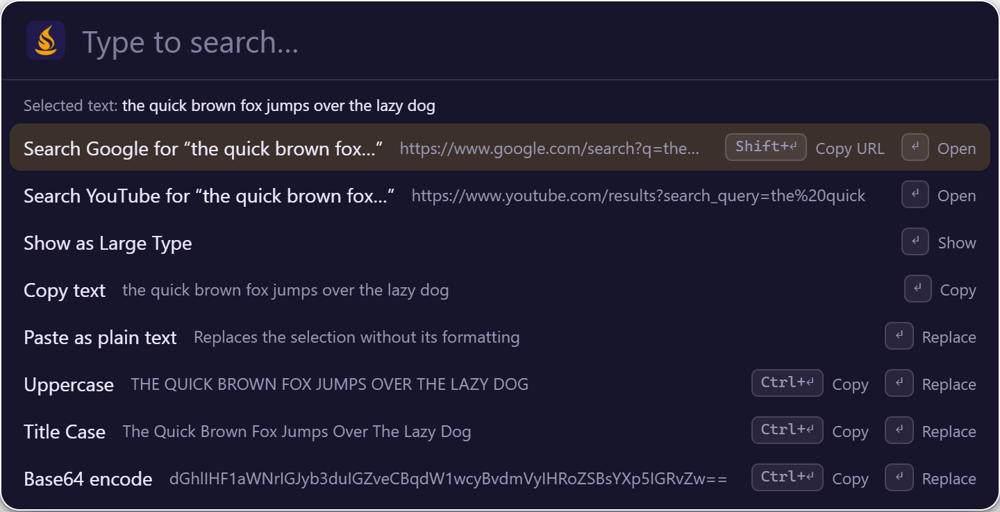
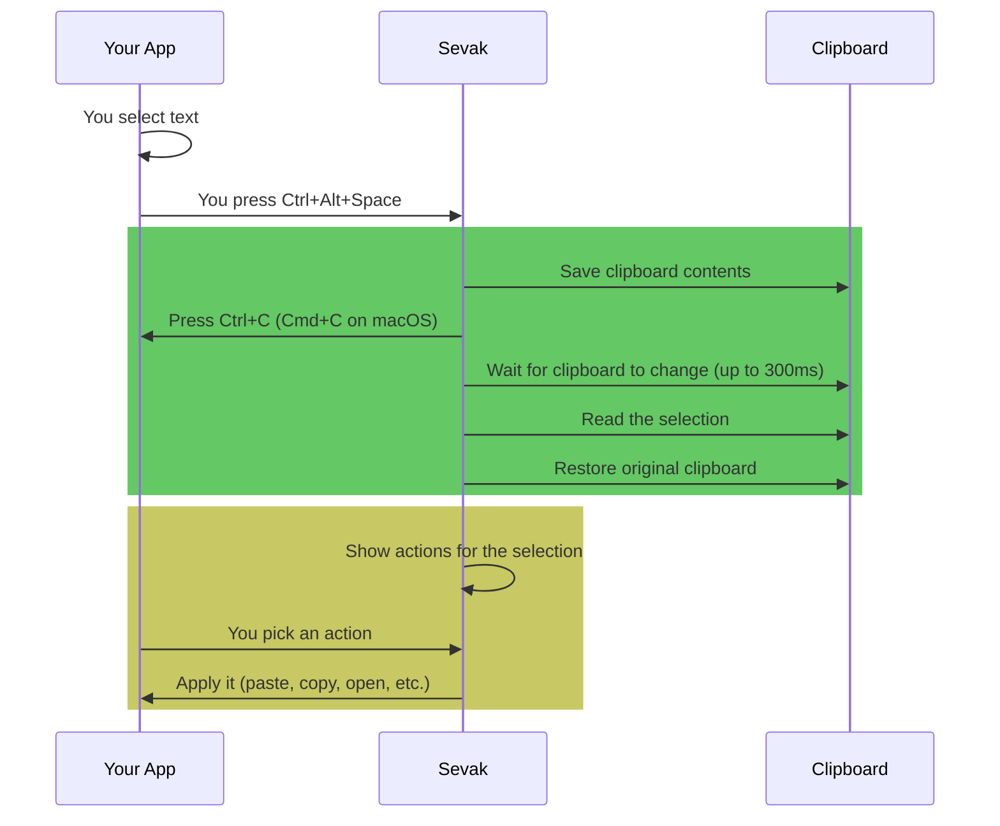

# Selection actions

Act on text, links, or files selected in another app without copying and pasting manually. Select something, press `Ctrl+Alt+Space` (configurable), and Sevak shows actions for it. Nothing runs until you pick an action with ++up++ / ++down++ and ++enter++, or `Ctrl+1` through `Ctrl+9`.



The picture shows sample text, rendered from the real interface with example data.

## Turn it on

The feature is on by default. To change the hotkey or turn it off:

```toml
[general]
actions_hotkey = "Ctrl+Alt+Space"   # "" turns it off
```

## How it works



The selection itself is **never stored or logged**. Sevak reads it once, shows actions, and forgets it unless you run an action.

## What you can do with selections

### Text

Select any text:

| Action | What it does |
|---|---|
| **Search [Engine] for "..."** | Opens your browser with a web search (one row per [`[[web_search]]`](../configuration.md#web_search) engine) |
| **Large Type** | Shows the text huge across the screen (for reading across the room) |
| **Copy** | Copies the text to the clipboard |
| **Paste as plain text** | Pastes without formatting (font, color, etc.) |
| **Calculate** | If the text is a calculation or conversion, shows the result (e.g., `2*3+4`, `10 km in mi`) |
| **Uppercase** | Transform: `hello` → `HELLO` (replaces the selection where pasting works) |
| **Lowercase** | Transform: `HELLO` → `hello` |
| **Title Case** | Transform: `hello world` → `Hello World` |
| **Trim whitespace** | Remove leading and trailing spaces |
| **URL-encode** | Transform: `hello world` → `hello%20world` |
| **URL-decode** | Transform: `hello%20world` → `hello world` |
| **Base64 encode** | Transform: `hello` → `aGVsbG8=` |
| **Base64 decode** | Transform: `aGVsbG8=` → `hello` (only if valid) |
| **Pretty-print JSON** | Format minified JSON with indentation |
| **Minify JSON** | Remove whitespace from JSON |

Transformations **replace the selection** in the app (Sevak pastes over it) where pasting works. `Ctrl+Enter` copies the result instead of pasting. If pasting is not available (Wayland, or macOS without permission), they copy.

### Workflows

A [workflow](../workflows.md) with a **Universal Actions** trigger appears in this list for the kinds of selection it accepts (text, links, or files and folders). Picking it runs the workflow with the selection as its argument, for example to tidy the text and paste it back.

### URLs and links

Select one or more URLs (starting with `http://`, `https://`, `mailto:` or `www.`):

| Action | What it does |
|---|---|
| **Open** | Opens the URL(s) in your default browser |
| **Copy** | Copies to the clipboard (one line per URL) |
| **Large Type** | Shows the URL(s) huge on screen |

### Files and folders

Select file paths or drag files from a file manager:

| Action | What it does |
|---|---|
| **Open** | Opens the file with its default application, or a folder in the file manager |
| **Show in folder** | Opens the file manager at the file's location |
| **Copy path** | Copies the full path to the clipboard (one line per file) |
| **Open in terminal** | Opens a terminal in the folder (folders only) |
| **Run as administrator** | Runs the program with elevated privileges (Windows .exe programs only) |
| **Send to Sevak** | Fills Sevak's search box with the path for browsing (path browsing) |

### Text that looks like a path

If you select text that matches a file path (`C:\Users\me\Documents`, `/home/me/Projects`, `~/Downloads`), Sevak also offers the file actions above, then the text actions (search, calculate, etc.).

## Actions and modifiers

Press ++enter++ to run the highlighted action. Modifiers change the behavior:

| Key | Effect | Example |
|---|---|---|
| ++enter++ | Run the action (as shown) | Paste the transformation, open the URL, etc. |
| ++ctrl+enter++ | Copy instead of pasting (transformations only) | Copy `HELLO` to clipboard instead of pasting |
| ++shift+enter++ | Copy the URL (web searches only) | Copy the search URL without opening it |

The row under each action hints at the modifiers.

## Pick an action with number keys

Instead of arrow keys and Enter, use `Ctrl+1` through `Ctrl+9` to run the 1st through 9th action directly:

| Key | Effect |
|---|---|
| ++ctrl+1++ | Run the 1st action |
| ++ctrl+2++ | Run the 2nd action |
| ... | ... |
| ++ctrl+9++ | Run the 9th action |

## Dismiss the action panel

- ++esc++: Close the action panel without running anything.
- ++left++: Close the action panel (same as Esc).
- Any other key: Close and continue typing in Sevak.

## Platform notes

=== "Windows"
    Selection capture works in every app **except windows running with elevated privileges** (Admin, UAC). Sevak tries anyway and shows what happens. For admin windows, select manually and set [`[actions] use_clipboard_fallback = true`](../configuration.md#actions) to act on what you copied.

=== "macOS"
    Requires *System Settings → Privacy & Security → Accessibility → Sevak*. Without this permission, Sevak cannot press Cmd+C in other apps and shows "Cannot read selection". Grant the permission and try again.
    
    Files in Finder and text both work. Pasting transformations also needs Accessibility permission and respects your keyboard layout.

=== "Linux (X11)"
    By default, Sevak reads the **PRIMARY selection** (text you just highlighted) first, without pressing any key (configurable: [`[actions] use_primary_selection = true`](../configuration.md#actions)). This is instant. If nothing is highlighted, it falls back to Ctrl+C.
    
    You can also turn off primary selection and always use Ctrl+C: `use_primary_selection = false`.
    
    Files are read from the clipboard. Terminal windows are skipped (Ctrl+C would interrupt the running program); use manual selection and clipboard fallback instead.

=== "Linux (Wayland)"
    Applications cannot read another app's selection or press keys. Sevak shows "Cannot read selection on this desktop" or similar. Workaround:
    
    1. Select the text manually.
    2. Copy it (Ctrl+C or Cmd+C).
    3. Set [`[actions] use_clipboard_fallback = true`](../configuration.md#actions) in your config.
    4. Press Ctrl+Alt+Space again.
    
    Sevak will then act on what you copied. This is not automatic, but it lets you use transformations and web searches.

## Special cases

!!! warning "Very large selections"
    Sevak refuses selections larger than 256 KB to avoid lag, and more than 1000 selected files and folders at once. On Windows an oversized text copy is recognised from the size of what the app put on the clipboard and is not read at all; elsewhere it is read and dropped at once. If you have a massive block of text selected, copy a smaller part and try again.

!!! warning "Terminal windows"
    On Windows and Linux, terminal windows (Windows Terminal, `conhost`, `cmd`, PowerShell, ConEmu, `mintty`, WezTerm, Alacritty, kitty, Tabby, Hyper, `gnome-terminal`, `konsole`, `xterm`, `tilix`, `terminator`, `foot`, `st` and others) do not receive Ctrl+C from Sevak because it would interrupt the running program. Select manually or use clipboard fallback instead. The same list decides where [snippet expansion](snippets.md) stays quiet unless you turn on `expand_in_terminals`.

!!! tip "No admin permission needed on macOS"
    Unlike pasting, selection capture on macOS needs the same Accessibility permission but does not require you to run Sevak as admin.

## Configuration

```toml
[general]
actions_hotkey = "Ctrl+Alt+Space"       # Hotkey to trigger actions; "" turns it off

[actions]
use_primary_selection = true            # Linux X11: read highlighted text first
use_clipboard_fallback = false          # Act on clipboard when capture fails
```

See [Configuration reference](../configuration.md) for details on all settings.

## Tips and troubleshooting

!!! tip "Bind actions to a different key"
    Choose a key not used by your desktop. On some layouts, Ctrl+Alt+Space types a no-break space; if that is your case, change the hotkey to `Ctrl+Alt+C` or another combination.

!!! tip "Use clipboard fallback on Wayland"
    If you are on Wayland and want to use transformations without the selection capture workaround, set `use_clipboard_fallback = true`. Then copy what you want to transform, press the hotkey, and pick an action. The result pastes or copies as normal.

!!! warning "Selection capture blocks keyboard input briefly"
    When you press the hotkey, Sevak waits for the modifiers to be released (up to 600ms) to avoid sending Ctrl+C while Ctrl is still down. If the hotkey's modifiers are held too long, Sevak releases them for the app. This ensures the copy succeeds, but it means your key bindings using those modifiers might behave unexpectedly for a moment.
