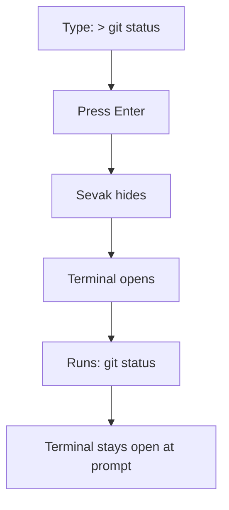

# Shell commands

Run shell commands in a terminal window. Type `> <command>` (or `><command>`, no space needed); nothing happens until you press ++enter++. Recent commands are offered again.

## How to use it

Type `>` followed by the command:

| Type | Shown | Press ++enter++ |
|---|---|---|
| `> git status` | "Run `git status` in terminal" | Opens your terminal and runs the command |
| `>npm test` | "Run `npm test` in terminal" | Opens your terminal and runs the command |
| `> ` (just `>`) | "Open terminal" + recent commands | Opens a terminal at a shell prompt (if a recent is selected, runs it) |

Nothing is executed until you press ++enter++. Recent commands are stored in `usage.json` and are offered again, newest first and ranked by frequency.

### Example



## Keep the terminal open

By default, after your command finishes, the terminal stays open at a shell prompt (`[shell] keep_open = true`). If you want it to close when the command exits, set `keep_open = false`.

## Choosing a terminal and shell

Sevak auto-detects a suitable terminal and shell for your platform, but you can specify one manually:

```toml
[shell]
terminal = ""          # "" = auto-detect
shell = ""             # "" = auto-detect
keep_open = true       # stay at a prompt after the command exits
```

### Auto-detection order

=== "Windows"
    **Terminal**: Windows Terminal (`wt`), else a console window.
    
    **Shell**: `pwsh` (PowerShell Core), else `powershell`, else `cmd`.
    
    For PowerShell, the command is encoded as Base64 to avoid quoting issues.

=== "macOS"
    **Terminal**: Terminal.app (or `iTerm2` if you set `terminal = "iterm"`, `terminal = "iterm2"`, or `terminal = "/Applications/iTerm.app"`).
    
    **Shell**: Your login shell (environment variable `$SHELL`), run by the terminal. Sevak does not choose the shell on macOS.

=== "Linux"
    **Terminal**: `$TERMINAL` environment variable, then `x-terminal-emulator`, `gnome-terminal`, `konsole`, `kitty`, `alacritty`, `wezterm`, `foot`, `xterm`.
    
    **Shell**: `$SHELL`, else `sh`.

### Examples

Choose a specific terminal or emulator:

```toml
[shell]
# Use Windows Terminal explicitly
terminal = "wt"

# Or an alternative like ConHost (Windows console)
terminal = "conhost"

# macOS: use iTerm2 instead of Terminal.app
terminal = "iterm"

# Linux: use Kitty with custom arguments
terminal = "kitty --class sevak"

# Linux: use a terminal by full path
terminal = "/usr/bin/alacritty"
```

Choose a different shell:

```toml
[shell]
# Use bash on Windows (with Git Bash)
shell = "bash"

# Use zsh on Linux
shell = "zsh"

# PowerShell on Linux
shell = "pwsh"
```

## Actions

- **++enter++**: Run the command in a terminal window.
- **++ctrl+k++** (action panel): See all available actions (typically just run).

## Options

| Setting | Default | What it does | Config section |
|---|---|---|---|
| Terminal | *(auto-detect)* | Terminal program: `wt`, `iterm`, `kitty`, `alacritty`, or a full path with optional args | [`[shell] terminal`](../configuration.md#shell) |
| Shell | *(auto-detect)* | Shell that runs the command: `pwsh`, `bash`, `zsh`, `fish`, etc. | [`[shell] shell`](../configuration.md#shell) |
| Keep open | `true` | Leave the terminal at a shell prompt after the command exits | [`[shell] keep_open`](../configuration.md#shell) |

## Platform notes

=== "Windows"
    Commands run in the terminal without a shell context, so shell aliases and functions (from `.bashrc`, `.zshrc`, etc.) are not available. Use full paths or install executables on `PATH`. PowerShell scripts need `powershell -ExecutionPolicy Bypass -File <path>`.

=== "macOS"
    Commands run through your login shell, so aliases and functions from your shell profile are available.

=== "Linux"
    Commands run through `$SHELL` (or `sh`) in non-interactive mode, so aliases from `.bashrc` (and similar) are typically not available. Use `source ~/.bashrc && <command>` if you need aliases or custom functions.

## Tips and troubleshooting

!!! tip "Keep recent commands"
    Recent commands are stored in `usage.json` (in Sevak's data folder). Clearing the usage store deletes them. Choose **Reload index** from the tray to rebuild, or restart Sevak.

!!! tip "Set a variable for the terminal"
    Some terminal programs recognize environment variables. For example, on Linux you can set `KITTY_LISTEN_ON` to enable remote scripting, or use `alacritty --class sevak` to apply different window decoration.

!!! warning "Elevated commands on Windows"
    Commands run as the current user. If you need to run a command as administrator, use `runas /user:Administrator <command>` instead (this will prompt for your admin password).

!!! warning "Terminal is missing"
    If Sevak cannot find a terminal on Linux, install one from the auto-detection list, or set `terminal` to a full path. Check that the terminal is on `PATH`: `which alacritty` or `which gnome-terminal`.

!!! warning "Shell not found"
    If the shell you specified is not installed, Sevak falls back to `sh` (Linux) or tries the next option in the auto-detect order (Windows). Verify the shell exists: `which bash` or `which pwsh`.
