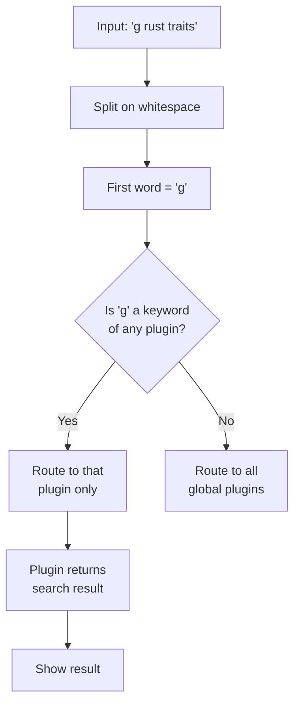

# Web search

Search the web with keyword triggers. Sevak comes with Google, YouTube and GitHub pre-configured. ++enter++ opens the search results in your browser.

## How to use it

Type a keyword followed by a space and your search terms:

| Input | Keyword | Search provider | What ++enter++ does |
|---|---|---|---|
| `g rust traits` | `g` | Google | Open google.com/search?q=rust+traits |
| `yt keyboard shortcuts` | `yt` | YouTube | Open youtube.com results |
| `gh sevak launcher` | `gh` | GitHub | Open github.com/search results |

Press ++tab++ on a bare keyword (`g`, `yt`, `gh`) to complete it with a space, ready for search terms.

The default fallback behavior: when nothing else matches, Sevak searches with the configured fallback engine (by default, Google). You can disable this by setting `[search] fallback_web_search = ""`.

## Actions

| Key(s) | Action |
|---|---|
| ++enter++ | Open the search results |
| ++shift+enter++ | Copy the search URL to your clipboard |

Use ++ctrl+k++ to see all available actions.

## Adding custom search engines

Edit `config.toml` to add, remove, or modify web search engines:

```toml
[[web_search]]
keyword = "g"
name = "Google"
url = "https://www.google.com/search?q={query}"

[[web_search]]
keyword = "yt"
name = "YouTube"
url = "https://www.youtube.com/results?search_query={query}"

[[web_search]]
keyword = "gh"
name = "GitHub"
url = "https://github.com/search?q={query}"
```

**To add a new engine:** copy one block and change the `keyword`, `name`, and `url`. The `{query}` placeholder gets replaced with your search terms (percent-encoded).

**To remove an engine:** delete its entire `[[web_search]]` block.

**To change the default:** define `[[web_search]]` entries in the order they should appear as fallbacks. The first one is used when nothing else matches.

### Finding URL templates

Most search engines use `?q=` or `?query=`. Navigate to the search engine's homepage (e.g., google.com), search for something, and look at the resulting URL. Replace the search term with `{query}`. Examples:

- Google: `https://www.google.com/search?q={query}`
- DuckDuckGo: `https://duckduckgo.com/?q={query}`
- Wikipedia: `https://en.wikipedia.org/w/index.php?search={query}`
- Wiktionary: `https://en.wiktionary.org/w/index.php?search={query}`
- Stack Overflow: `https://stackoverflow.com/search?q={query}`
- npm packages: `https://www.npmjs.com/search?q={query}`
- Wikipedia (full-text): `https://en.wikipedia.org/w/index.php?fulltext=Search&search={query}`

## How search routing works



Keyword-triggered web searches are always returned, never down-weighted. When you type `g ` with no terms, the engine shows a "Search Google" hint.

## Options

| Setting | Default | What it does | Config section |
|---|---|---|---|
| Search engines | g, yt, gh | Keywords, names and URL templates for web search | [`[[web_search]]`](../configuration.md#web_search) |
| Fallback | `g` | Web engine queried when nothing else matches (empty to disable) | [`[search] fallback_web_search`](../configuration.md#search) |

## Tips and troubleshooting

**Unicode in search terms:** Sevak automatically encodes search terms for URLs (spaces become %20, accented characters become UTF-8 bytes, etc.). Type naturally.

**Special characters:** Symbols like `&`, `#`, `@` are safe to type in search terms and will be encoded correctly.

**Multiple fallback options:** To offer several fallback engines in order, use a list:

```toml
[search]
fallback_web_search = ["g", "yt", "gh"]
```

If nothing matches, Sevak tries Google first, then YouTube, then GitHub, in order, returning the first one that gives results.

**No search keyword:** You can temporarily disable all web search by setting `disabled = ["web"]` in `[plugins]`, but you won't have a fallback for unmatched queries.
