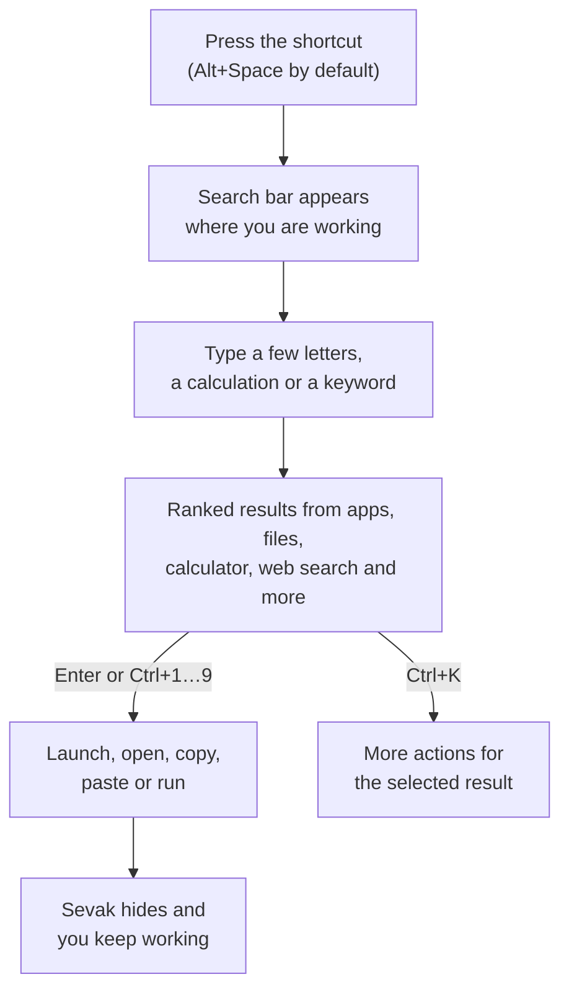

---
hide:
  - navigation
---

# Sevak documentation

**Your desktop. At your service.** Sevak is a keyboard-first launcher for
Windows, macOS and Linux. Press a shortcut, type what you need, and press
++enter++: open an app, find a file, calculate, convert units, search the web,
paste a snippet or run a command, all without leaving the keyboard.

[Download Sevak](https://github.com/ninad-k/Sevak/releases/latest){ .md-button .md-button--primary }
[Quick start](quickstart.md){ .md-button }
[PDF manual](pdf/Sevak-User-Guide.pdf){ .md-button }

## How it works in one picture

## Where to go next

-   **New to Sevak**

    ---

    [Install it](install.md), then follow the [five-minute quick start](quickstart.md).

-   **Everyday use**

    ---

    [Searching and launching](usage.md), the [keyboard shortcuts](keyboard.md)
    and every [feature](features/index.md) with examples.

-   **Make it yours**

    ---

    The [Settings window](settings.md), [themes](themes.md) and the complete
    [configuration file reference](configuration.md).

-   **When something is off**

    ---

    [Troubleshooting](troubleshooting.md), the [FAQ](faq.md) and what Sevak
    does with your data in [Privacy](privacy.md).

## Everything at a glance

| You type | What happens | Read more |
|---|---|---|
| `fire` | Finds Firefox; ++enter++ launches it | [Applications](features/apps.md) |
| `12*7`, `5 km in mi` | Shows the answer; ++enter++ copies it | [Calculator and conversions](features/calculator.md) |
| `g rust traits` | Searches Google in your browser | [Web search](features/web-search.md) |
| `f report` | Finds files in your chosen folders | [Files and folders](features/files.md) |
| `~/Downloads/`, `C:\Users\` | Browses folders as you type | [Files and folders](features/files.md) |
| `b recipes` | Opens a browser bookmark | [Browser bookmarks](features/bookmarks.md) |
| `cb` | Shows recent clipboard entries (once clipboard history is turned on) | [Clipboard history](features/clipboard.md) |
| `s sig` | Pastes a saved snippet | [Snippets](features/snippets.md) |
| `lock`, `sleep` | Runs a system command | [System commands](features/system.md) |
| `> git status` | Runs a shell command in a terminal | [Shell commands](features/shell.md) |

The exact keywords above are the defaults; most can be changed. The
[features overview](features/index.md) lists every keyword and how to change it.

!!! tip "Prefer a printed manual?"
    The whole user guide is also available as a single
    [PDF](pdf/Sevak-User-Guide.pdf), generated from these pages.
