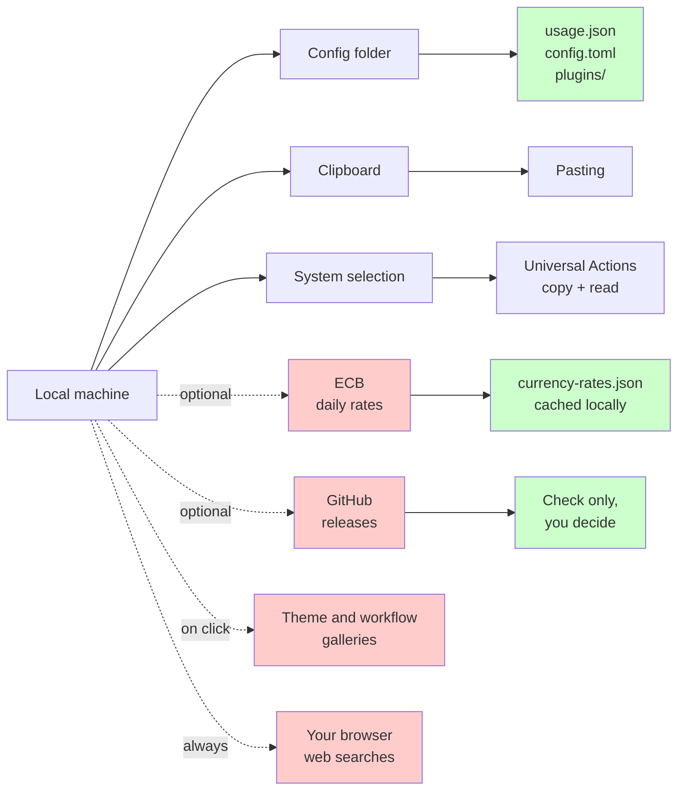

# Privacy

Sevak is local-first. Your data stays on your machine except when you explicitly choose a network feature.

## What stays local

- Application index, files and bookmarks (bookmarks are read from your browsers' files, read-only)
- Whole-disk and content file search (`ff`, `in`): queries go only to your computer's own file index (Windows Search, Spotlight, `locate`, Tracker or Baloo)
- The preview pane: it reads the selected file or folder from your disk, only while it is open; links are shown as addresses and never fetched. For a PDF, an Office file or a video it asks your operating system to draw a picture (Windows' PDF engine and thumbnails, macOS Quick Look, or `pdftoppm` on Linux), which may start a short-lived helper process with a time limit; the picture goes to the window in memory, and any temporary file the helper makes is deleted straight away
- Safari bookmarks (macOS): the bookmarks file is read only after you give Sevak Full Disk Access, only to search it, and nothing from it is stored or sent anywhere
- Search history (if enabled)
- Clipboard history (if enabled), including copied images (PNG files) and the paths of copied files, in the local (non-roaming) data folder, encrypted for your account on Windows
- Snippet library, and snippet expansion as you type (if enabled): the last 64 typed characters are kept in memory only, never stored, logged or sent
- Contacts (if enabled) and the 1Password list of logins (if enabled): in memory only, and kept out of the search history and usage statistics
- The dictionary and spelling checker (bundled WordNet data or the system's own), the emoji picker, automation tasks and media controls
- Themes: built-in, edited, imported or exported
- Settings and configuration
- Usage statistics (how often you run each result)
- Logs (for debugging)
- Script plugins, workflows and their data

All data is stored in a single folder on your machine; none is uploaded anywhere. What Sevak defends against, and what it does not, is set out in the [threat model](security/threat-model.md).

## What touches the network

Only when you opt in or use network features. Every network request Sevak itself makes is listed in this section: links you open, update checks, update downloads, currency rates, the theme gallery and the workflow gallery.

### Web search and links

When you search with a web keyword or open a web search result, a bookmark or any other link (including a Universal Actions web search), the address opens in your browser. For a web search, your query is sent to the selected search engine (Google, YouTube, GitHub, etc.) in your browser. Your search engine provider receives the query. This is **always your choice** — you type a web keyword and press Enter, or click a web result.

Example: typing `g rust traits` constructs `https://www.google.com/search?q=rust+traits` and opens it in your browser. Google sees `rust traits` as your query.

### Currency conversion

Opt-in feature (off by default). When enabled via `[calculator] currency = true`:

- Sevak downloads the **European Central Bank's daily reference rates** once per day
- URL: `https://www.ecb.europa.eu/stats/eurofxref/eurofxref-daily.xml` (small XML file, ~1.5 KB)
- No account or API key required
- Downloaded in the background (not during typing)
- Cached locally and reused for 24 hours
- Kept in `currency-rates.json` in your data folder

The ECB does not require authentication. Your IP address and request timestamp are visible to the ECB's servers, as with any web request. Sevak does not send additional context.

Disable with `[calculator] currency = false` to turn off the network request.

### Update checks

Opt-in feature (on by default). When enabled via `[general] check_for_updates = true`:

- Sevak checks **GitHub Releases** a minute after startup, then every six hours and when the launcher opens if the last check is over an hour old
- URL: `https://github.com/ninad-k/Sevak/releases/latest/download/latest.json` (small JSON metadata)
- No account required
- Done in the background (not during typing)
- Checking only; updates are never installed without your permission

Disable with `[general] check_for_updates = false` to turn off the network request.

#### Update channel

With the default `[general] update_channel = "stable"`, only the URL above is requested. If you switch to `"beta"` (Settings, General, Update channel), Sevak also requests `https://github.com/ninad-k/Sevak/releases/download/channel-beta/latest-beta.json`. It is the same kind of request to the same GitHub release assets, just a different small JSON file, and it sends nothing about you beyond what any web request does. The signature check on the downloaded package is the same on both channels.

### Installing an update

When an update is available and you agree to install it, its package is downloaded from GitHub Releases and its update signature is verified before it is installed. Windows installation may also download Microsoft's WebView2 runtime if it is missing.

### Theme gallery

Only when you click **Browse online themes** (**Settings → Appearance → Theme editor**):

- One request for `https://raw.githubusercontent.com/ninad-k/Sevak/v<your version>/gallery/themes.json`, the list of community themes, read from the release of your Sevak version (a build without a published release uses the latest release and says so)
- **Install** on a theme downloads that one theme file, saved only if its SHA-256 matches the one in the list; a theme of the same name is never replaced silently
- Files are requested only from Sevak's own repository on GitHub, also when a request is redirected
- Nothing is requested in the background or on startup

See [Theme gallery](themes.md#theme-gallery).

### Workflow gallery

Only when you press **Load gallery** (**Settings → Gallery**):

- One request for `gallery/index.json` from `raw.githubusercontent.com/ninad-k/Sevak`, at the tag of your Sevak version, the list of ready-made workflows and script plugins (a build without a published release uses the latest release and says so)
- **Install** on an entry downloads that one package, checked against the checksum in the index before anything is written; the installed folder still has to be allowed before it runs
- Nothing is requested in the background or on startup

See [The gallery](workflows.md#the-gallery).

### Extensions page and `ext`

Only when you press **Load the list** on **Settings → Extensions**, or press Enter on **Load the extension list** after typing `ext` or `store`:

- Two requests from `raw.githubusercontent.com/ninad-k/Sevak`, at the tag of your Sevak version: `gallery/index.json` (workflows, script plugins, native extensions) and `gallery/themes.json`. The lists are saved in the data folder (`extensions-catalog.json`) so the page works offline; opening the page reads that file and requests nothing
- **Install** and **Update** download that one package (for a native extension, the one build for your computer), checked against its checksum before anything is written; nothing runs until you allow it
- Nothing is requested in the background or on startup

See [Extensions](features/extensions.md).

All these galleries send nothing but the request itself (no cookies or identifiers beyond a `Sevak/<version> (gallery)` user agent). A build without a published release makes one more request, to GitHub's "latest release" link, to find out which release to read. Sevak never downloads plugins or workflows on its own.

## What is NOT collected

- No telemetry (no tracking, analytics, or usage data sent anywhere)
- No crash reports
- No advertising
- No profiling or behavioral analysis
- No timestamps of your searches or results
- No identifiers or user profiles

Script plugins and workflows run with your permissions and can make network requests themselves; review what they do before installing them. Workflows send nothing themselves and keep what you type or select out of the logs. 1Password's `op` tool, which the optional 1Password plugin runs when you type `1p `, talks to 1Password as it normally does; Sevak asks it only for the list of logins, never passwords.

## Diagnostics report

Sevak has no telemetry, so there is nothing to report problems automatically. To
make a bug report useful you can ask Sevak for a **diagnostics report**: **Settings
→ Help → Copy diagnostics**, or `sevak --diagnostics` on the command line. The
report is made on your computer. **It is never sent anywhere**: it is shown in a
box (or printed), and only you can copy it, save it or paste it into an issue. The
top of every report says what it contains and what it does not.

**Contains:**

- The Sevak version, commit and build; your OS name, version and architecture; the display server (X11 or Wayland), the desktop and the web view version.
- Where Sevak is installed and how (per user, Program Files, AppImage, Scoop...).
- A summary of your settings: which features are on, your shortcut and whether it is registered, the theme, the update setting and the keywords in use. Lists such as the folders you search, snippets and clipboard-ignore apps are only counted.
- The names and sizes (not contents) of the files in Sevak's config and data folders.
- Whether each plugin, script plugin and workflow loaded, failed (with the error), is switched off or waits for your approval, and how many apps and files are indexed.
- A few health checks (does the config parse, is the data folder writable, is the shortcut registered, does the tray icon exist) and the last 100 log lines with a count of recent errors and panics.

**Never contains:** clipboard history or snippet text; what is in any script or workflow; what you searched for or your search history; the usage statistics; contacts or 1Password data; the list of files or bookmark titles; the folders you chose to search; web search addresses; or any setting not listed above (a setting added in a later version stays out until it is deliberately added).

**Removed automatically:** your home folder (shown as `~`), user name (`<user>`) and computer name (`<host>`); other users' profile folders; in log lines, quoted text, paths outside Sevak's and the system's folders, e-mail addresses, web addresses with a query string or credentials, IPv4 and IPv6 addresses, API tokens and keys (GitHub, AWS, Slack, JWTs and similar), values after `password=` or `token:`, long hexadecimal and random-looking strings. This is a safety net, not a guarantee: Sevak's own log lines already avoid what you type, but read the report before you share it.

The script plugin and workflow entries are ids and an "allowed" state only, never their scripts. The checks write and delete one empty file in the data folder to see whether it is writable.

## Local data files

Inside your config folder (see [Files and data locations](files-and-data.md)):

| File | Purpose | Sent elsewhere? |
|---|---|---|
| `config.toml` | Your settings | No |
| `usage.json` | Frequency/recency of results; search history (if enabled) | No |
| `clipboard-history.json`, `clipboard/` | Clipboard history: text, paths of copied files, images (if enabled) | No |
| `currency-rates.json` | Cached ECB rates (if currency enabled) | No |
| `script-plugin-approvals.json` | Script plugins and workflows you allowed | No |
| `hotkey-takeover.json` | Whether you allowed Sevak to take Spotlight's or GNOME's shortcut, and the old GNOME values (so they can be restored) | No |
| `plugins/` folder | Script plugins and their data | No, unless the plugin makes network requests |
| `workflows/` folder | Workflows and their data | No, unless a workflow's script makes network requests |
| `themes/` folder | Theme files | No |
| Logs | Diagnostic output for troubleshooting | No (you can share them manually, or use the [diagnostics report](#diagnostics-report), which has a redacted tail) |

## Clipboard behavior

- **Pasting**: when you paste a result, Sevak hides, brings the previous window back, and presses ++ctrl+v++ (++cmd+v++ on macOS). The app itself receives the text.
- **Copying**: ++ctrl+c++ in the launcher copies the selected result's value or path to your clipboard. Your OS clipboard history (Windows Win+V, macOS, or a clipboard manager) may record it.
- **Accessibility**: on macOS, pasting and Universal Actions need the **Accessibility** permission. You grant this once in System Settings.

## The launcher shortcut

The default shortcut, Super+Space, is also used by the system. How Sevak takes it over:

- **Windows:** a keyboard hook, only while a shortcut needs it (Win+Space, or a key another app has registered). It compares each key press with your configured shortcuts and swallows those; it does not read, keep, log or send what you type, and no Windows setting changes. The hook is removed when you quit Sevak.
- **macOS and GNOME:** Sevak changes Spotlight's shortcut or GNOME's input-source shortcut only after you say yes in a dialog, and not at all if you say no. What you answered and the previous GNOME values are kept in `hotkey-takeover.json` in the data folder, so Sevak never asks twice and can restore the old settings. Nothing is sent anywhere.
- Settings in other apps are never changed.

See [Win+Space, Cmd+Space and Super+Space](troubleshooting.md#super-space).

## Snippet expansion as you type

Off by default (`[snippets] auto_expand`). While it is on, Sevak watches your keystrokes to notice a snippet keyword:

- Only the last 64 characters you typed are kept, in memory, and they are wiped whenever the text could have changed and after every expansion. They are never written to disk, logged or sent anywhere.
- Nothing is observed while the setting is off: expansion does not listen to the keyboard. (The Windows hook for the launcher shortcut, above, only compares key presses with your shortcuts.)
- Sevak's own windows, terminals, web browsers (unless `[snippets] expand_in_browsers = true`: a password field in a web page cannot be told from other text), apps listed in `[snippets] ignore_apps`, apps Sevak cannot identify, and password boxes the system can detect are skipped. On Windows that includes password fields reported by UI Automation (with browsers, only when their accessibility support is on).

See [Expand snippets as you type](features/snippets.md#expand-snippets-as-you-type).

## Selection reading (Universal Actions)

When you press the Universal Actions hotkey:

1. Sevak reads your system clipboard (and on X11 Linux, your PRIMARY selection)
2. Presses ++ctrl+c++ (++cmd+c++ on macOS) in the app you were using
3. Waits up to 0.3 seconds for the copy to complete
4. Reads the new clipboard content (text or files)
5. Restores your previous clipboard

**The original app makes the copy**, not Sevak. Your OS clipboard history may see it. Sevak's own clipboard history does not record this copy. The selection is never stored.

On **Windows and macOS**, this works everywhere except admin windows (Windows only). On **Linux Wayland**, app-to-app selection reading is not possible; use the fallback: copy the text yourself and set `[actions] use_clipboard_fallback = true`.

## Data locations

See [Files and data locations](files-and-data.md) for where everything is stored.

## Philosophy

Sevak is designed to be helpful without demanding trust. No cloud, no accounts, no surprises. You can verify what it does by reading the source code on GitHub.

## Architecture diagram

Red borders (top-right) = network. Green borders (bottom) = stays local.
