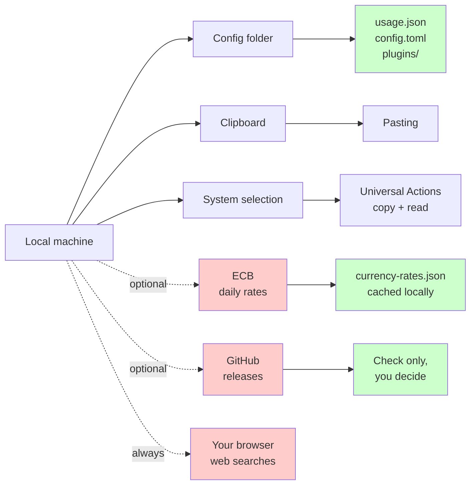

# Privacy

Sevak is local-first. Your data stays on your machine except when you explicitly choose a network feature.

## What stays local

- Application index, files and bookmarks
- Search history (if enabled)
- Clipboard history (if enabled)
- Snippet library
- Settings and configuration
- Usage statistics (how often you run each result)
- Logs (for debugging)
- Script plugins and their data

All data is stored in a single folder on your machine; none is uploaded anywhere.

## What touches the network

Only when you opt in or use network features:

### Web search

When you search with a web keyword or open a web search result, your query is sent to the selected search engine (Google, YouTube, GitHub, etc.) in your browser. Your search engine provider receives the query. This is **always your choice** — you type a web keyword and press Enter, or click a web result.

Example: typing `g rust traits` constructs `https://www.google.com/search?q=rust+traits` and opens it in your browser. Google sees `rust traits` as your query.

### Currency conversion

Opt-in feature (off by default). When enabled via `[calculator] currency = true`:

- Sevak downloads the **European Central Bank's daily reference rates** once per day
- URL: `https://www.ecb.europa.eu/stats/eurofxref/eurofxref-daily.xml` (small XML file, ~1.5 KB)
- No account or API key required
- Downloaded in the background (not during typing)
- Cached locally and reused for 24 hours
- Kept in `currency-rates.json` in your data folder

The ECB does not require authentication. Your IP address and request timestamp are visible to the ECB's servers, as with any web request. Sevak does not send additional context.

Disable with `[calculator] currency = false` to turn off the network request.

### Update checks

Opt-in feature (on by default). When enabled via `[general] check_for_updates = true`:

- Sevak checks **GitHub Releases** at startup and once per day for a new version
- URL: `https://github.com/ninad-k/Sevak/releases/latest/download/latest.json` (small JSON metadata)
- No account required
- Done in the background (not during typing)
- Checking only; updates are never installed without your permission

Disable with `[general] check_for_updates = false` to turn off the network request.

## What is NOT collected

- No telemetry (no tracking, analytics, or usage data sent anywhere)
- No crash reports
- No advertising
- No profiling or behavioral analysis
- No timestamps of your searches or results
- No identifiers or user profiles

Script plugins run with your permissions and can make network requests themselves; review what they do before installing them.

## Local data files

Inside your config folder (see [Files and data locations](files-and-data.md)):

| File | Purpose | Sent elsewhere? |
|---|---|---|
| `config.toml` | Your settings | No |
| `usage.json` | Frequency/recency of results; search history (if enabled) | No |
| `currency-rates.json` | Cached ECB rates (if currency enabled) | No |
| `plugins/` folder | Script plugins and their data | No, unless the plugin makes network requests |
| Logs | Diagnostic output for troubleshooting | No (you can share them manually) |

## Clipboard behavior

- **Pasting**: when you paste a result, Sevak hides, brings the previous window back, and presses ++ctrl+v++ (++cmd+v++ on macOS). The app itself receives the text.
- **Copying**: ++ctrl+c++ in the launcher copies the selected result's value or path to your clipboard. Your OS clipboard history (Windows Win+V, macOS, or a clipboard manager) may record it.
- **Accessibility**: on macOS, pasting and Universal Actions need the **Accessibility** permission. You grant this once in System Settings.

## Selection reading (Universal Actions)

When you press the Universal Actions hotkey:

1. Sevak reads your system clipboard (and on X11 Linux, your PRIMARY selection)
2. Presses ++ctrl+c++ (++cmd+c++ on macOS) in the app you were using
3. Waits up to 0.3 seconds for the copy to complete
4. Reads the new clipboard content (text or files)
5. Restores your previous clipboard

**The original app makes the copy**, not Sevak. Your OS clipboard history may see it. Sevak's own clipboard history does not record this copy. The selection is never stored.

On **Windows and macOS**, this works everywhere except admin windows (Windows only). On **Linux Wayland**, app-to-app selection reading is not possible; use the fallback: copy the text yourself and set `[actions] use_clipboard_fallback = true`.

## Data locations

See [Files and data locations](files-and-data.md) for where everything is stored.

## Philosophy

Sevak is designed to be helpful without demanding trust. No cloud, no accounts, no surprises. You can verify what it does by reading the source code on GitHub.

## Architecture diagram

Red borders (top-right) = network. Green borders (bottom) = stays local.
