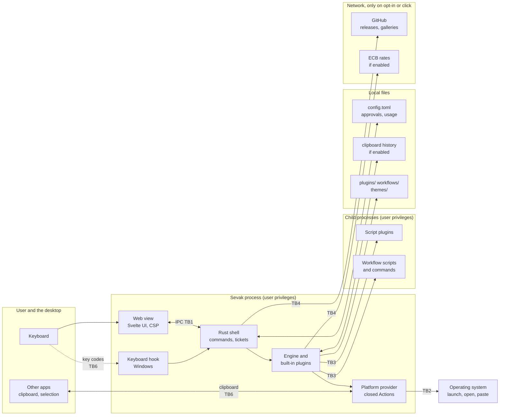
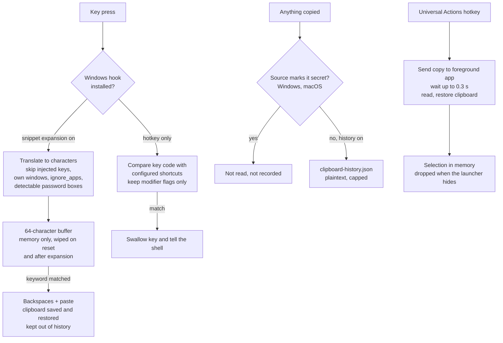
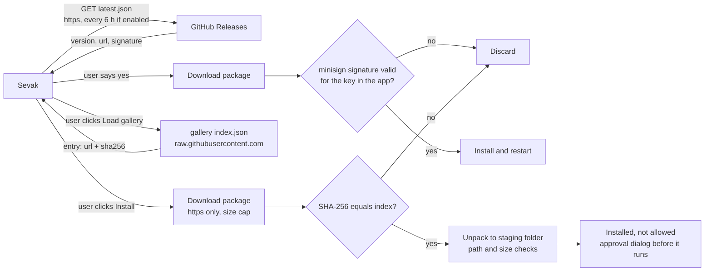

# Threat model

This page says what Sevak protects, from whom, where the trust boundaries are,
what the code does about each threat, and what it does not. It is written for
users who want to judge the risk, for contributors who change security-relevant
code, and for people reporting vulnerabilities (what counts is in
[SECURITY.md](https://github.com/ninad-k/Sevak/blob/main/SECURITY.md)).

It was written by reading the code of `main` (the commit it was reviewed
against is in the [review notes](#how-this-was-checked)), not from the other
documentation. Every mitigation below names the file and function that
implements it. Where something could not be confirmed it is marked
**(unverified)**. The model describes intent plus what was read; it is not a
proof, and anything that changes the picture is a reason to update this page.

!!! note "The short version"
    Sevak is a program that, by design, can read what you type into its own
    box, read your clipboard and selection when you ask, launch programs, and
    run scripts you approve. It runs as you, with no sandbox. It protects you
    from **other people's data** (files, web pages, clipboard contents, plugin
    and gallery content, the network) doing something you did not ask for. It
    does **not** protect you from software that already runs as your user.

## Scope and assumptions

| Assumption | Meaning |
|---|---|
| The operating system and the user account are not compromised | Software running as you can read your clipboard, files and screen, and can edit Sevak's config. Sevak does not try to stop that. |
| The web view is a trusted renderer of trusted pages | Sevak ships its own pages; the web view never loads remote content ([IPC](#webview-and-ipc)). The web view engine (WebView2, WKWebView, WebKitGTK) is a system component updated by the OS. |
| GitHub and the maintainer's account are trusted, with a bounded blast radius | Releases, `latest.json`, and the gallery indexes live there. A compromise is a [named actor](#actors), not an assumption that it cannot happen. |
| A single user, one desktop session | Other users of the same machine are an actor (they can read world-readable files), but fast-user-switching attacks are not modelled. |

Out of scope for the model: physical attacks, a malicious OS or firmware,
side channels, and denial of service by a user against themselves.

## Assets

What an attacker might want, and where it lives. "At rest" means on disk.

| Asset | Where it is | Sensitivity | Notes |
|---|---|---|---|
| Clipboard contents | In memory while polled; `clipboard-history.json` and `clipboard/*.png` at rest **if** history is enabled (off by default) | High: passwords and tokens are often copied | Plaintext at rest. Items the source app marks secret are not recorded on Windows and macOS. |
| Typed keystrokes (snippet expansion; the Windows hotkey hook) | The last 64 typed characters in memory, only while expansion is enabled | Very high | Never written, logged or sent. The hotkey hook alone compares key codes with configured shortcuts and keeps nothing. |
| Selections (Universal Actions) | In memory, until the launcher hides | Medium to high | Obtained by sending the copy shortcut to the foreground app and restoring the clipboard. Selection actions opt out of usage statistics. |
| Search queries | In memory; the last 50 may be in `usage.json` (setting) | Medium | Plugins that handle private text opt out of recording (`tracks_usage`). |
| File names and contents, paths | The OS file index and the disk; previews read on demand | Medium | Previews are capped and local-only. |
| Browser bookmarks, contacts, 1Password item metadata | Read from the browsers' files, the OS contacts store and the `op` tool; kept in memory | Medium | 1Password: titles, usernames and URLs of logins only. Sevak never asks `op` for secrets. |
| Configuration (`config.toml`, snippets, shell commands) | Config folder | High as a trust anchor | Anything in it can launch programs. Treated as trusted input. |
| Approvals (`script-plugin-approvals.json`) | Data folder | High as a trust anchor | Records which code the user allowed to run. |
| Script plugins and workflows | `plugins/`, `workflows/` | High | Run with the user's privileges once approved. |
| The update channel and release artifacts | GitHub Releases; the public key in the app | Critical | Whoever can publish a signed release controls every installed copy. |
| The signing key and release pipeline | Repository secrets, `.github/workflows/release.yml` | Critical | See [Release and update](#release-and-update). |

## Actors

| Actor | Capability assumed | In scope? |
|---|---|---|
| **Local malware running as the user** | Everything the user can do | **No** (it can already read the clipboard, change `config.toml` and run programs). Sevak limits what it *adds* for such an attacker, for example by keeping typed text out of files. |
| **Other local users** on the same machine | Read what is world-readable; write to shared temp folders | Yes, for file permissions and temp files |
| **Malicious file** in a searched, previewed or opened folder | Controls names, contents and metadata of files | Yes |
| **Malicious clipboard or selection content** | Anything a web page, document or another app puts on the clipboard or in a selection | Yes |
| **Malicious config, snippet or theme** (for example a synced dotfiles repo or a shared theme) | Controls text that Sevak parses | Yes for parsing and resource use. A config is trusted *to run commands*. |
| **Malicious script plugin or workflow** | Arbitrary code once approved; arbitrary data before | Yes for what happens *before* approval and for what the host does with its output. After approval it is the user's decision. |
| **Compromised gallery or release** | Controls files the gallery or the release download serves, and the manifest that lists them | Yes: see [Gallery](#gallery) and [Release and update](#release-and-update) |
| **Network attacker** (on-path, DNS, rogue Wi-Fi) | Observe and alter traffic | Yes |
| **Malicious web page or URL** the user opens | Whatever a browser does after Sevak hands it a link | Only for what Sevak hands over (scheme, encoding) |
| **Supply chain** (dependencies, GitHub Actions, build tools) | Inject code at build time | Partly: see the [backlog](#hardening-backlog) |
| **Another process on the same desktop at lower integrity** (Windows) | Send input events, post window messages | Limited; see [hook](#windows-keyboard-hook) |

## Trust boundaries

| # | Boundary | What crosses it | Controls |
|---|---|---|---|
| TB1 | **Web view to Rust** (Tauri IPC) | Query strings, result ids, settings, workflow definitions, theme data | CSP, no remote content, no plugin permissions, tickets, native dialogs for consent ([details](#webview-and-ipc)) |
| TB2 | **Rust to the operating system** | Launches, paths, URLs, keystrokes, clipboard, system commands | The closed `Action` vocabulary, the `PlatformProvider` trait, allow-lists for URL schemes, per-shell quoting |
| TB3 | **Sevak to script plugins and workflow children** | JSON in and out, environment, arguments | Approval, no shell, path checks, output caps, timeouts |
| TB4 | **Sevak to GitHub** (updates, galleries) and the ECB (rates) | Fetched indexes, packages, manifests | HTTPS only, size caps, SHA-256, updater signature, user action |
| TB5 | **Installer to the OS** | Files placed on disk, registry or login-item entries, WebView2 bootstrap | Per-user install (NSIS `currentUser`), package signature checks (unsigned installers: see below) |
| TB6 | **Sevak to other local processes** | The clipboard, injected key events, the single-instance channel for `--run`, `--query`, `--trigger` | Same-user only; see [Local interfaces](#local-interfaces) |

## Data-flow diagrams

### Overall

### Keystrokes, clipboard and selection

### Updates and galleries

## Existing mitigations

Each row was read in the code. "Where" gives the implementing file and symbol.

### Webview and IPC

| Mitigation | Where | What it does |
|---|---|---|
| Content Security Policy | `src-tauri/tauri.conf.json` (`app.security.csp`) | `default-src 'self'; style-src 'self' 'unsafe-inline'; img-src 'self' data:` plus the `sevak-icon` scheme; `connect-src ipc:` only. No remote script, style, frame, font or connection is allowed, and no inline script or `eval`. `'unsafe-inline'` is for styles only (themes are applied as CSS). |
| No HTML injection sinks | `ui/src` (searched for `{@html}`, `innerHTML`, `eval`, `new Function`) | Result text, subtitles, previews, folder names and URLs are rendered as Svelte text. Theme CSS is set with `textContent` (`ui/src/lib/appearance.ts`). |
| Minimal Tauri permissions | `src-tauri/capabilities/default.json` | `core:default` only, for the `main` and `settings` windows. No file-system, shell, dialog, updater, notification or global-shortcut plugin permission is granted to the page, so the page cannot call those plugins' commands. |
| App commands are narrow | `src-tauri/src/app.rs` (`generate_handler!`), `themes.rs` (`import_theme`, `export_theme`), `settings.rs` (`pick_directory`) | The page can call the commands registered there. None takes a path to read or write: files are chosen in native dialogs, results are named by id, and workflow folder names are validated (`valid_folder_name`, `workflow/model.rs`). `save_settings` and `save_workflow` do take whole configurations from the page, so they are exactly as trustworthy as the page (which is why the CSP and the absence of HTML sinks matter). |
| Actions never reach the page | `src-tauri/src/commands.rs` (`ResultDto`, `to_dtos`) | The page gets a display-only DTO. The `Action` stays in Rust. |
| Ticket model | `src-tauri/src/search.rs` (`Latest`, `store_results`, `result`); `commands.rs` (`execute`) | `execute(id, ticket)` only runs a result that the Rust side produced for a search the page made. Up to 8 recent result sets are kept; Universal Actions results are dropped when the launcher hides. The ticket is a counter, not a secret: it prevents running something stale or invented, it does not authenticate the page. |
| Icons by key | `src-tauri/src/icons.rs` (`valid_key`, `respond`) | The `sevak-icon` scheme serves only 16-hex keys that Sevak registered itself. No file-system scope is exposed. |
| Consent is a native dialog | `src-tauri/src/script_plugins.rs` (`ask`), `workflows.rs` (`ask`), `commands.rs` (`confirmed`) | Approving code and confirming destructive actions use OS dialogs (`blocking_show`), not web content. No IPC command records an approval. |
| Preview takes an id, not a path | `commands.rs` (`preview`, `text_view`) | The page cannot ask Sevak to read an arbitrary file. |

!!! info "Unverified"
    That every window can call every app command is Tauri's default when no
    app manifest restricts commands (`src-tauri/build.rs` does not). This was
    inferred from the Tauri documentation, not tested. The practical effect:
    the launcher window could call settings commands. The defence is that the
    page cannot be made to run attacker script (CSP and the absence of HTML
    sinks), not a per-window command check.

### Launching and opening

| Mitigation | Where | What it does |
|---|---|---|
| Closed `Action` enum | `sevak-core/src/model.rs` (`Action`) | Ten variants. No "run this command line" variant. |
| `open_url` allow-list | `sevak-platform/src/open.rs` (`open_url`, `has_allowed_scheme`) | Only `http://`, `https://` and `mailto:` (case-insensitive prefix); empty input refused. Enforced for every `OpenUrl` in `execute_action` (`actions.rs`), so web searches, bookmarks, script results and workflow URLs all pass through it. |
| `DeepLink` allow-list | `sevak-platform/src/deep_link.rs` | `tel:`, `addressbook://` and `onepassword://view-item/` links, built only by constructors that validate every piece (digits, `[A-Za-z0-9:_-]`, fixed-length ids). The `url` field is private. |
| Closed platform command enums | `sevak-platform/src/system.rs` (`SystemCommand`, `SettingsPage`), `tasks.rs` (`TaskKind`) | Sleep, lock, shut down, eject, quit-app and so on are enum values mapped to fixed OS invocations, with absolute paths for system tools where used. Destructive ones confirm (`Plugin::confirmation`). |
| No shell for plugins | `sevak-plugins/src/script/runner.rs` (`Spec::command`), `workflow/exec.rs`, `sevak-platform/src/process.rs` | `Command::new(program).args(...)`; no `sh -c` for scripts, workflow scripts or helper tools. The only shells are the terminal targets of `terminal.rs`, by design. |
| Per-shell quoting | `sevak-plugins/src/workflow/template.rs` (`quote_for`), `sevak-platform/src/terminal.rs` | Values placed into a terminal command are quoted for the shell that will read them (POSIX, fish, PowerShell, cmd). PowerShell commands go through `-EncodedCommand`. cmd refuses `" % !` and line breaks. Templates are expanded in a single pass, so inserted text is never re-parsed. |
| Desktop-entry `Exec` | `sevak-platform/src/desktop_entry.rs` | Parsed to argv; field codes are removed; run without a shell. |
| Web search encoding | `sevak-plugins/src/web_search.rs` | The query is percent-encoded before it replaces `{query}`. |

### Plugins and workflows

| Mitigation | Where | What it does |
|---|---|---|
| Approval before run | `script/approvals.rs`, `script/host.rs`, `workflow/host.rs` (`approval_key`), see [ADR-0005](../decisions/0005-approval-before-run.md) | Nothing that can run code starts before the user allows it in a native dialog. Workflows hash what can run, including script files. |
| Manifest paths stay inside the folder | `script/manifest.rs` (`relative_inside`, `resolve_argv`) | `command` and `script` that are relative may not contain `..`, a root or a drive prefix. Bare program names are looked up on `PATH`, not in the plugin folder. |
| Result mapping | `script/items.rs` (`convert_items`) | Item count (50), field lengths, score ceiling below `KEYWORD`, icons only from inside the plugin folder (canonicalised), `Custom` only for persistent plugins and only back to the plugin that produced it. |
| Output and time limits | `script/runner.rs`, `script/oneshot.rs`, `script/protocol.rs`, `workflow/exec.rs` | 1 MiB per stdout line/one-shot output, 64 KiB stderr (one-shot), query and hard timeouts, five failures disable a plugin until reload, `serde_json` default recursion limit. |
| Workflow limits | `workflow/validate.rs`, `workflow/exec.rs` | Cycles and bad ports rejected; at most 200 nodes, 500 connections, 200 steps, 8 concurrent runs, a 15-minute run limit; delays capped; output capped at 4 MiB. |
| Environment | `script/runner.rs`, `workflow/exec.rs` (`exportable`) | Variables exported to children cannot replace `PATH`, `LD_*`, `DYLD_*`, `SEVAK_*` and similar. |

### Gallery

| Mitigation | Where | What it does |
|---|---|---|
| User-initiated, HTTPS only | `sevak-plugins/src/net.rs` (`fetch_https`) | One GET per click, HTTPS required, redirects only to HTTPS and at most five, 20 s timeout, size cap by `Content-Length` and by reading at most cap+1 bytes, no cookies, user agent of program name and version only. |
| Checksum before anything is written | `workflow/gallery.rs` (`install_bytes`), `sevak-core/src/checksum.rs`, `theme_store.rs` | The SHA-256 from the index is compared with the downloaded bytes first; a mismatch discards the download. |
| Archive handling | `workflow/gallery.rs` (`clean_path`, `unpack`) | Limits: package 5 MiB, 200 files, 2 MiB per file, 10 MiB unpacked, 200-byte paths; per-file reads capped independently of the header. Path checks: backslashes normalised; rejects `..`, a leading `/`, `:` (drive letters, streams), NUL, control characters and trailing dot or space; symlink entries rejected; one top-level folder that must match the entry; duplicates rejected case-insensitively; manifest must parse and validate. |
| Staged install | `gallery.rs` | Unpacked into a dot-prefixed staging folder (ignored by the plugin scanner) and renamed into place; an existing folder is never overwritten; Unix modes are limited to 0644/0755. |
| Installed is not allowed | `src-tauri/src/workflows.rs` (`gallery_install`) | The installed folder still needs the approval dialog. |
| Themes are data | `sevak-core/src/theme_file.rs`, `theme.rs`, `theme_store.rs` | A downloaded theme is parsed into typed colours, numbers and quoted font names, then re-serialised; the downloaded bytes are not stored. Raw CSS only comes from the local `custom_css` file, which must be inside the config folder (canonicalised), UTF-8 and at most 64 KiB. |

### Release and update

| Mitigation | Where | What it does |
|---|---|---|
| Signed updater packages | `src-tauri/tauri.conf.json` (`plugins.updater.pubkey`, `endpoints`), `src-tauri/src/updater.rs`, `.github/workflows/release.yml` | The app embeds a minisign public key. The updater plugin refuses a package whose signature does not verify against it (**the verification itself is in `tauri-plugin-updater` and was not reviewed here**). `dangerous_insecure_transport_protocol` is false (asserted in a test in `updater.rs`). |
| User consent for installing | `updater.rs` (`offer`) | A dialog shows the version and release notes link; "Later" is remembered until restart. |
| Package-manager installs do not self-update | `updater.rs` (`ManagedBy`) | A `package-manager` marker disables the in-app updater. |
| Published checksums | `.github/workflows/release.yml` (publish job) | `SHA256SUMS.txt` lists every attached file. |
| Draft-then-publish | `release.yml` | A failed build leaves only a draft and no tag. |

### Keystrokes, clipboard, selection

| Mitigation | Where | What it does |
|---|---|---|
| Hook only while needed, removed when unused | `sevak-platform/src/windows/keyhook.rs` (`acquire`, `release`) | One hook thread shared by hotkeys and expansion; installed when the first client needs it and removed with the last. |
| Hook callback is bounded | `keyhook.rs` (`keyboard_proc`), `keyhook_expand.rs` | Does no I/O; sends to a channel; panics are caught and the key is passed on. |
| Hotkey path keeps almost nothing | `sevak-platform/src/hotkey_hook.rs` | A pure state machine over key codes and modifier flags with unit tests; nothing is logged. |
| Expansion ignores injected input | `windows/keyhook_expand.rs` (`is_ignored`) | `LLKHF_INJECTED`, `LLKHF_LOWER_IL_INJECTED` and Sevak's own stamp are skipped, so only physical typing can trigger an expansion. (The hotkey path filters only Sevak's own stamp.) |
| Buffer lifecycle | `sevak-plugins/src/snippet_expansion.rs` | 64 characters maximum; memory only; cleared on reset keys, window change, click, after every expansion, on drop; own windows, terminals, `ignore_apps` and detectable password boxes are not recorded; off by default and the listener is not created while off. Wiping is best effort (no `zeroize`). |
| Expansion's clipboard use | `windows/paste.rs`, `windows/expand.rs`, `snippet_expansion.rs` | Text is placed with the "exclude from monitoring" flags, the history is told to ignore it, the previous text clipboard is restored. |
| Secret clipboard formats | `sevak-platform/src/windows/paste.rs` (`ExcludeClipboardContentFromMonitorProcessing`, `CanIncludeInClipboardHistory`, `CanUploadToCloudClipboard`), `macos/paste.rs` (nspasteboard concealed/transient/auto-generated types) | Such copies are not read and not recorded; images and files are skipped too. **Not implemented on Linux.** |
| History caps and storage | `clipboard_history.rs`, `clipboard_store.rs`, `private_file.rs` | Per-item, per-count and image-budget caps; image file names are hashes (no traversal); atomic writes; owner-only permissions on Unix (0600/0700); Windows relies on the profile folder's ACL. |
| Selection capture | `sevak-platform/src/capture.rs`, `windows/capture.rs` | Refuses known terminals; reads nothing when the source marks the clipboard secret; restores the clipboard on every path; waits for modifiers to be released; size cap 256 KiB; selection actions opt out of usage statistics; selection text is never part of a result id. |
| Network paths in selected text | `sevak-plugins/src/selection/mod.rs` (`existing_path`) | UNC paths are not probed (fixed in this review). |
| Paste | `sevak-platform/src/windows/paste.rs`, `paste.rs` | One atomic input batch; refuses to paste into Sevak's own window; falls back to copy if the previous window cannot be focused. |
| Logging policy | `src-tauri/src/logging.rs`, `cli.rs` (`Launch`), `sevak-platform/src/keyboard.rs` | Hand-written `Debug` for types that carry text (`Launch`, `Selection`, `DeepLink`, `KeyEvent`, `ClipboardImage`); query lengths instead of text (hardened in this review). |

### Paths and files

| Mitigation | Where | What it does |
|---|---|---|
| Preview refuses network and relative paths | `sevak-core/src/preview.rs` (`refuse`, `is_network_path`) | UNC forms (`\\host`, `//host`, `\\?\UNC\`) are never opened by the preview. Previews are capped (text 64 KiB, text view 512 KiB, image 4 MiB, 100 folder entries) with binary detection. |
| File indexing does not follow symlinks | `sevak-plugins/src/files.rs` | `follow_links(false)` with an entry cap. |
| File buffer operations | `sevak-plugins/src/file_buffer/ops.rs` | Nothing is overwritten (`create_new`, `name (n)`), moves and trash ask first, a folder cannot be moved into itself, symlinks are not followed when zipping. |
| Config handling | `sevak-core/src/config.rs` | Parse failures leave the file untouched and run with defaults; values are clamped; saves write a temporary file and rename it. |
| Helper tools | `sevak-plugins/src/onepassword/op.rs`, `sevak-platform` helpers | `op` is run with `item list --categories Login` and `account list` only, stdin null, 60 s timeout; never `item get`, `read` or `run`. Subprocess arguments are separate argv elements; SQL for the OS index and AppleScript text are escaped or static. |
| Scratch copies | `bookmarks/*`, `contacts/sources.rs` | Browser databases are copied into a random private temp directory and opened there. |

## STRIDE by component

Threats that are mitigated are listed with the mitigation; anything that is not
fully mitigated is repeated under [Residual risks](#residual-risks).

### Webview and IPC

| | Threat | Mitigation / status |
|---|---|---|
| S | A remote page or frame pretends to be the launcher UI | The window loads bundled assets only; CSP forbids frames and remote loads. No navigation lock exists (unverified that a link could ever be followed; the UI has no `<a>` elements). |
| T | Script injection through result text, file names, clipboard text, plugin output or theme CSS | Text interpolation only; no HTML sinks; themes are typed data or a local CSS file; CSP blocks inline script and external loads. |
| R | n/a (no accounts) | n/a |
| I | The page reads files or secrets | No file or plugin permissions; previews are id-based; actions stay in Rust. |
| D | A flood of IPC calls | Calls run on worker threads; work per call is bounded; a slow plugin cannot block the window thread. |
| E | A compromised page calls settings or workflow commands | Consent for code is a native dialog. A compromised page could still save settings (such as a shell command) because `save_settings` takes a full config, which is why the CSP and sink-free UI are load-bearing. CSP lacks `base-uri` and `form-action` (hardening, see backlog). |

### Engine and built-in plugins

| | Threat | Mitigation / status |
|---|---|---|
| S | A script plugin claims another plugin's identity | The plugin id comes from the host, not the script (`items.rs`); execution dispatches on `item.plugin_id`. |
| T | A crafted result changes what Enter does | Actions are built in Rust; the page sends only ids. |
| I | Typed text ends up in files or logs | `tracks_usage` opt-outs for private plugins (selection, 1Password, contacts, dictionary, clipboard); log lines carry lengths and plugin ids. |
| D | A slow or hostile plugin stalls typing | Queries run off the main thread; late results are asynchronous; a latency budget is logged. |
| E | A plugin result executes more than its label says | Closed `Action`; confirmation for destructive actions. |

### Windows keyboard hook

| | Threat | Mitigation / status |
|---|---|---|
| S | Another process injects keys to trigger expansion or the launcher | Expansion ignores injected keys; the launcher hotkey path accepts them (low impact: the launcher opens). |
| T | A bug swallows keys or injects wrong keys | Only exact configured shortcuts are swallowed; expansion never swallows; the mask key and Sevak's own input are stamped. |
| I | The hook leaks what you type | No logging; the hotkey-only mode reads key codes only; expansion buffer is bounded and memory-only. This is the highest-value target in the process for local malware, which can read the same keystrokes with its own hook. |
| D | Slow callback makes Windows drop the hook | Callbacks only send to a channel. If Windows removes the hook, Sevak does not notice and shortcuts stop working (fails open: nothing is swallowed). |
| E | Hook runs at higher privilege than needed | It runs at Sevak's own privilege and sees only windows at that level or lower. |

### Clipboard monitor and history

| | Threat | Mitigation / status |
|---|---|---|
| T | A copied file name or image causes writes outside the store | Image names are hashes; no paths from the clipboard are used as destinations. |
| I | Secrets copied from password managers persist | Skipped when the source marks them (Windows, macOS); `ignore_apps`; history is off by default. Not covered on Linux; `ignore_apps` defaults to empty. |
| I | Another user or backup reads the file | 0600/0700 on Unix; on Windows the file inherits the profile ACL, and the default data folder is in the roaming profile (see backlog). |
| D | Huge images or many items | Per-item and image budgets, item count clamp, decode limits (third-party decoders run before some caps: unverified limits). |
| E | n/a | |

### Selection capture and paste

| | Threat | Mitigation / status |
|---|---|---|
| T | Selection text becomes a command | Selection actions are fixed (search, copy, open if it is a http/https/mailto link, open if it is an existing local path); workflows that receive the selection quote it per shell. |
| I | The copy shortcut interrupts a terminal job; the selection leaks to logs | Terminals refused (list is incomplete); selection never logged. |
| D | Huge selection | Capped at 256 KiB after the clipboard is read. |

### Script plugin host and workflows

| | Threat | Mitigation / status |
|---|---|---|
| S | A plugin folder claims the identity of another plugin | The id is part of the approval key and of every result id; duplicates are reported as broken. |
| T | A plugin file is changed after approval | Workflows: contents are hashed. Script plugins: only the command is bound (documented in [plugins](../plugins.md)). |
| R | Which workflow ran something? | Workflow runs log plugin and node, not user text. |
| I | Children inherit the whole environment | Documented behaviour; no secrets are added by Sevak. |
| D | Hung or chatty scripts | Timeouts, kill, output caps, restart limits. Only the direct child is killed; grandchildren can outlive a timeout. |
| E | A script result triggers more than display | Result mapping limits actions; `Custom` returns only to its plugin; script plugins can still request launches and opens, which the platform layer executes under its own allow-lists. |

### Gallery and theme store

| | Threat | Mitigation / status |
|---|---|---|
| S | A man-in-the-middle serves a fake gallery | HTTPS with the platform trust store; redirects to HTTPS only. |
| T | A tampered package passes | SHA-256 from the index must match; the index itself comes from the same repository branch, so this protects the transfer, not the source (see [Gallery trust](#gallery-trust)). |
| T | Zip-slip, symlink, zip bomb | Checks listed above. |
| E | An installed package runs by itself | It is installed unapproved and nothing runs until the dialog. |

### Updater and release pipeline

| | Threat | Mitigation / status |
|---|---|---|
| S | Fake `latest.json` | Packages must verify against the embedded key, so a fake manifest cannot install code. It could still advertise a different (validly signed, older) version: the updater plugin compares versions (unverified). |
| T | Tampered installer on the release page | Updater packages are signed. The first-time installers are not code-signed or notarized, and `SHA256SUMS.txt` is published beside them. |
| E | Pipeline compromise | Anyone who can run the release workflow with the signing secret can ship to everyone. Actions are referenced by tag, not by commit SHA. |
| D | A bad release | No staged rollout; rollback means a newer release. Mitigated by consent before install and by CI before merge. |

### Config, data files and approvals

| | Threat | Mitigation / status |
|---|---|---|
| T | A crafted `config.toml` | Parse errors fall back to defaults; values are clamped. A config can run commands by design. |
| T | Forged approvals | The file is plain JSON; forging needs write access as the user (out of scope). |
| I | Other users read `usage.json`, logs | On Unix these use the default umask (backlog). |
| D | Huge config or data files | Some stores cap reads; config and a few JSON stores read whole files (local, user-controlled). |

### Local interfaces

| | Threat | Mitigation / status |
|---|---|---|
| S/E | Another local process runs `sevak --run <id>` or `--trigger` through the single-instance channel | Needs the same user session. Destructive system commands still ask; `--trigger` starts only approved workflow external triggers; `--run` resolves ids from live plugins. The single-instance channel's access control is the Tauri plugin's **(unverified)**. |

## Residual risks

These are known, accepted for now, or tracked in the backlog. None needs a
vulnerability report: they are design properties or documented limits.

1. **Software running as you can do what Sevak can.** It can read the clipboard
   history file, `config.toml` and the approvals file, add a shell command or an
   approval, and hook the keyboard itself. Sevak keeps its own footprint small
   (no keystroke logging, memory-only buffers) but does not defend against it.
2. **Clipboard history is plaintext** and, when enabled, records anything that is
   not marked secret by its source. Protection is OS account and disk
   encryption. The default data folder on Windows is in the roaming profile.
3. **Approval is permission, not a sandbox.** An approved plugin or workflow runs
   as you. Script plugins bind approval to the command rather than the script
   file.
4. **The gallery has a single trust root** (the repository's `main` branch). The
   checksum protects the download; the approval dialog protects the machine. A
   compromised maintainer account compromises both the index and the packages.
5. **The release pipeline is a single point of trust**: one signing key held as a
   repository secret, and a workflow that releases on every merge. First-time
   installers are not code-signed or notarized.
6. **Keyboard hook visibility.** While expansion is on (or Win+Space is taken),
   a hook sees typing into every app at Sevak's privilege level. Password-box
   detection is partial: browsers' password fields are not detected on Windows or
   Linux.
7. **Linux has no secret-clipboard detection** and Wayland is unsupported for
   expansion, selection and paste ([ADR-0011](../decisions/0011-snippet-expansion-hooks-no-wayland.md)).
8. **System components**: the web view engine and the OS handlers for `http`,
   `https`, `mailto` and files are outside Sevak's control.
9. **Process trees**: script plugin timeouts kill the direct child only.
10. **Third-party decoders** (image and archive parsing) run before some Sevak
    size limits.

### Gallery trust

The gallery index and the packages it lists are both fetched from GitHub and
change whenever `main` changes. The SHA-256 in the index detects accidental or
network corruption and refuses a package that differs from the index; it cannot
detect a malicious change made to both. What stands in the way is that the
installed folder is **not** allowed to run until the user reads the approval
dialog. A signed index (using the updater key) and fetching by release tag would
remove the single trust root; they are in the backlog.

## Hardening backlog

Ordered by value for the effort. These are improvements, not a list of open
vulnerabilities; the review's individual findings are handled separately
(fixed, or reported privately).

| Priority | Item | Why |
|---|---|---|
| 1 | Bind script-plugin approval to the script file contents, as workflows already do | Closes the gap between "approved command" and "approved code"; also protects gallery updates |
| 2 | Sign the gallery and theme indexes with the updater key and fetch packages from a fixed repository prefix or tag | Removes the single trust root from [Gallery trust](#gallery-trust) |
| 3 | Pin GitHub Actions to commit SHAs, publish a signed checksum file, add Windows code signing and macOS notarization | Release integrity and OS trust prompts |
| 4 | Add `base-uri 'none'; form-action 'none'; object-src 'none'` to the CSP | Defence in depth; needs a run of the app to confirm nothing depends on them |
| 5 | Restrict app commands per window with a Tauri app manifest and per-window capabilities | A launcher window should not be able to call settings and workflow commands |
| 6 | Create all data files and the log folder with owner-only permissions (Unix) and move clipboard history to the local, non-roaming data folder (Windows) | Other local users and backups |
| 7 | Default `ignore_apps` for common password managers and browsers' private windows; use UI Automation `IsPassword` where available | Password-field detection is the weakest part of expansion |
| 8 | Kill script process trees (process group on Unix, job object on Windows) | Orphans and hung readers after a timeout |
| 9 | Apply one network-path policy across the file features | The preview already has one |
| 10 | Fuzz the parsers that read untrusted input: script protocol and Alfred JSON, gallery archives, vCards, clipboard images | Catches panics and limit mistakes |
| 11 | Windows: re-install the hook if the OS drops it; ignore hotkey presses injected by lower-integrity processes | Reliability and minor spoofing |
| 12 | Run `cargo audit` and `cargo deny` in CI (tracked separately) | Dependency advisories |

## How this was checked

- **Reviewed:** the code of `main` at commit `6018881`, plus the fixes in this
  change. Documentation was used as a map, never as evidence.
- **Method:** reading, not running. No instance of Sevak was started and no
  system setting was changed. Behaviour that depends on the operating system
  (Windows ACLs, clipboard-history exclusion flags on current Windows builds,
  hook timeouts, how shells and handlers treat a given string) is therefore
  marked or described as unverified where it matters.
- **Not covered in depth:** the unsafe Win32 and Objective-C code in
  `windows/people.rs`, `macos/*` and `windows/spell.rs`; third-party crates
  (`tauri`, `tauri-plugin-updater`, `reqwest`, `zip`, `arboard`, `image`);
  the single-instance channel's access control.
- **Keep it true:** a change to a boundary in this page (a new IPC command, a new
  network request, a new `Action`, a new place that stores user text) should
  update the page in the same pull request. The [development guide](../development.md)
  and [Privacy](../privacy.md) list the same network requests.

### Hardening: script and workflow trust

These items from the [backlog](#hardening-backlog) (1, 8 and part of 11) and
related review findings are done. What changed for users is listed in
[Script and workflow trust: changes](script-workflow-trust.md).

- A script plugin's approval is bound to a hash of its manifest, the files its
  command names and its folder, not just its id and command line; existing
  approvals ask once more.
- Script and workflow processes start with a scrubbed environment; a manifest
  asks for extra variables with `inherit_env`, and variables that change how
  interpreters or loaders start cannot be set by a workflow or inherited.
- Stopping a script stops everything it started (job object on Windows,
  process group on Linux and macOS).
- A script's results use a closed set of actions; `launch` needs a declared
  capability. A persistent script's stderr is read with limits.
- The Allow dialogs clean author-written text and list commands with
  arguments, environment variable names, standard input use and nodes that
  paste or open files and links; workflows that paste need approval.
- The Windows hotkey hook ignores injected key events unless
  `accept_injected_hotkeys` is set.
