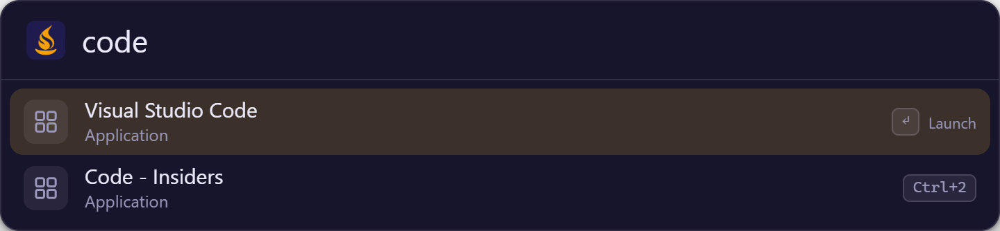
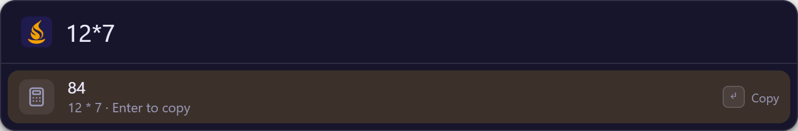
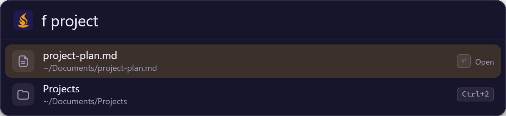

# Using Sevak

[← Help center](README.md) · [Quick start](quickstart.md) · [Configuration](configuration.md)

## Open, search, act


Sevak stays in the background after you hide the launcher. Press your shortcut
to bring it back. Opening it again clears the previous query.

**Enter follows the selected result's action:** apps launch, files open,
web results open in your browser, and calculations or UUIDs copy text.
The action hint on the selected row tells you what will happen.

## Applications

Type part of an installed application's name. Fuzzy matching lets a short
query find a longer name. Review the selected result before pressing Enter;
use the arrow keys when several applications match.



Sources differ by platform: Windows Start Menu shortcuts and packaged apps,
macOS application bundles, and Linux desktop entries. An executable stored
arbitrarily may not have a discoverable application entry.

Usage history helps order relevant matches. It does not guarantee a particular
application is always first. Choose **Reload index** after installing an app
if it does not appear.

## Calculator

Enter an expression directly; no keyword is required. The answer appears as a
result, and **Enter copies the number**.



| Expression | Result | Operation |
|---|---|---|
| `12*7` | `84` | Multiplication |
| `(125+75)/4` | `50` | Grouped arithmetic |
| `2^10` | `1024` | Powers |
| `sqrt(16)` | `4` | Functions |
| `5!` | `120` | Factorial |
| `17%5` | `2` | Remainder |

The `%` operator is **remainder**, not a percentage shortcut. For 15% of 200,
type `200*15/100`. Results use finite-precision arithmetic and are formatted
to a limited number of significant digits.

### Unit conversion

Type `<amount> <unit> (in|to|as|=) <unit>`. The amount can be any expression
(`(2+3) km in m`); Enter copies the result with its unit. Everything works
offline. `in` also works when you mean inches (`12 in in cm`).

| Category | Examples |
|---|---|
| Length | `10 km in mi`, `5'11" to cm`, `3 ft 4 in to cm` (also m, cm, mm, yd, nmi, ly, au) |
| Mass | `1 kg in lb`, `8 oz to g`, `1 ton in kg` |
| Temperature | `100 f to c`, `72°F in C`, `0 c to k` |
| Volume | `3.5 cups to ml`, `1 gal in L`, `1 tbsp in tsp`, `1 imp gal in L`, `2 m3 in L` |
| Area | `1 acre in m2`, `500 sq ft to m²`, `1 ha in acres` |
| Speed | `60 mph in km/h`, `10 m/s to knots`, `miles per hour` |
| Data | `5 GB in MiB`, `100 Mbit to MB`, `1 TiB in GB` |
| Time | `2 h 30 min in min`, `90 min to h`, `1 yr in days` |
| Pressure | `1 atm in psi`, `1 bar in kPa`, `760 torr in atm` |
| Energy | `1 kcal in kJ`, `1 kWh in MJ` |
| Angle | `180 deg in rad`, `1 turn in deg` |

Where case matters or a word is ambiguous:

- Names, plurals and abbreviations are case-insensitive (`km`, `Km`,
  `kilometers`), except data units: `MB` is a megabyte and `Mb` a megabit,
  `B` a byte and `b` a bit. All-lowercase `kb`, `mb`, `gb` mean bytes.
  `KB`/`MB`/`GB` are powers of 1000; `KiB`/`MiB`/`GiB` powers of 1024.
- `oz` is a mass ounce, `fl oz` a fluid ounce. `pt`, `qt`, `gal` and `cup` are
  US customary; use `imp pt` / `imp gal` for imperial. `ton` is the US short
  ton, `tonne` or `t` the metric one.
- `m` is meters and `min` minutes. A month is a twelfth of a Julian year.
- `cal` is the small calorie, `Cal` the food Calorie (1 kcal).
- `°` and `deg` alone are angles; before a letter they are temperatures.
- Results keep up to 10 significant digits (`10 km in mi` is `6.213711922 mi`).

### Currency conversion

Off by default. Turn it on under **Settings → Plugins** or set
`[calculator] currency = true`, then reload. Sevak downloads the European
Central Bank's daily euro reference rates (30 currencies, no cryptocurrencies)
in the background at most once a day, never while you type, and keeps them in
`currency-rates.json`. Until the first download finishes the row says
"Fetching exchange rates…". Use ISO codes (`usd`, `eur`, `gbp`), signs (`€`,
`$`, `£`, `¥`; `$` is the US dollar, `¥` the yen) or words (`euros`):
`100 usd in eur`, `50 € to $`, `$100 in eur`. The subtitle shows the rate and
the ECB's publication date.

## Files and folders

Type `f ` followed by at least two characters of a file or folder name.



`f` searches indexed **names** inside your selected directories; to search the
whole disk or inside documents, see [Whole-disk and content
search](#whole-disk-and-content-search). Enter opens a file with its default application or a folder
in the file manager.

By default:

- Roots are Desktop, Documents and Downloads; depth is 4 levels.
- Dot-files and dot-folders are excluded.
- File results may also appear in ordinary searches.
- Generated/cache directories such as `node_modules`, `.git`, `target`,
  `__pycache__`, `.cache`, `venv`, `.venv` and `AppData` are skipped.

The file index is capped at 100,000 entries. Keep roots focused. Use
**Settings → Files** to change roots and depth, then Save. Choose **Reload
index** after files move or when a recent change is not reflected.

### Whole-disk and content search

`f` only knows the folders you chose. Two more keywords ask your computer's own
file index, which covers the whole disk and can read inside documents:

- `ff report` finds files and folders by **name** anywhere the index looks.
- `in invoice 2026` finds files by the **words inside** them (at least three
  characters).

Several words must all match. Results are ordinary file results: Enter opens,
`Ctrl+Enter` shows in folder, `Shift+Enter` copies the path, Tab fills in the
path. Names match from the start of each word (`rep` finds `annual_report.docx`).
Hidden files, caches and generated folders are left out, as for `f`.

| OS | Names | Inside files | Notes |
|---|---|---|---|
| Windows | Windows Search; "Everything" if `es.exe` is on `PATH` and Everything is running | Windows Search | Only indexed places are searched (by default your user folders and the Start menu). Add drives in *Indexing Options*. Reading PDFs and Office files depends on the installed search filters. |
| macOS | Spotlight (`mdfind`) | Spotlight | Honors Spotlight's Privacy list; app bundles and system folders are left out. |
| Linux | `plocate` or `locate` | Tracker 3 (`tracker3`), else Baloo (`baloosearch`) | Names need a `locate` database (`updatedb`, usually a daily timer). Contents need Tracker or Baloo to be installed and indexing. |

Asking the index takes a moment, so it never holds up typing: for `ff`, matches
from the `f` folder index appear immediately, and the index's results join the
list when they arrive. A search that takes more than two seconds is given up.
If there is no index to ask (the Windows Search service is stopped, `locate` is
not installed), a "File index unavailable" row says what to do, and `ff` still
shows the folder matches. Queries go only to that local index, never over the
network. Turn it off with `files.use_os_index = false`, or change the keywords
(`files.index_keyword`, `files.content_keyword`) in
[configuration](configuration.md#search-the-whole-disk).

### Browsing a path

Type a path to list a folder directly: `~/Documents/`, `/etc/`, `C:\Users\`
or `\\server\share\`. Entries are filtered by what you type after the last
slash, folders first. **Tab** completes the selected entry (folders get a
trailing slash so you can keep drilling down), **Shift+Tab** goes up one
folder, and Enter opens the entry. In ordinary searches this needs
`files.global = true`; after `f ` it always works. Slow or unreachable drives
never freeze typing.

### File buffer

Collect several files and folders, then act on all of them. With a file or
folder result selected (from file search or a browsed path; not bookmarks or
apps):

| Key | What it does |
|---|---|
| `Alt+Up` / `Alt+Down` | Add the selected result to the buffer and move the selection up / down (Option on macOS) |
| `Alt+Left` | Remove the last item |
| `Alt+Backspace` / `Alt+Delete` | Empty the buffer |
| `Alt+Right` | Open the buffer's actions |

The buffer is a strip of chips above the results (click the `x` on a chip to
drop it). It stays while you search for other things, and is emptied when the
launcher hides, unless you set
[`file_buffer.keep_between_shows`](configuration.md#file-buffer). The same
actions are in the action panel of a file result (**Add to file buffer**, and
**File buffer actions** once something is collected). The `Alt+Left`,
`Alt+Right` and `Alt+Backspace` keys only act while the buffer holds something,
so on macOS Option+Left and Option+Backspace keep their text-editing meaning
when it is empty.

| Buffer action | What it does |
|---|---|
| Open all | Opens each item with its default application (asks above 10 items) |
| Show in folder | Opens a file manager window for each folder the items are in (asks above 3) |
| Copy paths | Copies the paths, one per line |
| Copy files to clipboard | Puts the files on the clipboard as a file list, so pasting in Explorer, Finder or a file manager copies them |
| Move to… / Copy to… | Asks for a folder, then moves or copies the items there |
| Move to Trash | Sends the items to the Recycle Bin, Trash or freedesktop trash |
| Compress to .zip | Writes `Archive.zip` (one item: `<name>.zip`) into the folder the items share |
| Open in terminal | Opens a terminal in each folder, or in the folder of each file (asks above 3) |
| More file actions… | The [Universal Actions](#universal-actions) for files, over the collected items |

**Move to…** and **Copy to…** turn the search bar into a folder picker, starting
at `~/`. Type a path or browse it as usual: `Tab` opens the highlighted folder,
`Shift+Tab` goes up, `Enter` uses the highlighted folder, `Ctrl+Enter` uses the
path exactly as typed, and `Esc` cancels. Only folders are listed; the path
browsing needs [`files.global`](configuration.md#search-a-project-folder) or
the `f ` prefix.

What to expect:

- Moving and trashing ask first, naming the items. Nothing is overwritten: a
  name that is taken becomes `report (2).docx` (`photos (2)`, `a (2).tar.gz`).
- Move, copy, trash and zip run in the background with a progress line under the
  chips; you can keep typing. When done, a line says what happened. If some
  items failed it says how many worked and why the first one did not, and the
  failed ones stay in the buffer. Moved and trashed items leave the buffer;
  copied and zipped ones stay for the next action.
- A folder is never moved or copied into itself. Items inside a collected folder
  are handled with the folder, not twice. Moving to another drive copies first
  and removes the original only if the copy worked.
- Zip archives skip symbolic links, and files that cannot be read (the line
  says how many).
- There is no undo, and no way to cancel a running operation. Trashed items can
  be restored from the Recycle Bin or Trash.
- On Linux, trashing needs `gio` (part of GLib), and "Copy files to clipboard"
  works with file managers that read `text/uri-list`; some (Nautilus) only
  accept their own format and may ignore it.

## Bookmarks

Type `b ` and part of a bookmark's title or address. Sevak reads the bookmarks
of Chrome, Edge, Brave, Vivaldi, Chromium, Opera, Firefox, LibreWolf and Zen,
across every profile, read-only. The same address saved in several browsers
appears once, with the browsers listed in the subtitle. Enter opens it in your
default browser. Bookmarks also appear in ordinary searches unless
`bookmarks.global = false`; pick browsers with `bookmarks.browsers`.

## Result actions

Most results can be used in more than one way. The row under the list shows
what the modifiers do for the selected result:

| Result | `Ctrl+Enter` | `Shift+Enter` | `Alt+Enter` |
|---|---|---|---|
| Application | Show in folder | Copy path | Run as administrator (Windows, not Store apps) |
| File or folder | Show in folder | Copy path | |
| Web search | | Copy URL | |

Press `→` (with the caret at the end of the text) or `Ctrl+K` to open the
**action panel**, which lists every action; `↑`/`↓` and Enter pick one, `Esc`
or `←` closes it. `Ctrl+C` copies the selected result's path, URL or value, and
`Ctrl+L` shows it as **Large Type** across the screen; any key dismisses it.

## Preview, Text View and Grid View

**Preview pane.** Tap `Shift` (press and release it alone) or press `Ctrl+Y`
(`Cmd+Y` on macOS) to open a pane under the list that shows what the selected
result is. It follows the selection as you move; tap `Shift` or press `Ctrl+Y`
again, or `Esc`, to close it (the first `Esc` closes the pane, the next hides
Sevak). It shows:

| Result | The pane shows |
|---|---|
| Text and code files | The first 64 KB in a monospace font, with size and modified date |
| Images (PNG, JPEG, GIF, WebP, SVG, BMP, ICO; up to 4 MB) | The picture and its pixel size |
| PDFs and other binary files | Kind, size, path and modified date (pages are not rendered) |
| Folders | The first 100 entries, folders first, and the item count |
| Applications | Kind, path or launch command, and the version when it is cheap to read (macOS apps) |
| Web results and bookmarks | The address, title and site. Nothing is fetched from the network |
| Snippets | The text as Enter would paste it, with `{date}` and the other placeholders filled in |
| Clipboard history entries | The copied text, the full image, or the copied file (several files: their paths) |
| Calculator and conversions | The result and the calculation |
| Emoji | The emoji large, with its name, keywords and code points |

The pane reads only the file or folder the selected result refers to, only
when it is open, and never reads network locations (`\\server\share`). The
window grows to make room and shrinks back when you close the pane; near the
bottom of a small screen it moves up so the pane stays visible.

**Text View.** A result that carries a long text (a long or multi-line
clipboard entry, a snippet, a script plugin's output) can be opened in a
scrollable, taller view with `Ctrl+T`. `↑` `↓` `PageUp` `PageDown` `Home` `End`
scroll; `Ctrl+C` copies the text, `Enter` runs the result as usual, and `Esc`
or `←` goes back to the list. Rows that exist only to show text (marked by
the script that produced them) open the Text View on `Enter`.

**Grid View.** Plugins that offer pictures show their results as a grid of
tiles instead of a list, when every result of a search is a tile. Move with
`←` `→` `↑` `↓` (`PageUp`/`PageDown` jump three rows), `Enter` runs the
selected tile, `Ctrl+K` opens its actions, and the preview pane (`Shift` or
`Ctrl+Y`) works as for list rows. The grid shows up to 60 tiles. Built in:

- **Emoji picker.** Type `:` and a name (`:heart`, `:thumbs up`) or `emoji `
  and a name. Enter pastes the emoji into the app you were using (it copies it
  where pasting is unavailable); `Shift+Enter` copies it instead. About 1,900
  emoji are bundled, found by name and keywords, offline. Skin-tone variants
  are not listed: apps apply their own tone setting. Turn it off by adding
  `"emoji"` to `[plugins] disabled`.
- **Clipboard images.** `cb image` (with the history on) finds copied images;
  when only images match they show as a grid of thumbnails, and the preview
  pane shows the full picture.
- Script plugins can request tiles too: see [plugins.md](plugins.md#views-text-and-grid).

## System commands

Type a command's name, as you would an app (two or more letters). Only the
commands that work on your machine are listed.

| Command (aliases) | Windows | macOS | Linux |
|---|---|---|---|
| Lock screen (`lock`) | `LockWorkStation` | `pmset displaysleepnow` | `loginctl lock-session` |
| Sleep (`suspend`) | `SetSuspendState` | `pmset sleepnow` | `systemctl suspend` |
| Hibernate | `shutdown /h`, if hibernation is on | not offered | `systemctl hibernate`, if swap is set up |
| Restart (`reboot`) | `shutdown /r /t 0` | System Events | `systemctl reboot` |
| Shut down (`shutdown`, `power off`) | `shutdown /s /t 0` | System Events | `systemctl poweroff` |
| Log out (`logout`, `sign out`) | `shutdown /l` | System Events | `gnome-session-quit`, KDE `qdbus`, or `loginctl terminate-session` |
| Empty Recycle Bin / Trash | `SHEmptyRecycleBin` | Finder | `gio trash --empty` |
| Settings pages (`bluetooth`, `display`, `wifi`, `sound`, `network`, `power`…) | `ms-settings:` | System Settings panes | `gnome-control-center <panel>`, if installed |

Restart, shut down, log out and empty trash ask for confirmation first. On
macOS the first use asks permission to control System Events or Finder, and
Lock only locks when "Require password" is set to immediately (the default).
Turn confirmation off or hide commands in [`[system]`](configuration.md#system-commands).

## Terminal commands

`> git status` (or `>git status`, no space needed) shows "Run `git status` in
terminal"; Enter opens your terminal and runs it. Nothing runs until you press
Enter. `>` alone lists your recent commands and an "Open terminal" row.

| OS | Terminal (auto-detected) | Shell |
|---|---|---|
| Windows | Windows Terminal (`wt`), else a console window | `pwsh`, else `powershell`, else `cmd` |
| macOS | Terminal.app (`terminal = "iterm"` for iTerm2) | your login shell |
| Linux | `$TERMINAL`, `x-terminal-emulator`, `gnome-terminal`, `konsole`, `kitty`, `alacritty`, `wezterm`, `foot`, `xterm` | `$SHELL`, else `sh` |

Commands run in a non-interactive shell, so aliases from `.bashrc` and similar
are not available. Recent commands are kept in `usage.json`.
[Choose a terminal or shell](configuration.md#terminal-commands).

## Paste, clipboard history and snippets

**Pasting.** Results from `cb` and `s` paste into the app that had focus when
you opened Sevak: Sevak hides, brings that window back and presses Ctrl+V
(Cmd+V on macOS).

- **Windows**: works everywhere except windows running as administrator.
- **macOS**: needs *System Settings → Privacy & Security → Accessibility →
  Sevak*; without it Sevak copies instead and the row says so. Layouts that
  move the `V` key (such as Dvorak) do not paste.
- **Linux X11**: works. **Wayland**: Sevak can only copy.

**Clipboard history** (`cb <text>`) is off by default; turn it on with
`[clipboard] enabled = true`. It keeps what you copy, newest first, up to
`max_items` entries of all kinds together:

| You copy | The row shows | Enter | Other actions |
|---|---|---|---|
| Text | The first line, with its length in lines | Pastes the text | |
| An image (a screenshot, "Copy image" in a browser) | A thumbnail, `Image 1920 × 1080` and the file size | Pastes the image | `Ctrl+Enter` copies it without pasting; `Shift+Enter` **Save image as…** writes a PNG to the Desktop (else Downloads) as `Clipboard image <date> <time>.png`, never over an existing file, and shows it in the file manager |
| Files or folders (a file manager's copy) | The file names and how many | Pastes the files, as a file manager's paste would | `Ctrl+Enter` shows the first one in the file manager; `Shift+Enter` copies the files without pasting; `Ctrl+C` copies their paths as text |

Typing after `cb` filters by text, file name, or the word `image` (`cb image`,
shown as a [grid of thumbnails](#preview-text-view-and-grid-view)).
Copying the same text, picture or files again moves the existing entry to the
top instead of adding another. Files are only recorded by their path: if one has
been moved or deleted by the time you paste, the rest are pasted, and if none is
left Sevak says so.

Not recorded: content that password managers mark as secret (Windows and
macOS), copies made in apps listed in `ignore_apps`, text longer than
`max_item_bytes`, images whose PNG is larger than `max_image_bytes` (10 MB by
default), a copy of more than 1000 files, Sevak's own pastes, and the copy
Universal Actions makes to read your selection. On Linux there is no secret
marker, so use `ignore_apps`. Turn the new kinds off with
`[clipboard] images = false` / `files = false`. Images together are also kept
under about 500 MB: the oldest go first.

Everything is stored **unencrypted** in Sevak's data folder, only while the
history is on: text and the paths of copied files in `clipboard-history.json`,
and each image as a PNG file (plus a small thumbnail) in the `clipboard` folder
next to it. A screenshot of a bank page is as readable there as it was on
screen, so add apps that handle such things to `ignore_apps`, or turn images
off. Type `cb clear` to show a "Clear clipboard history" row: it deletes the
entries and the image files. Trimming the history (`max_items`) deletes the
image files of the entries it drops too.

**Snippets** (`s <name>`) paste text from your
[`[[snippet]]` entries](configuration.md#snippets). Placeholders are filled in
when you press Enter:

| Placeholder | Result |
|---|---|
| `{date}`, `{time}`, `{datetime}` | `2026-10-03`, `14:05`, `2026-10-03 14:05` |
| `{date:FORMAT}` | Custom [strftime](https://docs.rs/chrono/latest/chrono/format/strftime/index.html) format, e.g. `{date:%d %B %Y}` (also `{time:..}`, `{datetime:..}`) |
| `{clipboard}` | The clipboard's text |
| `{uuid}` | A new random UUID |
| `{{` and `}}` | A literal `{` and `}` |

Expanding a snippet's keyword as you type in other apps is not supported.

## Web search


| Keyword | Provider | Example |
|---|---|---|
| `g` | Google | `g rust traits` |
| `yt` | YouTube | `yt svelte tutorial` |
| `gh` | GitHub | `gh tauri` |

A keyword needs a following space. Bare `g` is an ordinary query; `g rust
traits` selects Google. Enter opens the constructed URL in your browser,
where the provider receives your terms.

When an ordinary query produces no results, Sevak can offer a fallback web
search. The default is `g`; change or disable it under **Settings → Search**,
or list several (`fallback_web_search = ["g", "yt"]`).
Typing just a keyword (`g`) offers a row that **Tab** completes to `g `.
[Add a custom web keyword](configuration.md#add-a-web-search-keyword).

## Universal Actions

Select something in any app (text, a link, files in a file manager), press
`Ctrl+Alt+Space` (`general.actions_hotkey`; empty turns it off) and Sevak shows
what you can do with it. Nothing runs by itself: you always pick an action, with
`Up` / `Down` and `Enter`, or `Ctrl+1` ... `Ctrl+9`. `Esc` closes it.

| You selected | Actions |
|---|---|
| Text | Search with each web engine in `[[web_search]]` (`Search Google for "..."`), show as Large Type, copy, paste as plain text, calculate it if it is a calculation or conversion (`2*(3+4)`, `10 km in mi`), and transform it: Uppercase, Lowercase, Title Case, Trim whitespace, URL-encode, URL-decode, Base64 encode, Base64 decode, Pretty-print JSON, Minify JSON (each only when it applies and changes the text) |
| One or more URLs (`http://`, `https://`, `mailto:`, `www.`) | Open, copy, Large Type |
| Files and folders | Open, show in folder, copy path(s), open in terminal (a folder), run as administrator (a Windows program), send to Sevak (fills the search box with the path so you can browse from there) |
| A path written as text, such as `C:\Users\me\Documents` | The file actions above, then the text actions |

Transformations and the calculator **replace the selection** in the app (Sevak
pastes over it) where pasting works; `Ctrl+Enter` copies the result instead.
Where pasting is not possible (Wayland, or macOS without the Accessibility
permission) they copy. `Shift+Enter` on a web search copies its URL. Each row
shows what its keys do.

How the selection is read: Sevak remembers the app you are in, saves the
clipboard, presses `Ctrl+C` (`Cmd+C` on macOS) in that app, waits up to about
0.3 seconds for the copy, reads the text or the list of files, and puts the
clipboard back (plain text, HTML, files and a copied image are restored; any
other format is not). The hotkey's own `Ctrl` / `Alt` keys are waited out first so
the app sees a plain copy. Sevak's clipboard history does not record this copy.
The app itself makes the copy, though, so an operating system clipboard history
(Windows `Win+V`) or another clipboard manager can see it; and a few editors
copy the whole current line when nothing is selected.

| System | What happens |
|---|---|
| Windows | Works in every app except windows running as administrator (Windows blocks key presses sent to them). |
| macOS | Needs *System Settings > Privacy & Security > Accessibility > Sevak*, the same permission pasting uses. Files in Finder and text both work. |
| Linux, X11 | The text you have highlighted (the `PRIMARY` selection) is used first, with no key pressed ([`[actions] use_primary_selection`](configuration.md#universal-actions)). The catch: it is whatever was highlighted last, even if the highlight is gone. Turn the option off to always press `Ctrl+C` instead. Files in the file manager are read from the clipboard. |
| Linux, Wayland | Applications cannot read another app's selection or press keys, so nothing can be captured. Sevak says so; bind `sevak --actions` with `sevak --setup-hotkey`, copy the text yourself, and set `[actions] use_clipboard_fallback = true` to act on the clipboard. |

Two safeguards. Terminal windows (Windows Terminal, `cmd`, PowerShell, `xterm`,
`gnome-terminal`, `konsole`, `alacritty`, ...) never receive `Ctrl+C` on Windows
and Linux because it would interrupt the program running there; select with the
mouse and use the clipboard fallback instead (or on X11 the `PRIMARY` selection
already has it). Selections over 256 kB are refused.

Switch it off with `actions_hotkey = ""` or by disabling the `selection`
plugin; see [configuration](configuration.md#universal-actions). Details for
plugin authors are in [plugins.md](plugins.md#universal-actions).

## Search history

On an empty search bar, `↑` and `↓` step through the last 50 searches you
ran, newest first; typing leaves history. Turn it off with
`search.query_history = false`, which also deletes the stored searches.

## UUID example plugin

When enabled, type `uuid ` for a UUID, `uuid 5` for several choices, or
`uuid upper` for uppercase output. Enter copies the selected value.
See the [worked UUID example](plugins.md#writing-a-built-in-plugin).

## Script plugins

Add your own keywords without building Sevak: put a folder with a
`plugin.toml` and a script (Python, PowerShell, Node, anything) in the
`plugins` folder next to `config.toml`, then choose **Reload index**. Sevak asks
once whether to allow a new plugin, and again if its command changes. Scripts
run with your permissions and are not sandboxed, so install only plugins you
trust. A one-shot script that prints
[Alfred Script Filter JSON](https://www.alfredapp.com/help/workflows/inputs/script-filter/json/)
lets many existing Alfred scripts work. Three examples are in
[`examples/plugins/`](../examples/plugins); the full guide is in
[plugins.md](plugins.md#external-plugins).

## Keyboard shortcuts

| Key | Action |
|---|---|
| `Alt+Space` (macOS: `Option+Space`) | Show or hide; configurable |
| `↑` / `↓` | Previous / next result |
| `Ctrl+P` / `Ctrl+N` | Alternative previous / next keys |
| `PageUp` / `PageDown` | Move by a page |
| `Enter` | Execute the selected result |
| `Ctrl+Enter` / `Shift+Enter` / `Alt+Enter` | Run an [alternative action](#result-actions) |
| `→` (caret at the end) or `Ctrl+K` | Open the action panel |
| `Tab` | Complete the input to the selected result |
| `Shift+Tab` | Go up one folder while browsing a path |
| `↑` / `↓` on an empty bar | Recall earlier searches |
| `Ctrl+C` (no text selected) | Copy the selected result's path, URL or value |
| `Ctrl+L` | Show the selected result as Large Type |
| `Shift` (tap) or `Ctrl+Y` | Show or hide the [preview pane](#preview-text-view-and-grid-view) |
| `Ctrl+T` | Open the selected result's long text in the Text View |
| `←` `→` `↑` `↓` in a grid | Move between tiles ([Grid View](#preview-text-view-and-grid-view)) |
| `Ctrl+1` … `Ctrl+9` | Execute the corresponding result |
| `Alt+Up` / `Alt+Down` on a file | Add it to the [file buffer](#file-buffer), then move |
| `Alt+Left` / `Alt+Right` / `Alt+Backspace` | Remove the last buffered file / its actions / empty it |
| `Esc` | Close the innermost thing first (Text View, action panel, preview pane, the folder picker of Move to… / Copy to…), then hide the launcher |

On macOS, `Command` takes the place of `Ctrl`.
The global launcher shortcut is configured separately; you can also add
[custom hotkeys](configuration.md#custom-hotkeys).

## Tray and menu-bar actions

| Menu item | Purpose |
|---|---|
| Show | Open the launcher |
| Settings | Open the settings window |
| Reload index | Re-read config and rebuild app, file and bookmark indexes; load new script plugins |
| Check for updates | Check GitHub Releases on demand |
| Quit | Exit Sevak |

With hide-on-blur enabled, clicking another window hides the launcher.
Hiding does not quit it. Desktops without a tray can use the hotkey and CLI.

## Command line

These examples assume `sevak` is on your command path. Otherwise, use the
installed executable's full path.

```sh
sevak                       # Open the launcher
sevak --toggle              # Toggle the launcher
sevak --query "> "          # Open the launcher with text already typed
sevak --run system:lock     # Run a result by id without showing the launcher
sevak --actions             # Universal Actions for the current selection
sevak --background          # Start without showing the launcher
sevak --settings            # Open Settings
sevak --quit                # Quit the running instance
sevak --setup-hotkey        # Configure GNOME shortcuts on Linux (also [[hotkey]] entries)
sevak --setup-hotkey Ctrl+Space
sevak --config ~/Dropbox/sevak   # Use another config folder (combine with any option)
sevak --help
sevak --version
```

Only one instance runs at a time; subsequent invocations forward their action.
`--config` only applies to the instance that starts Sevak.
